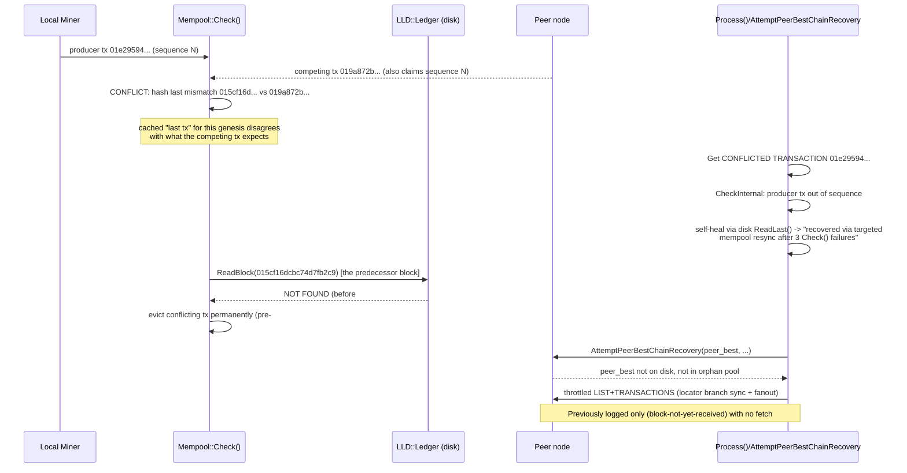
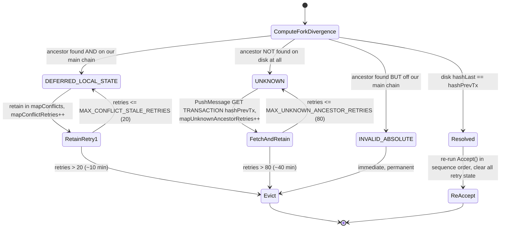
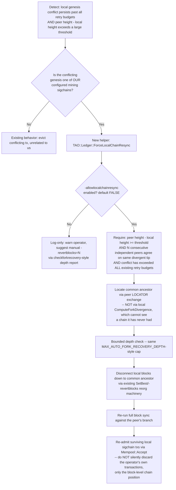

# Fork-Recovery Knowledge Base — "Stuck on My Own Mined Fork" Wedge

**Status as of this document:** the specific wedge shown in the four attached log
excerpts (local tip stuck at height 6800060–6800065 while peers advertise
6800144–6800295) is fixed by PR #664 (commit `bb1ca9cd9`, merged into `NODE` as
`9ac3ecea5`). This document exists so future sessions don't have to
re-derive the history and design from scratch. **Read this before touching
`Mempool::Check()`, `ComputeForkDivergence()`, `AttemptPeerBestChainRecovery()`,
or anything calling itself "fork recovery."**

---

## 1. Timeline — how we got here (git history, not guesswork)

This subsystem has been rewritten several times. Each row is a real commit,
found via `git log --all -S"<symbol>"` after unshallowing the repo — not
inferred from log messages.

| Commit | What it did |
|---|---|
| `aaab2e61e` | **Added** `Mempool::AttemptForkRecovery()` + `-autoforkrecovery` (opt-in, default **off**). Automatically rolls back the local best chain (`stateAncestor.SetBest()`) to a conflict's ancestor block, but **only when that ancestor is already on our own main chain** (`fAncestorOnMainChain == true`) and within `MAX_AUTO_FORK_RECOVERY_DEPTH`. Refuses if the ancestor is off-chain or not found. |
| `723a2b902` | Added the `checkforkrecovery <genesis>` RPC (read-only diagnostic, calls `ComputeForkDivergence()` with no side effects) and depth/warning logging. |
| `ff68de15b` | Changed `-autoforkrecovery` default from `false` → **`true`**. |
| `6068b5888`/`a9e51c0b4`/`6a09d6afa` | Iterated on orphan-graph safety around the same feature. |
| `92d57c67c` (PR #647) | **Removed** the automatic-rollback path, calling it "an unsafe automatic-rollback path," in favor of a graph-aware orphan map. |
| `9d6faf6e1` / `055517f09` (revert of #647) | **Reverted** #647 — `AttemptForkRecovery`/`-autoforkrecovery` came back. |
| `08812995a` ("stranded-state loops" fix, PR #663 lineage) | **Replaced** `AttemptForkRecovery()` entirely with a new admissibility classifier: every conflict is now sorted into `DEFERRED_LOCAL_STATE` (ancestor on our main chain → retain/retry) or `INVALID_ABSOLUTE` (else → evict permanently). **This is the point the user recalls "a Coding Agent talked me into removing it."** `AttemptForkRecovery`, `-autoforkrecovery`, `GENESIS_CONFLICT_RECOVERY_THRESHOLD`, and `MAX_AUTO_FORK_RECOVERY_DEPTH` do **not exist anywhere in the current codebase** — confirmed by full-tree grep, not just "not on this branch."  A stale repo memory claiming `-autoforkrecovery` still exists/defaults true has been down-voted. |
| `bb1ca9cd9` / `9ac3ecea5` (**PR #664**, merged into `NODE`) | Fixed the exact bug reported in the screenshots: the binary `else` branch in `08812995a`'s classifier conflated **"ancestor not found on disk at all"** (a sync gap — transient) with **"ancestor found but off our main chain"** (a real, resolved fork — permanent). Split into three states; see §3. |

**Key correction to the user's recollection:** `AttemptForkRecovery` was not
simply "removed by a coding agent's advice" once — it was removed, reverted,
then removed again for good as part of a larger classifier rewrite. It also
never solved the exact scenario in the screenshots (see §5) because it only
ever rolled back to ancestors **already on our own main chain** — it refused
whenever the ancestor was off-chain, which is precisely the state the wedged
node was in.

---

## 2. What the four log excerpts actually show (confirmed root cause)

All four screenshots are the same wedge, recurring across separate restarts
(timestamps 10:16, 00:27, 00:46, 02:52 — different sessions, identical hashes):

- Local tip stuck at height 6800060–6800065; peers advertise 6800144–6800295
  (up to ~230 blocks ahead).
- The offending block is always the same: `hash=1d6a8925b9e9ab7b9048`, whose
  producer transaction (`01e29594e7b32f7f1634`) belongs to genesis
  `a1d4333aa33129768ec27896ccf04d419058c6ae` — the local node's own mining
  sigchain.



- `ComputeForkDivergence()` (`mempool.cpp:912-944` pre-#664 / current) reads
  disk for the block hosting the conflicting predecessor tx. When that read
  fails, it means **either** "we haven't synced that far" **or** "this
  ancestor genuinely isn't part of any chain we'll ever have" — and the
  pre-#664 code treated both as the latter, permanently discarding the
  correct chain's data.
- `AttemptPeerBestChainRecovery` (`process.cpp`) previously logged
  `not_on_disk=true`/`in_orphan_pool=no`/`action=block-not-yet-received` and
  **returned without issuing any fetch** when the peer's tip was far ahead
  (too far to be in the orphan pool). **Fixed (option 1-A):** that path now
  issues the same throttled locator-anchored `LIST` + `SPECIFIER::TRANSACTIONS`
  (with optional one-peer fanout) used for the orphan-gap case. Stop hash is
  `hashPeerBest`; throttle key is `hashDeepestAncestor` (defaults to the tip
  when no orphans were walked).
- Historically the node's own miner kept producing new blocks on top of the
  stuck local tip, which is what made it look like "the chain is only being
  extended by my own miner."

---

## 3. Current classification state machine (post–PR #664)



Implementation: `src/TAO/Ledger/mempool.cpp` (`Check()`'s conflict-
reconciliation loop, ~line 780 onward) and `src/TAO/Ledger/types/mempool.h`
(`MAX_CONFLICT_STALE_RETRIES`, `MAX_UNKNOWN_ANCESTOR_RETRIES`,
`mapConflictRetries`, `mapUnknownAncestorRetries`, `setStrandedGeneses`,
`setUnknownAncestorGeneses`).

**What #664 fixed:** the `UNKNOWN` branch is new. Previously `!fAncestorFound`
fell into the same `else` as "found but off-chain," causing immediate,
permanent eviction of the correct chain's conflicting transaction while the
node was still >200 blocks behind. Now `UNKNOWN` gets a much larger retry
budget (80 vs. 20) *and* actively re-requests the missing predecessor
transaction from a random connected peer, instead of passively waiting for
an unrelated block-sync path to close the gap. Each retry corresponds to one
pass of `Check()`'s conflict-reconciliation loop, which runs at most once per
`CONFLICTS_SWEEP_INTERVAL_SECONDS` (30s, `mempool.h`) — so 80 retries ≈ 40
minutes of retention before falling back to eviction.

**What #664 does NOT fix:** if the gap is large enough that
`MAX_UNKNOWN_ANCESTOR_RETRIES` (80 × the 30s sweep ≈ 40 minutes) is exhausted
before block-level sync catches up, the transaction is still evicted — the
underlying "no single authoritative resync path" problem from the original
analysis remains. The block-sync half of that wedge (`AttemptPeerBestChainRecovery`
silent no-op when the tip is far ahead) is addressed separately by the
option 1-A active-fetch path (see §6 step 2).

---

## 4. Inventory of narrow patches (still fragmented, still no single decision point)

The original problem statement's diagnosis that this is "many narrow,
independent patches" rather than one authoritative reconciliation path is
still accurate after #664. Each of these tracks its own retry/attempt state,
keyed differently, with no shared coordinator:

| Subsystem | State tracked | Cap | File |
|---|---|---|---|
| Mempool conflict classifier | `mapConflictRetries` (per genesis) | 20 sweeps | `mempool.cpp`/`mempool.h` |
| Mempool conflict classifier (new) | `mapUnknownAncestorRetries` (per genesis) | 80 sweeps | `mempool.cpp`/`mempool.h` |
| Block Check() self-heal | `mapLastConflicted` (per block) | n/a (one-shot ReadLast retry) | `tritium.cpp` (`fSelfHealSequencing`) |
| Process() check-reject resync | `mapCheckRejects` (per block hash) | `CHECK_REJECT_RESYNC_THRESHOLD` | `process.cpp:189-256`, `include/process.h:90-125` |
| Missing-tx retry | `mapLastMissing` (per block hash) | `MAX_MISSING_TRANSACTIONS_RETRIES` | `process.cpp:149-201` |
| Branch-recovery escalation | `mapMissingBranchEscalations`/`setUnrecoverableBlocks` (per block hash) | `MAX_BRANCH_RECOVERY_ESCALATIONS` (3) | `process.cpp:773-788`, `1180-1243` |
| Orphan/locator branch sync throttle | `mapLastOrphanRequest` (per ancestor hash) | `ORPHAN_REQUEST_THROTTLE_SECONDS` | `process.cpp:792-810` |

None of these consult each other. It's possible (and was observed in the
screenshots) for the block-level self-heal to declare "recovered" in the
same instant the mempool-level classifier evicts the same genesis's
transaction as `INVALID_ABSOLUTE` — three subsystems disagreeing about
retry-vs-evict for the same underlying conflict, exactly as originally
diagnosed. **This fragmentation is unchanged by #664** — #664 only fixed the
misclassification bug inside one of these subsystems. Consolidating them
into one state machine with one shared per-genesis+height counter (as
originally proposed) is still valid, larger, higher-risk future work — not
undertaken here because the user asked to land the scoped fix first (which
was, unbeknownst to this session at start, already merged as #664).

---

## 5. Open question raised by the user: evicting our *own* locally-mined blocks

The user's operational observation: sometimes the true fix isn't "wait
longer for sync" (§3's `UNKNOWN` path) — it's "our local best chain is
itself built on a branch that will never match the peers' canonical chain,
and we must throw away our own locally-mined/accepted blocks down to the
real common ancestor before we can resync."

**This is a different, harder case than anything `AttemptForkRecovery` ever
handled.** The old `AttemptForkRecovery` (§1) only ever rolled back to an
ancestor **already present on our own main chain** — i.e. it un-does *extra*
local blocks we mined past a point peers agree with. It explicitly refused
when the ancestor was off our main chain (`INVALID_ABSOLUTE`-shaped
conflicts) because it had no way to verify what to roll back *to* without
already having peers' chain data. In the screenshots, the ancestor
(`015cf16dcbc74d7fb2c9`) is not found on disk **at all** — that's the
`UNKNOWN` case, and `AttemptForkRecovery` would have refused it outright
("cannot compute rollback target"), same as the old code's behavior shown in
`git show 9d6faf6e1:src/TAO/Ledger/mempool.cpp`.

So a genuine "evict local blocks and adopt peer's chain" capability does
**not exist anywhere in this codebase's history** — it would be new,
higher-risk functionality, not a restoration of something removed. This
tracks with the user's own stated uncertainty ("unsure the exact cascading
consequences without detailed Code Review").

### Proposed design (NOT implemented — spec only, for a future scoped session)

Per the user's explicit request, this must be its own hardened, isolated
helper — not scattered logic — so it can be reviewed/micromanaged in one
place.



Design constraints this helper must satisfy (captured now so they aren't
re-litigated later):

1. **One function, one entry point** (e.g.
   `TAO::Ledger::ForceLocalChainResync(hashGenesis)` in its own new file,
   e.g. `src/TAO/Ledger/fork_recovery.cpp`), not logic inlined into
   `Mempool::Check()` or `Process()`. All the existing narrow patches in §4
   should eventually call into this single decision point rather than each
   independently deciding retry-vs-evict.
2. **Opt-in, default off**, mirroring the `-autoforkrecovery` precedent —
   the user's own history shows an always-on automatic rollback was
   considered risky enough to be reverted twice before being redesigned.
3. **Never destroys the operator's signed transactions** — only the local
   *chain position* (which blocks are "best"). Sigchain transactions that
   are still valid against the peer's canonical chain must be re-admitted to
   mempool afterward, not discarded, addressing the user's "don't blow away
   a user's sigchain history" concern directly.
4. **Requires corroboration from multiple independent peers**, not a single
   peer's claim, before ever disconnecting local blocks — a single
   malicious/buggy peer must not be able to trigger a rollback.
5. **Bounded depth**, same rationale as the old `MAX_AUTO_FORK_RECOVERY_DEPTH`
   — refuse and log a suggested `-revertblocks=N` rather than attempting an
   unbounded automatic rollback.
6. **Full test coverage before any wiring into automatic paths** — land it
   first as a manually-invocable helper (or RPC, mirroring the read-only
   `checkforkrecovery` precedent) so an operator can trigger it deliberately
   while confidence is being built, before ever considering an automatic
   trigger.

This section is intentionally a specification, not code — implementing it
requires the "detailed Code Review" the user says they don't yet have
confidence to fully reason through, and it is explicitly the
higher-risk/higher-effort option from the original analysis (Simplicity:
Low, largest change, highest regression risk).

---

## 6. Recommended next scoped steps (smallest risk first)

1. ~~Fix the `UNKNOWN` vs `INVALID_ABSOLUTE` misclassification.~~ **Done —
   PR #664.**
2. ~~Give `AttemptPeerBestChainRecovery` an active fetch path for the
   "not on disk, not in orphan pool" case (§2).~~ **Done — option 1-A:**
   throttled locator `LIST` + `SPECIFIER::TRANSACTIONS` with optional
   one-peer fanout (same path as orphan-gap recovery).
3. Only after (1) and (2) are proven in production: consider the
   consolidated fork-recovery state machine (§4) and the
   `ForceLocalChainResync` helper (§5), each as its own separately reviewed
   change.

---

## 7. Where to look next time (avoid re-deriving)

- `src/TAO/Ledger/mempool.cpp` — `Mempool::Check()` conflict-reconciliation
  loop (~line 780+), `ComputeForkDivergence()` (~line 912+).
- `src/TAO/Ledger/types/mempool.h` — `ForkDivergenceInfo`, all the
  `MAX_*_RETRIES` constants and `map*Retries`/`set*Geneses` state.
- `src/TAO/Ledger/process.cpp` — `AttemptPeerBestChainRecovery()` (~line
  530+), `ShouldSendBranchSyncRequest()` (~line 792+), branch-recovery
  escalation (~line 1180+).
- `src/Legacy/rpc/info.cpp` / `rpc.cpp` — `checkforkrecovery` RPC (read-only,
  still functional, good starting point for any future manual-trigger
  helper).
- `docs/archive/MISSING_TX_FORK_WEDGE_BUG.md` — earlier, related wedge
  (missing-tx retry limit) with its own root-cause writeup; same family of
  bugs, different subsystem.
- Git history commands used to build §1 (repeat these before assuming
  something "used to exist" or "was removed" — don't rely on memory alone):
  ```
  git fetch --unshallow origin   # repo is shallow-cloned by default
  git log --all --oneline -S"<SymbolName>" -- src/path/file.cpp
  git show --stat <hash>
  ```
