# Falcon Verification - Node Side

## Overview

This document describes the node-side implementation of Falcon signature verification for mining authentication. Falcon-1024 provides post-quantum security for the stateless mining protocol.

**Security Level:** NIST Level 5 (256-bit quantum resistance)  
**Algorithm:** Falcon-1024 (NIST PQC standardized)  
**LLL-TAO Version:** 5.1.0+

---

## Dual Signature Architecture

### Overview

Nexus uses a **dual Falcon signature system** for enhanced security and operational flexibility. This is a CRITICAL aspect of the protocol that separates session authentication from blockchain proof.

### Signature Types

| Type | Purpose | Lifetime | Storage | Used In | Default |
|------|---------|----------|---------|---------|---------|
| **Disposable** | Session authentication + block verification | 24h-7d (configurable) | Session cache (memory) | MINER_AUTH (0xD000) + SUBMIT_BLOCK (0x0005) | **Always ON** |
| **Physical** | Blockchain proof (permanent record) | Permanent | Blockchain block data | SUBMIT_BLOCK (0x0005) - embedded after Disposable | **OFF** (optional) |

### Why Two Signatures?

**Disposable Signature (Session + Block Verification Layer):**
- **ALWAYS ON:** Cannot be disabled, always enabled by default
- **Matches miner's Falcon size:** 809 bytes (Falcon-512) or 1577 bytes (Falcon-1024)
- **Used in two places:** MINER_AUTH (session auth) + SUBMIT_BLOCK (block verification)
- **Rotatable:** Can be changed without blockchain transaction
- **Revocable:** If compromised, revoke session and generate new key
- **Hot storage:** Can be stored on mining machine
- **Session-bound:** Only authenticates the miner for 24h-7d
- **Verified then discarded:** Used in SUBMIT_BLOCK for verification, NOT stored in blockchain

**Physical Signature (Blockchain Layer):**
- **OPTIONAL:** Disabled by default, must be enabled via config (`physicalsigner=1`)
- **When enabled:** Provides permanent blockchain proof of authorship
- **Comes AFTER Disposable:** When present, embedded after Disposable signature in sequence
- **Immutable:** Linked permanently to blockchain account (genesis hash)
- **Proof of ownership:** Proves block came from legitimate account
- **Cold storage:** Should be kept in hardware wallet or secure server
- **Block-bound:** When enabled, required for every block submission
- **IN blockchain:** When enabled, stored permanently in block data (809 or 1577 bytes overhead)

### Critical Security Property

**The node verifies Disposable signature in SUBMIT_BLOCK (always), and Physical signature if enabled:**

1. **Disposable signature** → Verifies block was signed by authenticated session (ALWAYS verified)
2. **Physical signature** → When enabled, validates block ownership and stores in blockchain (OPTIONAL)

**SUBMIT_BLOCK packet structure:**
- **ALWAYS present:** Disposable Falcon signature (verified, then discarded)
- **When enabled:** Physical Falcon signature (verified, then stored in blockchain)
- **Sequence when Physical enabled:** Disposable FIRST, Physical SECOND

**Configuration:**
- **Disposable:** Always enabled, cannot be disabled
- **Physical:** Enable with `physicalsigner=1` in config (disabled by default)

### Operational Model

```
┌─────────────────────────────────────────────────────┐
│ Mining Machine (Hot Environment)                    │
│                                                      │
│ ┌────────────────┐                                  │
│ │ Disposable Key │ ← Used frequently (every 24h)    │
│ │ (Session Auth) │ ← Can be on disk/memory         │
│ └────────────────┘                                  │
│                                                      │
│ ┌────────────────┐                                  │
│ │ Remote Signer  │ → Calls secure signing service   │
│ │ Client         │ → For physical signatures        │
│ └────────────────┘                                  │
└─────────────────────────────────────────────────────┘
                    ↓ Network call
┌─────────────────────────────────────────────────────┐
│ Secure Server (Cold Environment)                    │
│                                                      │
│ ┌────────────────┐                                  │
│ │ Physical Key   │ ← Used rarely (per block found)  │
│ │ (Block Proof)  │ ← Hardware wallet or HSM         │
│ └────────────────┘                                  │
└─────────────────────────────────────────────────────┘
```

---

## Complete Dual Signature Flow

### Authentication and Block Submission Sequence

```mermaid
sequenceDiagram
    participant Miner
    participant Node
    participant SessionCache
    participant Blockchain
    
    Note over Miner,Blockchain: CRITICAL: Dual Signature System - Always This Order
    
    rect rgb(255, 230, 230)
        Note over Miner,SessionCache: STEP 1: Session Authentication (Disposable Signature)
        
        Miner->>Miner: Load disposable Falcon key
        Note right of Miner: Hot key on mining machine<br/>Can be rotated anytime
        
        Miner->>Miner: Generate session signature
        Note right of Miner: Sign with disposable private key
        
        Miner->>Node: MINER_AUTH (0xD000)
        Note right of Miner: Contains:<br/>• Genesis hash (32 bytes)<br/>• Disposable Falcon pubkey (897/1793 bytes)<br/>• Disposable signature<br/>• Miner ID
        
        Node->>Node: Derive ChaCha20 key
        Note left of Node: key = SHA256(domain ‖ genesis)
        
        Node->>Node: Decrypt disposable pubkey
        Note left of Node: ChaCha20 decryption
        
        Node->>Node: Verify DISPOSABLE signature
        Note left of Node: Falcon::Verify(disposable_pubkey,<br/>message, signature)
        
        alt Disposable Signature Valid
            Node->>SessionCache: Cache disposable pubkey
            Note over SessionCache: Store for 24h-7d<br/>In-memory cache<br/>Not persisted to disk
            
            Node->>Node: Generate session ID
            Note left of Node: 32-byte random session ID
            
            Node-->>Miner: MINER_AUTH_RESPONSE (0xD001)
            Note left of Node: SUCCESS + session_id
            
            Note over Miner,Node: Session authenticated<br/>Miner can now request templates
        else Disposable Signature Invalid
            Node-->>Miner: MINER_AUTH_RESPONSE (0xD001)
            Note left of Node: REJECT + error code
            
            Note over Miner: Authentication failed<br/>Cannot proceed
        end
    end
    
    Note over Miner,Blockchain: Mining happens... (0-60 seconds typical)
    
    rect rgb(230, 255, 230)
        Note over Miner,Blockchain: STEP 2: Block Submission (Disposable ALWAYS + Physical OPTIONAL)
        
        Miner->>Miner: Solution found!
        Note right of Miner: Valid nonce discovered
        
        Miner->>Miner: Construct block data
        Note right of Miner: Block header + transactions
        
        Miner->>Miner: Sign block with disposable key
        Note right of Miner: ALWAYS: Disposable signature<br/>over block hash<br/>(from session key)
        
        opt Physical Falcon Enabled (physicalsigner=1)
            Miner->>Miner: Sign block with physical key
            Note right of Miner: OPTIONAL: Physical signature<br/>over block hash<br/>(cold storage key)
        end
        
        Miner->>Node: SUBMIT_BLOCK (0x0005)
        Note right of Miner: Contains:<br/>• Block header<br/>• Transactions<br/>• DISPOSABLE signature (ALWAYS)<br/>• PHYSICAL signature (if enabled)<br/>• Physical Falcon pubkey (if enabled)<br/>• Genesis hash
        
        Node->>Node: Validate proof-of-work
        Note left of Node: Verify hash < target<br/>Time: 5-10ms
        
        Node->>Node: Verify DISPOSABLE signature (ALWAYS)
        Note left of Node: Falcon::Verify(disposable_pubkey,<br/>block_hash, disposable_signature)<br/>Matches cached session key<br/>Time: 10-20ms
        
        alt Disposable Signature Invalid
            Node-->>Miner: REJECT (0x00)
            Note left of Node: CRITICAL: Block rejected<br/>Disposable signature verification failed!
            
            Note over Miner: Disposable signature failed<br/>Block not accepted
        end
        
        opt Physical Falcon Enabled
            Node->>Node: Verify PHYSICAL signature (OPTIONAL)
            Note left of Node: Falcon::Verify(physical_pubkey,<br/>block_hash, physical_signature)<br/>Time: 10-20ms
            
            alt Physical Signature Invalid
                Node-->>Miner: REJECT (0x00)
                Note left of Node: CRITICAL: Block rejected<br/>Physical signature verification failed!
                
                Note over Miner: Physical signature failed<br/>Block not accepted
            end
        
            Node->>Blockchain: Check genesis account exists
            Note over Blockchain: Verify account is registered<br/>on blockchain
            
            alt Genesis Account Not Found
                Node-->>Miner: REJECT (0x00)
                Note left of Node: Genesis hash not found<br/>Account doesn't exist
            end
            
            Node->>Blockchain: Get account public key
            Note over Blockchain: Retrieve registered<br/>Falcon pubkey from account
            
            Node->>Node: Compare physical pubkey
            Note left of Node: Verify submitted pubkey<br/>matches blockchain account pubkey
            
            alt Physical Pubkey Mismatch
                Node-->>Miner: REJECT (0x00)
                Note left of Node: Physical pubkey doesn't match<br/>blockchain account
            end
        end
        
        Note over Node: ALL VALIDATIONS PASSED
        
        Node->>Node: Discard disposable signature
        Note left of Node: Disposable signature verified<br/>but NOT stored in blockchain
        
        Node->>Blockchain: Add block to chain
        Note over Blockchain: Block permanently stored<br/>Physical signature stored if enabled<br/>Disposable always discarded
        
        Node->>Blockchain: Broadcast to network
        Note over Blockchain: P2P propagation
        
        Node-->>Miner: ACCEPT (0x01)
        Note left of Node: Block accepted!<br/>Reward will be paid to genesis account
        
        Note over Miner,Blockchain: Block mined successfully<br/>Disposable signature always verified and discarded<br/>Physical signature optional (if enabled)
    end
    
    Note over Miner,Blockchain: Disposable signature ALWAYS verified in SUBMIT_BLOCK<br/>✓ Disposable (ALWAYS - verified, discarded)<br/>✓ Physical (OPTIONAL - if enabled, verified and stored)
```



### Key Points

**Disposable signature is ALWAYS verified in SUBMIT_BLOCK:**
- **ALWAYS ON:** Cannot be disabled, always verified
- **Verified then discarded:** Not stored in blockchain (0 bytes overhead)

**Physical signature is OPTIONAL in SUBMIT_BLOCK:**
- **OFF by default:** Enable with `physicalsigner=1` config
- **When enabled:** Verified then stored in blockchain (809 or 1577 bytes overhead)
- **Sequence when enabled:** Disposable FIRST, Physical SECOND

**Validation rules:**
- Invalid disposable → Block always rejected (disposable always required)
- Invalid physical (when enabled) → Block rejected
- Physical disabled → Only disposable verified, block accepted without physical signature

**Size:**
- Both signatures match miner's Falcon variant: 809 bytes (Falcon-512) or 1577 bytes (Falcon-1024)
- Disposable signature overhead: 0 bytes (always discarded)
- Physical signature overhead: 0 bytes (if disabled) or 809/1577 bytes (if enabled and stored)

**Security isolation:**
- Disposable key compromise → Rotate key, no blockchain impact
- Physical key compromise → Full account compromise (only relevant if enabled)

**Operational efficiency:**
- Disposable key used frequently (every session, every block)
- Physical key used only when enabled (every block if enabled) but kept in cold storage

---

## Falcon-1024 Background

### What is Falcon?

Falcon (Fast Fourier Lattice-based Compact Signatures) is a NIST-standardized post-quantum signature scheme. It provides security against attacks by both classical and quantum computers.

**Key Properties:**
- **Quantum-resistant:** Secure against Shor's algorithm
- **Compact signatures:** ~1.5 KB for Falcon-1024
- **Fast verification:** <2ms on modern hardware
- **Deterministic:** Same message always produces same signature (with ct=1)

### Falcon-512 vs. Falcon-1024

| Property | Falcon-512 | Falcon-1024 |
|----------|------------|-------------|
| Security level | NIST Level 1 | NIST Level 5 |
| Quantum bits | 128-bit | 256-bit |
| RSA equivalent | RSA-2048 | RSA-4096 |
| Public key | 897 bytes | 1793 bytes |
| Private key | 1281 bytes | 2305 bytes |
| Signature | 809 bytes | 1577 bytes |
| Signing time | <1ms | <1.5ms |
| Verify time | <1ms | <2ms |

**Node Support:** Nexus nodes automatically detect and support both versions.

---

## Authentication Architecture

### Dual Signature System

Nexus uses **two types** of Falcon signatures:

#### 1. Disposable Falcon (Session + Block Verification - ALWAYS ON)

**Purpose:** Real-time mining protocol authentication + block verification  
**Lifetime:** Single mining session (24h-7d configurable)  
**Storage:** Session cache only (NOT stored on blockchain)  
**Used in:** MINER_AUTH opcode + SUBMIT_BLOCK opcode (verified then discarded)  
**Verified during:** Session establishment + block submission  
**Default:** Always enabled, cannot be disabled

**Workflow:**
```
1. Miner generates Falcon keypair (matches size: 809 or 1577 bytes)
2. Miner sends Falcon public key in MINER_AUTH
3. Node verifies public key format
4. Node creates session bound to this key
5. Disposable signature used for:
   a) Session authentication (MINER_AUTH)
   b) Block verification (SUBMIT_BLOCK - ALWAYS verified)
6. Session expires after 24 hours (default)
7. Disposable signature verified in SUBMIT_BLOCK, then discarded
8. Zero blockchain storage overhead
```

#### 2. Physical Falcon (Blockchain Proof - OPTIONAL, OFF by default)

**Purpose:** Permanent proof of block authorship  
**Lifetime:** Stored forever on blockchain  
**Storage:** Stored in block (809 or 1577 bytes overhead)  
**Used in:** SUBMIT_BLOCK opcode (optional, comes AFTER Disposable)  
**Verified during:** Block validation (when enabled)  
**Default:** Disabled by default, enable with `physicalsigner=1`

**Workflow:**
```
1. Enable Physical Falcon with physicalsigner=1 in config
2. Miner signs solved block with physical Falcon key
3. Miner includes BOTH signatures in SUBMIT_BLOCK (Disposable FIRST, Physical SECOND)
4. Node verifies Disposable signature (always required)
5. Node verifies Physical signature (when enabled)
6. Node verifies Physical signature matches blockchain account
7. Node discards Disposable signature
8. Physical signature stored in block permanently
9. Provides long-term authorship proof
```

**Configuration:**
- **To enable:** Set `physicalsigner=1` in nexus.conf or command line
- **To disable (default):** Set `physicalsigner=0` or omit setting

---

## Node-Side Verification

### MINER_AUTH Processing

#### Step 1: Extract Falcon Public Key

```cpp
// src/LLP/stateless_miner_connection.cpp
void StatelessMinerConnection::ProcessAuth(const Packet& packet)
{
    // Extract genesis hash (first 32 bytes)
    uint256_t hashGenesis;
    packet >> hashGenesis;
    
    // Extract public key length (2 bytes, big-endian)
    uint16_t nPubkeyLen;
    packet >> nPubkeyLen;
    
    // Validate length matches Falcon-512 or Falcon-1024
    if(nPubkeyLen != 897 && nPubkeyLen != 1793) {
        SendAuthResponse(false); // Invalid key size
        return;
    }
    
    // Extract public key bytes
    std::vector<uint8_t> vPubkey(nPubkeyLen);
    packet >> vPubkey;
}
```

#### Step 2: Decrypt Public Key (if remote)

For remote connections, the public key is encrypted with ChaCha20:

```cpp
// Derive ChaCha20 key from genesis hash
std::vector<uint8_t> vSeed;
vSeed.insert(vSeed.end(), 
             (const uint8_t*)"nexus-mining-chacha20-v1", 24);
vSeed.insert(vSeed.end(), hashGenesis.begin(), hashGenesis.end());
uint256_t hashKey = LLC::SK256(vSeed);
std::vector<uint8_t> vChaChaKey(hashKey.begin(), hashKey.begin() + 32);

// Decrypt public key (if remote)
bool fRemote = !IsLocalhost(GetAddress());
if(fRemote) {
    if(!DecryptChaCha20(vPubkey, vChaChaKey, vPubkey)) {
        SendAuthResponse(false); // Decryption failed
        return;
    }
}
```

**Why encrypt?** Protects miner privacy and prevents public key leakage during transmission.

#### Step 3: Detect Falcon Version

```cpp
// Auto-detect Falcon version from public key size
LLC::FalconVersion nVersion = LLC::FalconVersion::UNKNOWN;

if(vPubkey.size() == 897) {
    nVersion = LLC::FalconVersion::FALCON512;
    debug::log(2, "Detected Falcon-512 public key");
}
else if(vPubkey.size() == 1793) {
    nVersion = LLC::FalconVersion::FALCON1024;
    debug::log(2, "Detected Falcon-1024 public key");
}
else {
    SendAuthResponse(false); // Invalid size
    return;
}
```

**Stealth Mode:** Node automatically detects version without miner specifying it.

#### Step 4: Validate Genesis Hash

```cpp
// Verify genesis exists on blockchain
if(!LLD::Ledger->HasFirst(hashGenesis)) {
    debug::warning("Genesis hash not found: ", hashGenesis.ToString());
    SendAuthResponse(false); // Invalid genesis
    return;
}

// Genesis validation ensures miner has valid Tritium account
// Rewards will be routed to this genesis (or MINER_SET_REWARD address)
```

#### Step 5: Check Optional Whitelist

```cpp
// Optional: Check if public key is whitelisted
if(config::HasArg("-minerallowkey")) {
    std::vector<std::string> vAllowedKeys = 
        config::GetMultiArgs("-minerallowkey");
    
    // Convert public key to hex string
    std::string strPubkey = HexStr(vPubkey);
    
    // Check if in whitelist
    bool fAllowed = false;
    for(const auto& strAllowed : vAllowedKeys) {
        if(strAllowed == strPubkey) {
            fAllowed = true;
            break;
        }
    }
    
    if(!fAllowed) {
        debug::warning("Miner public key not whitelisted");
        SendAuthResponse(false); // Not authorized
        return;
    }
}
```

**Whitelist Format:** Hexadecimal strings in `nexus.conf`:
```ini
minerallowkey=0123456789abcdef...  # 1794 hex chars (Falcon-512)
minerallowkey=fedcba9876543210...  # 3586 hex chars (Falcon-1024)
```

#### Step 6: Create Session

```cpp
// Generate unique session ID
uint32_t nSessionId = LLC::GetRand(); // Random 32-bit integer

// Create mining context
MiningContext ctx;
ctx.fAuthenticated = true;
ctx.nSessionId = nSessionId;
ctx.hashGenesis = hashGenesis;
ctx.vMinerPubKey = vPubkey;
ctx.nFalconVersion = nVersion;
ctx.vChaChaKey = vChaChaKey;
ctx.nSessionStart = runtime::unifiedtimestamp();
ctx.nSessionTimeout = 86400; // 24 hours

// Store in session cache
{
    std::lock_guard<std::mutex> lock(SessionCacheMutex);
    SessionCache[nSessionId] = std::move(ctx);
}

debug::log(0, "Miner authenticated: session=", nSessionId,
           " genesis=", hashGenesis.ToString().substr(0, 8),
           " falcon=", nVersion == LLC::FalconVersion::FALCON1024 ? "1024" : "512");

// Send success response
SendAuthResponse(true, nSessionId);
```

---

## Dual Falcon Verification (SUBMIT_BLOCK)

### SUBMIT_BLOCK Signature Verification

When a miner submits a solved block, the packet ALWAYS contains Disposable signature, and optionally Physical signature:

```cpp
// src/LLP/stateless_miner_connection.cpp
void StatelessMinerConnection::ProcessSubmitBlock(const Packet& packet)
{
    // ... extract and validate block ...
    
    // ALWAYS: Extract and verify Disposable Falcon signature
    uint16_t nDisposableSigLen;
    packet >> nDisposableSigLen;
    
    // Validate disposable signature length matches Falcon version
    MiningContext& ctx = GetSession(nSessionId);
    uint16_t nExpectedLen = 
        (ctx.nFalconVersion == LLC::FalconVersion::FALCON512) ? 809 : 1577;
    
    if(nDisposableSigLen != nExpectedLen) {
        SendBlockRejected("Invalid Disposable Falcon signature length");
        return;
    }
    
    // Extract disposable signature bytes
    std::vector<uint8_t> vDisposableSignature(nDisposableSigLen);
    packet >> vDisposableSignature;
    
    // Verify disposable signature (ALWAYS required)
    uint1024_t hashBlock = block.GetHash();
    if(!VerifyFalconSignature(vDisposableSignature, ctx.vMinerPubKey, hashBlock)) {
        SendBlockRejected("Invalid Disposable Falcon signature");
        return;
    }
    
    debug::log(1, "Disposable Falcon signature verified (", nDisposableSigLen, " bytes) - will be discarded");
    
    // OPTIONAL: Check if Physical Falcon is enabled
    bool fPhysicalEnabled = config::GetBoolArg("-physicalsigner", false);
    
    if(fPhysicalEnabled) {
        // Extract and verify Physical Falcon signature
        uint16_t nPhysicalSigLen;
        packet >> nPhysicalSigLen;
        
        // Validate physical signature length matches Falcon version
        if(nPhysicalSigLen != nExpectedLen) {
            SendBlockRejected("Invalid Physical Falcon signature length");
            return;
        }
        
        // Extract physical signature bytes
        std::vector<uint8_t> vPhysicalSignature(nPhysicalSigLen);
        packet >> vPhysicalSignature;
        
        // Verify physical signature
        if(!VerifyFalconSignature(vPhysicalSignature, ctx.vMinerPubKey, hashBlock)) {
            SendBlockRejected("Invalid Physical Falcon signature");
            return;
        }
        
        // Attach physical signature to block (permanent storage)
        block.vchBlockSig = vPhysicalSignature;
        
        debug::log(1, "Physical Falcon signature verified (", nPhysicalSigLen, " bytes) - will be stored in blockchain");
    }
    else {
        debug::log(1, "Physical Falcon disabled - block will not have permanent signature");
    }
    
    // Disposable signature always discarded (not stored)
    
    // Continue with block acceptance...
}
}
```

### Falcon Signature Verification Implementation

```cpp
// src/LLC/falcon.cpp
bool VerifyFalconSignature(
    const std::vector<uint8_t>& vSignature,
    const std::vector<uint8_t>& vPubkey,
    const uint1024_t& hashMessage)
{
    // Determine Falcon version from public key size
    int nVariant = (vPubkey.size() == 897) ? FALCON_512 : FALCON_1024;
    
    // Initialize Falcon context
    falcon_context ctx;
    if(falcon_init(&ctx, nVariant) != 0) {
        debug::error("Failed to initialize Falcon context");
        return false;
    }
    
    // Import public key
    if(falcon_import_public_key(&ctx, vPubkey.data(), vPubkey.size()) != 0) {
        debug::error("Failed to import Falcon public key");
        falcon_free(&ctx);
        return false;
    }
    
    // Prepare message (hash of block)
    std::vector<uint8_t> vMessage(hashMessage.begin(), hashMessage.end());
    
    // Verify signature
    int nResult = falcon_verify(
        &ctx,
        vSignature.data(), vSignature.size(),
        vMessage.data(), vMessage.size()
    );
    
    falcon_free(&ctx);
    
    if(nResult == 0) {
        return true; // Signature valid
    }
    else {
        debug::warning("Falcon signature verification failed: code ", nResult);
        return false;
    }
}
```

**Performance:**
- Falcon-512 verification: <1ms
- Falcon-1024 verification: <2ms
- Typical: ~1.5ms for Falcon-1024

---

## Node Verification Implementation

### Step 1: Disposable Signature Verification (Session Auth)

**Location:** `src/LLP/miner.cpp` (MiningServer::ProcessAuth)

```cpp
/* Process MINER_AUTH packet - Verify disposable signature */
bool MiningServer::ProcessAuth(Packet& packet)
{
    /* Extract components from MINER_AUTH packet */
    std::vector<uint8_t> vGenesis(32);
    std::memcpy(&vGenesis[0], &packet.DATA[0], 32);
    uint256 hashGenesis = uint256(vGenesis);
    
    /* Extract disposable Falcon public key */
    uint16_t nPubkeyLen = *(uint16_t*)&packet.DATA[32];
    std::vector<uint8_t> vDisposablePubkey(nPubkeyLen);
    std::memcpy(&vDisposablePubkey[0], &packet.DATA[34], nPubkeyLen);
    
    /* Derive ChaCha20 session key from genesis */
    std::string strDomain = "nexus-mining-chacha20-v1";
    std::vector<uint8_t> vKey(32);
    LLC::Argon2_256(vKey, strDomain + hashGenesis.ToString());
    
    /* Decrypt disposable pubkey if wrapped */
    std::vector<uint8_t> vDecryptedPubkey;
    if(config.GetBoolArg("-chacha20wrapping", true))
    {
        std::vector<uint8_t> vNonce(12);
        std::memcpy(&vNonce[0], &packet.DATA[34 + nPubkeyLen], 12);
        
        if(!LLC::ChaCha20::Decrypt(vDisposablePubkey, vKey, vNonce, vDecryptedPubkey))
        {
            return error("ProcessAuth: ChaCha20 decryption failed");
        }
    }
    else
    {
        vDecryptedPubkey = vDisposablePubkey;
    }
    
    /* CRITICAL: Verify disposable Falcon signature */
    std::vector<uint8_t> vMessage = ConstructAuthMessage(hashGenesis);
    std::vector<uint8_t> vDisposableSignature;
    ExtractSignatureFromPacket(packet, vDisposableSignature);
    
    if(!LLC::Falcon::Verify(vDecryptedPubkey, vMessage, vDisposableSignature))
    {
        return error("ProcessAuth: Disposable Falcon signature verification FAILED");
    }
    
    /* Disposable signature VALID - Create session */
    uint256 hashSessionID;
    hashSessionID.SetRandom();
    
    /* Store disposable pubkey in session cache */
    SessionCache[hashSessionID].vDisposablePubkey = vDecryptedPubkey;
    SessionCache[hashSessionID].hashGenesis = hashGenesis;
    SessionCache[hashSessionID].nTimeout = runtime::timestamp() + (24 * 3600); // 24h
    SessionCache[hashSessionID].nChannel = 0; // Will be set by SET_CHANNEL
    
    /* Send success response */
    Packet response(MINER_AUTH_RESPONSE);
    response.DATA.push_back(1); // Success
    response.DATA.insert(response.DATA.end(), hashSessionID.begin(), hashSessionID.end());
    response.LENGTH = response.DATA.size();
    
    WritePacket(response);
    
    debug("ProcessAuth: Disposable signature VALID - Session created: %s", 
          hashSessionID.ToString().substr(0, 20).c_str());
    
    return true;
}
```

---

### Step 2: Disposable + Optional Physical Verification (Block Submission)

**Location:** `src/LLP/miner.cpp` (MiningServer::ProcessSubmitBlock)

```cpp
/* Process SUBMIT_BLOCK packet - Verify Disposable (always) + Physical (if enabled) */
bool MiningServer::ProcessSubmitBlock(Packet& packet)
{
    /* ... Previous validation (PoW, structure, etc.) ... */
    
    /* STEP 1: Verify DISPOSABLE Falcon signature (ALWAYS) */
    uint16_t nDisposableSigLen;
    std::memcpy(&nDisposableSigLen, &packet.DATA[offset], 2);
    offset += 2;
    
    std::vector<uint8_t> vDisposableSignature(nDisposableSigLen);
    std::memcpy(&vDisposableSignature[0], &packet.DATA[offset], nDisposableSigLen);
    offset += nDisposableSigLen;
    
    /* Get disposable pubkey from session cache */
    std::vector<uint8_t> vDisposablePubkey = SessionCache[hashSessionID].vDisposablePubkey;
    
    /* Verify disposable signature over block hash */
    uint1024_t hashBlock = block.GetHash();
    std::vector<uint8_t> vMessage(hashBlock.begin(), hashBlock.end());
    
    if(!LLC::Falcon::Verify(vDisposablePubkey, vMessage, vDisposableSignature))
    {
        return error("ProcessSubmitBlock: Disposable Falcon signature verification FAILED");
    }
    
    debug("ProcessSubmitBlock: Disposable signature VALID (%d bytes) - will be discarded", 
          nDisposableSigLen);
    
    /* STEP 2: Check if PHYSICAL Falcon is enabled (OPTIONAL) */
    bool fPhysicalEnabled = config::GetBoolArg("-physicalsigner", false);
    
    if(fPhysicalEnabled)
    {
        /* Extract Physical Falcon signature */
        uint16_t nPhysicalSigLen;
        std::memcpy(&nPhysicalSigLen, &packet.DATA[offset], 2);
        offset += 2;
        
        std::vector<uint8_t> vPhysicalSignature(nPhysicalSigLen);
        std::memcpy(&vPhysicalSignature[0], &packet.DATA[offset], nPhysicalSigLen);
        offset += nPhysicalSigLen;
        
        /* Extract physical public key */
        std::vector<uint8_t> vPhysicalPubkey;
        ExtractPubkeyFromPacket(packet, offset, vPhysicalPubkey);
        
        /* Verify physical signature over block hash */
        if(!LLC::Falcon::Verify(vPhysicalPubkey, vMessage, vPhysicalSignature))
        {
            return error("ProcessSubmitBlock: Physical Falcon signature verification FAILED");
        }
        
        /* Verify physical pubkey matches blockchain account */
        uint256 hashGenesis = SessionCache[hashSessionID].hashGenesis;
        
        TAO::Register::Object account;
        if(!TAO::Register::DB::Read(hashGenesis, account))
        {
            return error("ProcessSubmitBlock: Genesis account %s not found on blockchain", 
                         hashGenesis.ToString().c_str());
        }
        
        std::vector<uint8_t> vRegisteredPubkey;
        if(!account.get("pubkey", vRegisteredPubkey))
        {
            return error("ProcessSubmitBlock: Account has no registered public key");
        }
        
        if(vPhysicalPubkey != vRegisteredPubkey)
        {
            return error("ProcessSubmitBlock: Physical pubkey mismatch - "
                         "Block pubkey doesn't match blockchain account");
        }
        
        /* Attach physical signature to block (permanent storage) */
        block.vchBlockSig = vPhysicalSignature;
        
        debug("ProcessSubmitBlock: Physical signature VALID (%d bytes) - will be stored in blockchain", 
              nPhysicalSigLen);
    }
    else
    {
        debug("ProcessSubmitBlock: Physical Falcon disabled - no permanent signature stored");
    }
    debug("ProcessSubmitBlock: Disposable signature discarded (not stored in blockchain)");
    
    /* ... Continue with block acceptance ... */
    
    return true;
}
```

---

### Verification Summary

**Node performs verifications in two stages:**

| Stage | Step | Signature Type | Requirement | Verifies | Result |
|-------|------|----------------|-------------|----------|--------|
| **Stage 1** | **1** | Disposable | **Always** | Session authentication (MINER_AUTH) | Session created or rejected |
| **Stage 2** | **2** | Disposable | **Always** | Block authenticity (SUBMIT_BLOCK) | Block continues or rejected |
| **Stage 2** | **3** | Physical | **If enabled** | Block ownership + blockchain proof (SUBMIT_BLOCK) | Block accepted or rejected |

**Validation rules:**
- Disposable verification (Stage 1) → ALWAYS required, failure prevents mining
- Disposable verification (Stage 2) → ALWAYS required, failure rejects block
- Physical verification (Stage 2) → ONLY if enabled (`physicalsigner=1`), failure rejects block

**Storage:**
- Disposable signature in SUBMIT_BLOCK: ALWAYS verified then **discarded** (0 bytes blockchain overhead)
- Physical signature in SUBMIT_BLOCK: When enabled, verified then **stored** (809 or 1577 bytes blockchain overhead)

---

## Security Properties

### Disposable Signature Compromise

**Scenario:** Attacker steals disposable private key from mining machine

**Impact:**
- ✓ Attacker CAN authenticate sessions (create mining sessions)
- ✗ Attacker CANNOT submit valid blocks (no physical key)
- ✗ Attacker CANNOT steal rewards (physical key required for blockchain proof)
- ✗ Attacker CANNOT impersonate on blockchain (physical key not compromised)

**Mitigation:**
1. Detect compromise (unauthorized sessions)
2. Revoke compromised disposable key
3. Generate new disposable key
4. Re-authenticate with new key
5. **No blockchain transaction needed**
6. Physical key remains safe (offline/hardware wallet)

**Recovery time:** < 5 minutes (no blockchain involvement)

---

### Physical Signature Compromise

**Scenario:** Attacker steals physical private key

**Impact:**
- ✗ **CRITICAL:** Full account compromise
- ✗ Attacker CAN submit blocks as you
- ✗ Attacker CAN steal rewards
- ✗ Attacker CAN impersonate your blockchain identity
- ✗ Attacker CAN drain your account

**Mitigation:**
1. **Immediate:** Rotate physical key on blockchain (requires transaction)
2. **Immediate:** Transfer funds to new account
3. **Long-term:** Use hardware wallet or HSM for physical key
4. **Long-term:** Implement multi-signature (future enhancement)

**Recovery time:** Hours to days (blockchain transactions required)

---

### Why This Design Excels

**Separation of Concerns:**
- **Hot key (disposable):** Operational security, rotatable, session-only
- **Cold key (physical):** Maximum security, rarely used, blockchain proof

**Risk Isolation:**
- Mining machine compromise → Only disposable key at risk
- Physical key compromise → Rare due to cold storage

**Operational Efficiency:**
- Mining doesn't require cold key access (only per-block signature)
- Can use remote signing service for physical signatures
- Disposable key rotation without blockchain overhead

**Security vs Usability Balance:**
- Frequent operations (auth) → Hot key (convenient)
- Critical operations (block proof) → Cold key (secure)

---

### Best Practice Architecture

```
┌─────────────────────────────────────────────────────┐
│ Mining Infrastructure                                │
│                                                      │
│ ┌────────────────────────────────────────────────┐  │
│ │ Mining Machine (Public Network)                │  │
│ │                                                 │  │
│ │ ├── Disposable Key (filesystem)                │  │
│ │ │   • Used for session auth                    │  │
│ │ │   • Rotated monthly                          │  │
│ │ │   • Low-value risk                           │  │
│ │                                                 │  │
│ │ ├── Remote Signer Client                       │  │
│ │ │   • Sends block hash to signing service     │  │
│ │ │   • Receives physical signature              │  │
│ │ │   • No private key on disk                   │  │
│ │                                                 │  │
│ │ ├── Nexus Miner                                │  │
│ │     • Uses disposable for auth                 │  │
│ │     • Requests physical signature via client   │  │
│ └────────────────────────────────────────────────┘  │
│                           ↕                          │
│                    TLS Connection                    │
│                           ↕                          │
│ ┌────────────────────────────────────────────────┐  │
│ │ Signing Server (Private Network / VPN)         │  │
│ │                                                 │  │
│ │ ├── Physical Key (hardware wallet)             │  │
│ │ │   • Never leaves secure environment          │  │
│ │ │   • Signs block hashes only                  │  │
│ │ │   • Logs all signing operations              │  │
│ │                                                 │  │
│ │ ├── Rate Limiting                              │  │
│ │ │   • Max 1000 signatures/day                  │  │
│ │ │   • Alert on unusual activity                │  │
│ │                                                 │  │
│ │ ├── Audit Log                                  │  │
│ │     • Record every signature request            │  │
│ │     • Monitor for compromise                    │  │
│ └────────────────────────────────────────────────┘  │
└─────────────────────────────────────────────────────┘
```

**Security layers:**
1. Mining machine can be compromised → Only disposable key lost
2. Signing server is isolated → Physical key remains safe
3. Hardware wallet → Physical key never in software
4. Rate limiting → Limits damage if signing server compromised
5. Audit logging → Detect compromise attempts

---

### Post-Quantum Security

**Classical Attack Resistance:**
- Lattice-based cryptography (not factoring or discrete log)
- No known classical attacks better than brute force
- RSA-4096 equivalent security (Falcon-1024)

**Quantum Attack Resistance:**
- Secure against Shor's algorithm (breaks RSA/ECC)
- Secure against Grover's algorithm
- 256-bit quantum security level (Falcon-1024)
- ~2^128 quantum operations required to break

### Key Bonding

**Single Keypair Requirement:**
Both Disposable and Physical signatures must use the **same** Falcon keypair:

```cpp
// Verify bonding during SUBMIT_BLOCK
if(fHasPhysical) {
    // Physical signature must be signed with session's public key
    if(!VerifyFalconSignature(vSignature, ctx.vMinerPubKey, hashBlock)) {
        SendBlockRejected("Signature key mismatch");
        return;
    }
}
```

**Why bonding?**
- Prevents signature swapping attacks
- Ensures consistent miner identity
- Simplifies miner configuration

### Genesis Hash Binding

Session keys are cryptographically bound to genesis hash:

```cpp
// ChaCha20 key derivation (deterministic from genesis)
vSeed = "nexus-mining-chacha20-v1" || hashGenesis
vChaChaKey = SHA256(vSeed)[0:32]
```

**Security benefits:**
- Different genesis = different encryption key
- Prevents cross-account signature replay
- Ties session to specific Tritium account

---

## Performance Characteristics

### Verification Latency

| Operation | Target | Typical | 95th Percentile |
|-----------|--------|---------|-----------------|
| Public key extraction | <0.1ms | <0.05ms | 0.08ms |
| ChaCha20 decryption | <0.5ms | 0.3ms | 0.4ms |
| Falcon version detection | <0.1ms | <0.01ms | 0.02ms |
| Genesis validation | <1ms | 0.5ms | 0.8ms |
| Signature verification | <5ms | 1-2ms | 4ms |
| **Total MINER_AUTH** | **<5ms** | **2-3ms** | **4ms** |

### Throughput Capacity

**Per Node:**
- Authentication requests/sec: 1000+
- Signature verifications/sec: 500+
- Concurrent authenticated sessions: 1000+

**Bottlenecks:**
- Database genesis lookup (mitigated by caching)
- Signature verification CPU cost (parallel execution)

---

## Configuration

### Disposable Falcon (Always Enabled)

Disposable Falcon signature verification is **always enabled** and cannot be disabled. No configuration needed - it's automatically used for all mining sessions and block submissions.

### Physical Falcon (Optional, Disabled by Default)

Physical Falcon signature is **disabled by default** and must be explicitly enabled:

```ini
# In nexus.conf
physicalsigner=1    # Enable Physical Falcon signatures (OFF by default)
```

**To enable Physical Falcon:**
1. Add `physicalsigner=1` to nexus.conf, or
2. Start node with `-physicalsigner=1` command line flag

**To disable (default):**
- Set `physicalsigner=0`, or
- Omit the setting entirely (default is OFF)

**When enabled:**
- Every submitted block must include a Physical Falcon signature
- Signature is verified against blockchain account
- Signature is stored permanently in the block (809 or 1577 bytes overhead)

**When disabled (default):**
- Only Disposable Falcon signature is verified
- No permanent signature stored in blockchain (0 bytes overhead)
- Blocks are still secure via Disposable signature + PoW

### Optional: Key Whitelisting

Restrict mining to specific Falcon public keys:

```ini
# In nexus.conf
minerallowkey=<hex_string_897_or_1793_bytes>
minerallowkey=<hex_string_897_or_1793_bytes>
# Add more as needed
```

**Use cases:**
- Private mining pools
- Corporate environments
- Testnet restriction

**See:** [Key Whitelisting Guide](../security/key-whitelisting.md)

---

## Troubleshooting

### "Authentication failed" (MINER_AUTH_RESPONSE 0x00)

**Possible causes:**

1. **Genesis not found:**
   ```
   Solution: Verify genesis hash is valid Tritium account
   Check: ./nexus accounts/list/accounts
   ```

2. **Invalid public key size:**
   ```
   Solution: Regenerate Falcon keys on miner
   Command: nexusminer --generate-keys --falcon=1024
   ```

3. **ChaCha20 decryption failed:**
   ```
   Solution: Verify genesis hash matches on miner and node
   Check: Ensure miner is using correct genesis
   ```

4. **Not whitelisted:**
   ```
   Solution: Add miner's public key to minerallowkey
   Command: nexusminer --export-pubkey > pubkey.txt
   ```

### "Invalid Falcon signature" (SUBMIT_BLOCK rejection)

**Possible causes:**

1. **Key mismatch:**
   ```
   Solution: Ensure miner using same key as authentication
   Check: Regenerate keys if corrupted
   ```

2. **Signature corruption:**
   ```
   Solution: Check network connection quality
   Check: Enable packet integrity checking
   ```

3. **Wrong Falcon version:**
   ```
   Solution: Ensure miner and node use same version
   Check: Both should auto-negotiate (should not happen)
   ```

---

## Cross-References

**See also (Miner perspective):**
- <a href="https://github.com/Nexusoft/NexusMiner/blob/main/docs/current/security/falcon-authentication.md">NexusMiner Falcon Authentication</a> - Miner-side dual signature implementation
- <a href="https://github.com/Nexusoft/NexusMiner/blob/main/docs/current/getting-started/key-generation.md">NexusMiner Key Management</a> - How to generate and manage both key types

**See also (Node documentation):**
- <a>Stateless Mining Protocol</a> - Complete protocol flow including authentication
- <a>Mining Server Architecture</a> - Session cache design and management
- <a>Opcodes Reference</a> - MINER_AUTH and SUBMIT_BLOCK packet formats

**See also (Security):**
- <a>Quantum Resistance</a> - Falcon-1024 cryptographic properties
- <a>Network Security</a> - Key whitelisting and DDoS protection

**Related Documentation:**
- [Genesis Verification](genesis-verification.md)
- [Session Cache](session-cache.md)
- [Miner Authentication](miner-authentication.md)
- [Key Whitelisting](../security/key-whitelisting.md)
- [Quantum Resistance](../security/quantum-resistance.md)

**Miner Perspective:**
- [NexusMiner Falcon Authentication](https://github.com/Nexusoft/NexusMiner/blob/main/docs/current/security/falcon-authentication.md)
- [NexusMiner Key Generation](https://github.com/Nexusoft/NexusMiner/blob/main/docs/current/getting-started/key-generation.md)

**Source Code:**
- `src/LLC/falcon.cpp` - Falcon signature implementation
- `src/LLP/stateless_miner_connection.cpp` - Authentication handler
- `src/LLP/include/stateless_miner.h` - Mining context

---

## Version Information

**Document Version:** 1.0  
**Falcon Version:** Falcon-512 and Falcon-1024 (auto-detect)  
**LLL-TAO Version:** 5.1.0+  
**NIST Standard:** FIPS 204 (draft)  
**Last Updated:** 2026-01-13
