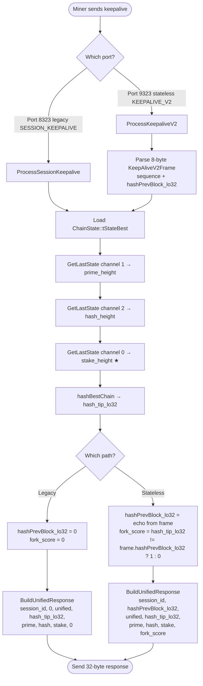
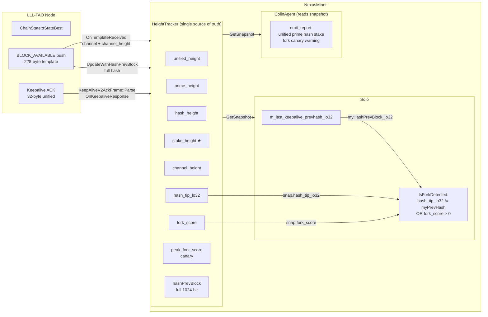
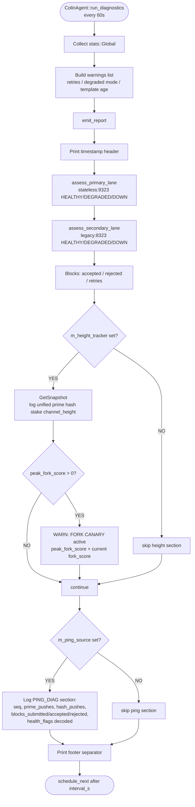

# Unified Keepalive Protocol — NexusMiner + LLL-TAO

**Status:** Current (as of 2026-02-26)  
**PRs:** LLL-TAO #299–302, NexusMiner #214–216  
**The Missing Piece Fixed:** `stake_height` tracking (was always 0 on stateless path before PR #299)

---

## Overview

The Nexus miner maintains session state with the node via periodic keepalive exchanges.
Before unification, the legacy port (8323) and stateless port (9323) sent **different packet formats**,
causing the miner's `HeightTracker` to have incomplete state — most critically, `stake_height` was
never populated on the stateless path.

After unification, **both ports send the same 32-byte packet** parsed by the same struct,
feeding the same `HeightTracker::OnKeepaliveResponse()` method, making `HeightTracker` the
single source of truth for all chain heights including stake.

---

## Diagram 1 — Unified Wire Format

```
┌─────────────────────────────────────────────────────────────────────────┐
│             UNIFIED KEEPALIVE ACK  (32 bytes, both ports)               │
├──────────┬────────────────────┬────────────┬───────────────────────────┤
│ Bytes    │ Field              │ Encoding   │ Notes                     │
├──────────┼────────────────────┼────────────┼───────────────────────────┤
│ [0-3]    │ session_id         │ LE uint32  │ Session validation        │
│ [4-7]    │ hashPrevBlock_lo32 │ BE uint32  │ Echo of miner fork canary │
│          │                    │            │ (0 on legacy path)        │
│ [8-11]   │ unified_height     │ BE uint32  │ Node's chain height       │
│ [12-15]  │ hash_tip_lo32      │ BE uint32  │ lo32 of hashBestChain     │
│          │                    │            │ (fork cross-check)        │
│ [16-19]  │ prime_height       │ BE uint32  │ Prime channel height      │
│ [20-23]  │ hash_height        │ BE uint32  │ Hash channel height       │
│ [24-27]  │ stake_height       │ BE uint32  │ ★ THE MISSING PIECE       │
│          │                    │            │ was ALWAYS 0 before PR#299│
│ [28-31]  │ fork_score         │ BE uint32  │ 0=healthy, >0=divergence  │
│          │                    │            │ (0 on legacy path)        │
└──────────┴────────────────────┴────────────┴───────────────────────────┘

  Note: nBits NOT included — miner reads difficulty from:
    1. 228-byte template push (CreateBlockForStatelessMining bakes nBits in)
    2. 12-byte GET_BLOCK / GET_ROUND response
```

---

## Diagram 2 — Node-Side Keepalive Flow (both ports)



---

## Diagram 3 — Miner-Side HeightTracker Data Flow



---

## Diagram 4 — ColinAgent Diagnostic Report Structure



---

## Diagram 5 — The Missing Piece: Stake Height Tracking Timeline

```
TIME ──────────────────────────────────────────────────────────────────────►

BEFORE PR #299–302 (broken state):
  Legacy port (8323):
    Session keepalive → BuildBestCurrentResponse (28b) → stake_height ✅ present
    But: miner parsed into KeepaliveTelemetrySnapshot (not HeightTracker!)
    Result: HeightTracker::stake_height ALWAYS = 0 ❌

  Stateless port (9323):
    KEEPALIVE_V2_ACK → KeepAliveV2AckFrame (32b with sequence) → stake_height ✅ present
    But: OnKeepaliveAck() did NOT update stake_height (field not in old call signature)
    Result: HeightTracker::stake_height ALWAYS = 0 ❌

  Colin report:
    stake=0 always — useless for diagnostics ❌

═══════════════════════════════════════════════════════════════════════════════

AFTER PR #299–302 / #214–216 (fixed state):
  Both ports:
    Keepalive → BuildUnifiedResponse (32b, session_id LE) → stake_height ✅
    → KeepAliveV2AckFrame::Parse() → OnKeepaliveResponse()
    → HeightTracker::stake_height = actual stake height ✅

  Colin report:
    Heights │ unified=6001 prime=451 hash=801 stake=999  (channel_height=801) ✅

  Fork detection:
    IsForkDetected(myPrevHash_lo32):
      hash_tip_lo32 (from ACK) != myPrevHash_lo32  →  fork!
      OR fork_score (from ACK) > 0                 →  fork!

  Peak fork canary:
    peak_fork_score = max(all fork_scores seen since start)
    is_fork_active() = peak_fork_score > 0
    Once triggered, NEVER resets — persistent warning in Colin report ✅
```

---

## Component Reference Table

| Component | File | Role |
|-----------|------|------|
| `BuildUnifiedResponse()` | `src/LLP/include/keepalive_v2.h` | NODE: builds 32-byte response for both ports |
| `ProcessSessionKeepalive()` | `src/LLP/stateless_miner.cpp` | NODE: legacy port keepalive handler |
| `ProcessKeepaliveV2()` | `src/LLP/stateless_miner.cpp` | NODE: stateless port keepalive handler |
| `KeepAliveV2AckFrame` (NODE) | `src/LLP/include/keepalive_v2.h` | NODE: struct + Serialize() |
| `KeepAliveV2AckFrame` (MINER) | `src/LLP/include/colin_ping_protocol.h` | MINER: struct + Parse() + IsForkDetected() |
| `HeightTracker::OnKeepaliveResponse()` | `src/protocol/src/protocol/height_tracker.cpp` | MINER: unified update for all 6 fields |
| `HeightTracker::Snapshot` | `src/protocol/inc/protocol/height_tracker.hpp` | MINER: snapshot struct (unified_height, prime_height, hash_height, **stake_height**, hash_tip_lo32, fork_score, peak_fork_score) |
| `ColinAgent::emit_report()` | `src/colin_agent.cpp` | MINER: reads HeightTracker snapshot, logs all heights + fork canary |
| `Solo::process_messages()` | `src/protocol/src/protocol/solo.cpp` | MINER: routes both keepalive paths → OnKeepaliveResponse() |

---

## What Was Deleted

| Deleted Component | Reason |
|-------------------|--------|
| `BuildBestCurrentResponse()` | Replaced by `BuildUnifiedResponse()` |
| `sequence` field in stateless ACK | Replaced by `session_id` (LE, consistent with legacy) |
| `nBits` in keepalive response | Miner reads from template / GET_BLOCK |
| `hashBestChain_prefix` (4 raw bytes) | Replaced by `hash_tip_lo32` |
| `OnKeepaliveAck()` | Replaced by `OnKeepaliveResponse()` |
| `OnLegacyKeepalive()` | Replaced by `OnKeepaliveResponse()` |
| `UpdateSource::KEEPALIVE_ACK` | Replaced by `UpdateSource::KEEPALIVE` |
| `UpdateSource::LEGACY_KEEPALIVE` | Replaced by `UpdateSource::KEEPALIVE` |
| `KeepaliveTelemetrySnapshot` | Replaced by `HeightTracker::Snapshot` |
| `KeepaliveTelemetryStore` | Replaced by `HeightTracker` |
| `keepalive_telemetry.hpp` | Entire file deleted |
| `ForkScoreSource` callback on ColinAgent | Colin reads directly from HeightTracker |
| `m_last_keepalive_fork_score` on Solo | Replaced by `HeightTracker::Snapshot::fork_score` |
| `static_assert(PAYLOAD_SIZE != 28, ...)` | No longer needed |

---

## Version History

| Version | Date | Change |
|---------|------|--------|
| 1.0 | 2026-02-26 | Initial unified protocol document (post PR #299–302, #214–216) |
