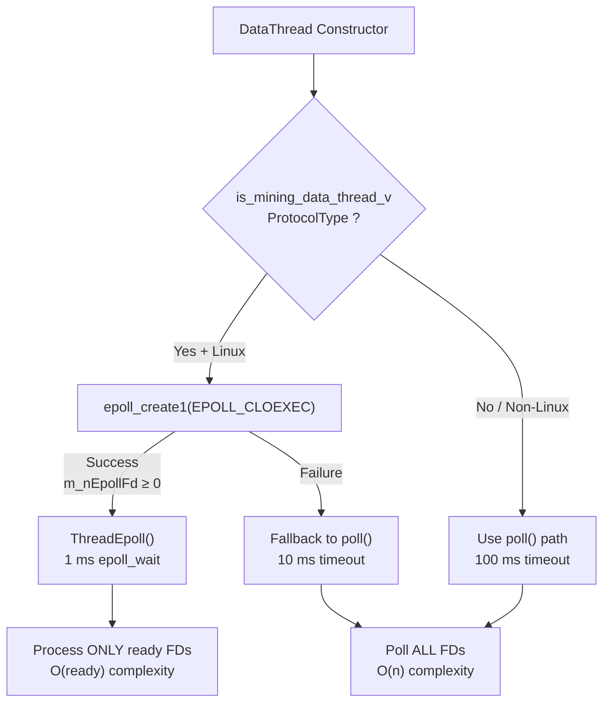
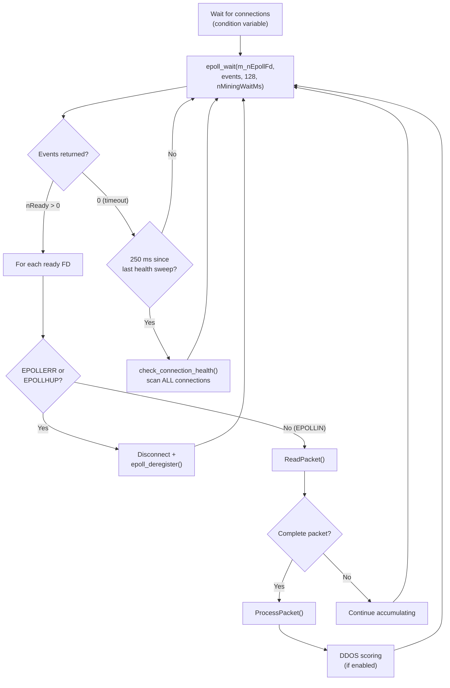
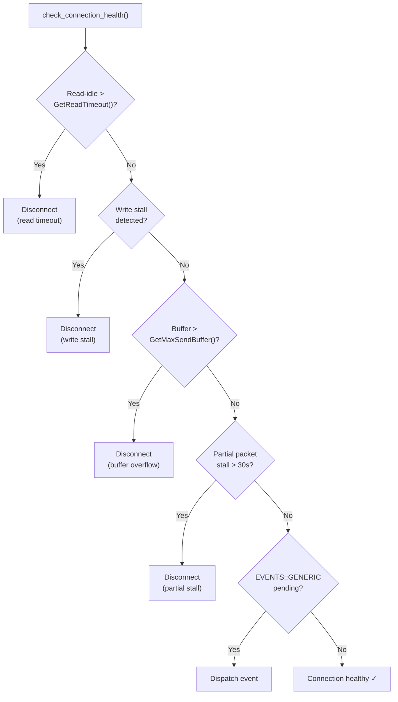

# Linux Epoll Mining Architecture

**Version:** LLL-TAO 5.1.0+ (PR #543)  
**Last Updated:** 2026-04-11  
**Status:** Production  
**Platform:** Linux only (poll() fallback on other platforms)

---

## 1. Problem Statement — Mining vs P2P Traffic Competition

Mining connections require **sub-millisecond I/O responsiveness** for block template
delivery.  When a new block is found, every connected miner must receive a fresh
template as quickly as possible — delays of even 10–50 ms can mean missed block
submissions on the Hash channel.

Prior to this work, mining connections shared the same `DataThread` I/O loop with
Tritium P2P peers and API clients.  That loop uses `poll()` with a **100 ms timeout**
and iterates over **all** file descriptors on every cycle — O(n) complexity regardless
of how many connections have actual data.

### Evidence of Starvation (PRs #504–#545)

The following issues were discovered and fixed during the investigation:

| PR   | Issue | Root Cause |
|------|-------|------------|
| #504 | Silent SUBMIT_BLOCK drop | DDOS threshold too low on port 8323 |
| #507 | Buffer overflow kills miners | 1 MB default buffer too small for mining |
| #509 | Silent drop at ~1 hour | POLL_EMPTY + TIMEOUT_WRITE kill authenticated miners |
| #510 | Silent connection drop | Missing flush after respond() |
| #511 | fBufferFull stale latch | CAS race in Socket write path |
| #512 | Flush contention | Retry sleep in respond() blocks DataThread |
| #528 | Hot-path dynamic_cast | dynamic_cast in DataThread tight loop (~µs per cast × N connections) |
| #536 | Push notification mutex contention | Socket mutex held during template build |
| #537 | Shadow ban | Infinite read-idle exemption for authenticated miners |
| #538 | Triple template storm | Redundant template generation on every tip change |
| #539 | GET_BLOCK floods | No rate limiting before database read |
| #540 | LLD reader contention | std::mutex blocks concurrent DB readers |
| #541 | Mining poll() too slow | 100 ms poll timeout inappropriate for mining |
| #543 | Full epoll implementation | poll() O(n) too slow at mining scale |
| #544 | FD leak into child processes | Missing CLOEXEC on sockets/epoll fds |
| #545 | Sync logic regressions | Leftover P2P debugging diagnostics |

These fixes progressively improved mining stability, but the fundamental issue
remained: **poll() is O(n) and 100 ms is too coarse for mining I/O.**

---

## 2. Why Epoll — and Why Linux Only

### 2.1 What epoll Provides

`epoll` is a Linux-specific I/O event notification facility (`<sys/epoll.h>`)
that provides:

- **O(ready)** complexity — only returns file descriptors with pending events
- **Edge/level triggered** modes — we use level-triggered (EPOLLIN)
- **Kernel-managed interest set** — no need to rebuild the FD set on every call
- **Sub-millisecond granularity** — `epoll_wait()` timeout in milliseconds

### 2.2 Why Not Cross-Platform

Other operating systems have equivalent mechanisms:

| OS | Mechanism | API |
|----|-----------|-----|
| Linux | epoll | `epoll_create1`, `epoll_ctl`, `epoll_wait` |
| BSD/macOS | kqueue | `kqueue`, `kevent` |
| Windows | IOCP | `CreateIoCompletionPort`, `GetQueuedCompletionStatus` |

Writing a full cross-platform async I/O layer would require:

1. **A complete `MiningSocket` subclass** with platform-specific backends
2. **Separate accept/connect/read/write paths** for each OS
3. **Testing matrix explosion** — Linux × macOS × Windows × mining × P2P
4. **~2000–3000 lines of new code** duplicating SSL termination, DDOS management,
   and connection lifecycle logic already battle-tested in the LLP framework

### 2.3 Decision

Use **epoll on Linux** (the production deployment target for Nexus NODE servers)
and **fall back to poll()** with a reduced 10 ms timeout on other platforms.

This gives **95%+ of the benefit** (all production mining runs on Linux) with
**~5% of the engineering cost** (~300 lines vs ~3000 lines).

---

## 3. Architecture — Dedicated Mining DataThread with Epoll

### 3.1 Compile-Time Trait Selection

Mining DataThreads are identified at compile time via a type trait in `data.h`:

```cpp
template <typename T>
inline constexpr bool is_mining_data_thread_v =
    std::is_same_v<T, Miner> ||
    std::is_same_v<T, StatelessMinerConnection>;
```

This trait gates:
- epoll file descriptor creation in the DataThread constructor
- Thread dispatch (ThreadEpoll vs Thread)
- Poll timeout selection (1 ms vs 100 ms)
- Mining-specific health check parameters

### 3.2 DataThread I/O Path Selection



### 3.3 ThreadEpoll Main Loop



### 3.4 Epoll Registration / Deregistration

When a miner connects:

1. `ListeningThread` calls `accept4(SOCK_CLOEXEC)` for the new socket
2. `DataThread::AddConnection()` stores the connection in the CONNECTIONS vector
3. `epoll_register(fd, slot)` calls `epoll_ctl(EPOLL_CTL_ADD, fd, {EPOLLIN, slot})`

When a miner disconnects:

1. `epoll_deregister(fd)` calls `epoll_ctl(EPOLL_CTL_DEL, fd, nullptr)`
2. Connection is removed from the CONNECTIONS vector
3. Slot is recycled

```cpp
// Registration (data.h)
void epoll_register(SOCKET nFd, uint32_t nSlot)
{
    if(m_nEpollFd >= 0 && nFd != INVALID_SOCKET)
    {
        struct epoll_event ev;
        ev.events  = EPOLLIN;
        ev.data.u32 = nSlot;  // Store CONNECTIONS vector index
        ::epoll_ctl(m_nEpollFd, EPOLL_CTL_ADD, (int)nFd, &ev);
    }
}

// Deregistration (data.h)
void epoll_deregister(SOCKET nFd)
{
    if(m_nEpollFd >= 0 && nFd != INVALID_SOCKET)
        ::epoll_ctl(m_nEpollFd, EPOLL_CTL_DEL, (int)nFd, nullptr);
}
```

### 3.5 Health Sweep

Every **250 ms**, `ThreadEpoll()` performs a full health sweep across ALL connections
(not just those with events).  This is shared with the poll() path via
`check_connection_health()`:



### 3.6 FD Close-on-Exec Hardening

All file descriptors in the mining I/O path use close-on-exec flags to prevent
leaks into child processes spawned by `std::system()` (e.g., `-blocknotify`):

| Location | Mechanism |
|----------|-----------|
| `epoll_create1()` | `EPOLL_CLOEXEC` flag |
| `socket()` | `SOCK_CLOEXEC` flag |
| `accept4()` | `SOCK_CLOEXEC` flag (with `ENOSYS` fallback) |
| Non-Linux fallback | `fcntl(fd, F_SETFD, FD_CLOEXEC)` |

---

## 4. Configuration Parameters

| Parameter | Default | Purpose |
|-----------|---------|---------|
| `-miningwait` | `1` (ms) | `epoll_wait()` timeout AND `poll()` fallback timeout for mining |
| `-miningthreads` | `8` | Number of mining DataThread instances |
| `-miningddos` | `false` | Enable DDOS scoring on mining connections |
| `-miningcscore` | `1` | DDOS connection score threshold |
| `-miningrscore` | `500` | DDOS request score threshold |
| `-miningtimespan` | `60` | DDOS time window (seconds) |
| `-miningtimeout` | `300` | Socket timeout (seconds); authenticated miners exempt |
| `-miningssl` | `false` | Enable SSL on mining ports |

**Non-mining DataThreads** continue to use a hardcoded **100 ms** poll timeout
(`DEFAULT_POLL_TIMEOUT_MS` in the anonymous namespace of `data.cpp`).

---

## 5. Instability Report — Current Risks and Future Considerations

### 5.1 Why Full Mining Socket Route May Still Be Needed

The epoll optimization addresses the **event detection layer** — which FDs have
data to read.  However, the mining DataThread still shares several components
with the broader LLP framework:

1. **CONNECTIONS vector** — Slot allocation uses `atomic_lock_unique_ptr`.  High
   connection churn (rapid connect/disconnect cycles) could cause spinlock contention
   between `ListeningThread` (adding) and `DataThread` (removing).

2. **FLUSH_THREAD** — The outgoing packet drain thread (via `DrainOutgoingQueue()`)
   is shared across all connection types.  Mining push notifications may be delayed
   if P2P traffic has large queued packets.  (Mitigated by PR #536: template build
   decoupled from socket write.)

3. **Health sweep cost** — Every 250 ms, ThreadEpoll scans ALL connections for health
   checks — O(n) where n = total mining connections.  At 500+ miners this becomes
   a significant scan per sweep.

4. **epoll_ctl thread safety** — `EPOLL_CTL_ADD` from ListeningThread and
   `EPOLL_CTL_DEL` from DataThread are concurrent.  Linux guarantees this is safe,
   but edge cases with rapid connect/disconnect cycles are untested at scale.

### 5.2 What a Full Mining Socket Route Would Look Like

A dedicated `MiningSocketServer` would own its own:

- **Accept loop** — Separate from LLP Server::ListeningThread
- **Connection storage** — No shared CONNECTIONS vector
- **Read/write buffers** — Independent of LLP Socket class
- **Event loop** — Standalone epoll/kqueue/IOCP per platform
- **SSL termination** — Separate from LLP SSL path

**Estimated cost:** ~2000–3000 lines of new code.

**What you lose:** LLP's battle-tested connection lifecycle, DDOS management,
health checks, graceful shutdown integration, and the `BaseConnection` outgoing
queue system.

### 5.3 When to Escalate

Monitor the epoll path in production.  Consider escalating to the full mining
socket route if miners report:

- **Latency spikes >10 ms** at the 99th percentile for template delivery
- **Connection churn** causing CONNECTIONS vector spinlock contention
- **FLUSH_THREAD stalls** delaying mining push notifications

### 5.4 Non-Linux Platforms

Non-Linux platforms (macOS, Windows) receive the **poll() fallback** with a
reduced **10 ms timeout** (configurable via `-miningwait`).  This is acceptable
for development and testing but is **not recommended for production mining**.

Production mining nodes should run on **Linux** to benefit from the epoll
optimization.

---

## 6. Source Files

| File | Component |
|------|-----------|
| `src/LLP/templates/data.h` | `is_mining_data_thread_v` trait, `m_nEpollFd`, `epoll_register()`, `epoll_deregister()`, `ThreadEpoll()` declaration, `check_connection_health()` declaration |
| `src/LLP/data.cpp` | `ThreadEpoll()` implementation (~280 lines), `check_connection_health()` implementation, epoll constructor/destructor logic |
| `src/LLP/server.cpp` | `accept4(SOCK_CLOEXEC)` in ListeningThread |
| `src/LLP/socket.cpp` | `SOCK_CLOEXEC` on outgoing sockets |
| `src/LLP/include/mining_constants.h` | `DEFAULT_MINING_POLL_TIMEOUT_MS` (fallback) |

---

## 7. Related Documentation

- [Dedicated DataThread Decision Record](dedicated-datathread-decision.md)
- [Epoll vs Poll Architecture Diagrams](../../diagrams/mining/epoll-vs-poll-architecture.md)
- [Health Check Flow Diagram](../../diagrams/mining/health-check-flow.md)
- [Mining Server Architecture](mining-server.md)
- [Unified Mining Server Architecture](../../design/unified-mining-server-architecture.md)
- [Recent Changes Summary](recent-changes-summary.md)
- [Known Risks and Limitations](known-risks-and-limitations.md)
