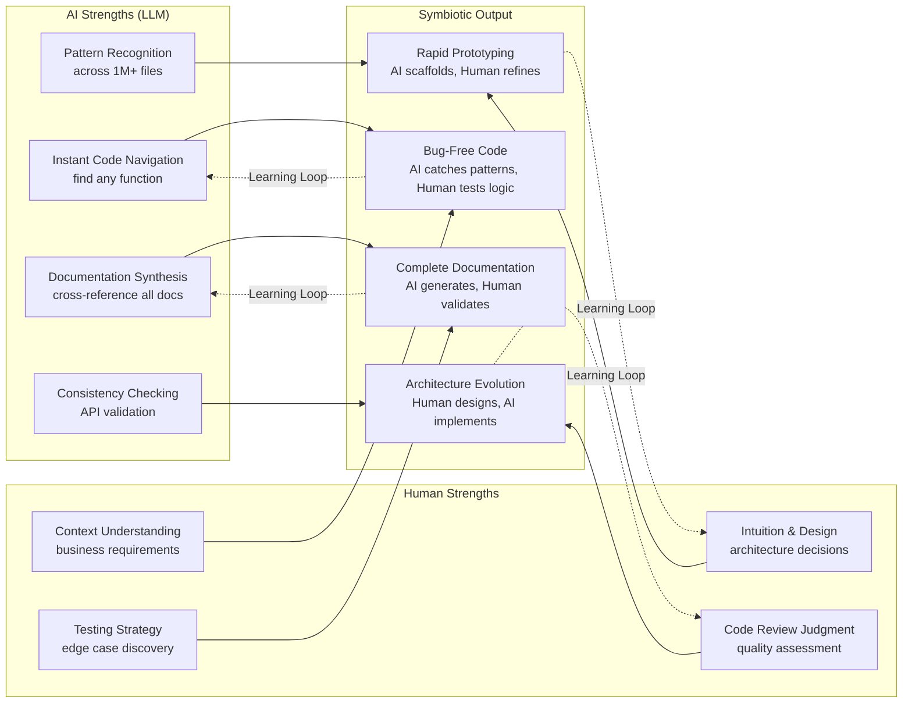
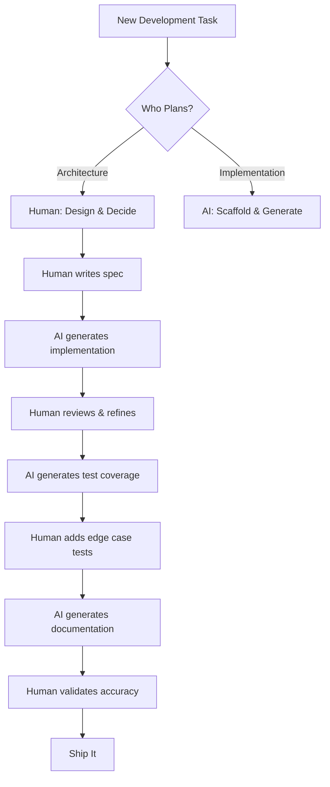

# AI-Human Symbiotic Link

Diagram showing the complementary strengths of AI and human developers working together on the Nexus codebase.

---

## AI-Human Strengths & Symbiotic Output

---

## Collaboration Workflow

---

## When to Use AI vs Human Judgment

| Task | AI | Human | Together |
|------|-----|-------|----------|
| Find all usages of a function | ✅ Fast & complete | ❌ Slow & error-prone | AI finds, Human analyzes |
| Design new API endpoint | ❌ Lacks context | ✅ Understands requirements | Human designs, AI implements |
| Write boilerplate code | ✅ Consistent & fast | ❌ Tedious & error-prone | AI generates, Human reviews |
| Security review | ⚠️ Pattern-based only | ✅ Contextual reasoning | AI flags, Human validates |
| Cross-reference documentation | ✅ Instant & thorough | ❌ Time-consuming | AI synthesizes, Human verifies |
| Debug complex race condition | ❌ Limited reasoning | ✅ Intuition & experience | AI traces, Human diagnoses |

---

## Cross-References

- [Learning Pathways](learning-pathways.md)
- [Common Tasks Cheat Sheet](cheat-sheets/common-tasks.md)
- [AI-Assisted Onboarding](../../onboarding/ai-assisted-onboarding.md)
- [AI-Human Advancement Thesis](../../philosophy/ai-human-advancement.md)
