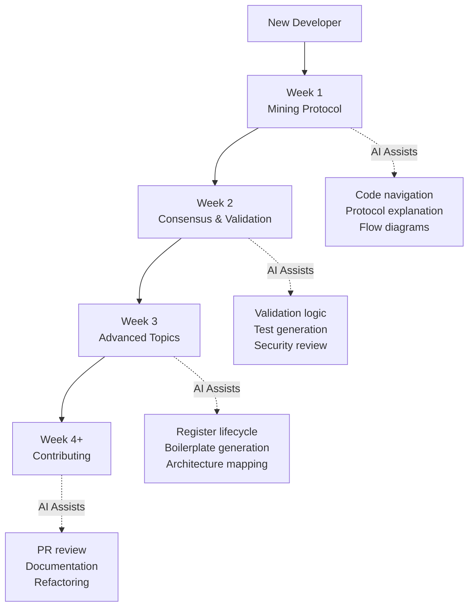

# Learning Pathways

How to use AI to master the Nexus LLL-TAO codebase progressively.

---

## Learning Path Overview

---

## Week 1: Mining Protocol (with AI)

### Learning Goals
- Understand the LLP mining protocol flow
- Learn push notification mechanics
- Explore Legacy vs Stateless protocol differences

### AI-Assisted Steps

1. **Ask AI:** "Explain the LLP mining protocol flow in LLL-TAO"
   - AI will trace through `src/LLP/` and reference protocol docs
   - Review the [Mining Flow Diagram](../architecture/mining-flow-complete.md)

2. **Ask AI:** "Show me push notification implementation"
   - AI will locate `src/LLP/include/push_notification.h`
   - Review the [Push Notification Flow](../push-notification-flow.md)

3. **Human:** Test mining on testnet, verify AI's explanation matches behavior

4. **Together:** Identify optimization opportunities in the mining loop

---

## Week 2: Consensus & Validation

### Learning Goals
- Understand block validation pipeline
- Learn consensus channel differences (PoS, Prime, Hash)
- Explore transaction verification

### AI-Assisted Steps

1. **AI:** Generate flowchart of block validation
   - Review [Consensus Validation Flow](../architecture/consensus-validation-flow.md)

2. **Human:** Review for security edge cases AI might miss

3. **AI:** Find all validation checks in codebase
   - Ask: "List all block validation checks in `src/TAO/Ledger/tritium.cpp`"

4. **Human:** Add missing test cases for edge conditions

---

## Week 3: Advanced Topics

### Learning Goals
- Map the TAO register lifecycle
- Understand trust scoring and peer management
- Learn the Falcon authentication system

### AI-Assisted Steps

1. **AI:** Map entire TAO register lifecycle
   - Review [Ledger State Machine](../architecture/ledger-state-machine.md)

2. **Human:** Design a new register type (if applicable)

3. **AI:** Generate boilerplate implementation matching existing patterns

4. **Human:** Refine, optimize, and add comprehensive tests

---

## Week 4+: Contributing

### Learning Goals
- Submit quality pull requests
- Write documentation that helps future developers
- Maintain code consistency

### AI-Assisted Steps

1. **AI:** Review PR for consistency with codebase style
2. **Human:** Verify business logic and security implications
3. **AI:** Generate documentation for new features
4. **Human:** Validate accuracy and add context

---

## Quick Reference: AI Prompts by Topic

| Topic | Effective AI Prompt |
|-------|-------------------|
| Mining | "Trace the mining flow from MINER_AUTH to BLOCK_ACCEPTED" |
| Validation | "What validation checks does TritiumBlock::Check() perform?" |
| Registers | "Explain the TAO register state transitions" |
| Trust | "How is peer trust score calculated in trust_address.cpp?" |
| Auth | "Walk through the Falcon handshake sequence" |
| Packets | "Compare Legacy and Stateless packet formats" |

---

## Cross-References

- [AI-Human Simlink](ai-human-simlink.md)
- [Common Tasks Cheat Sheet](cheat-sheets/common-tasks.md)
- [AI-Assisted Onboarding](../../onboarding/ai-assisted-onboarding.md)
