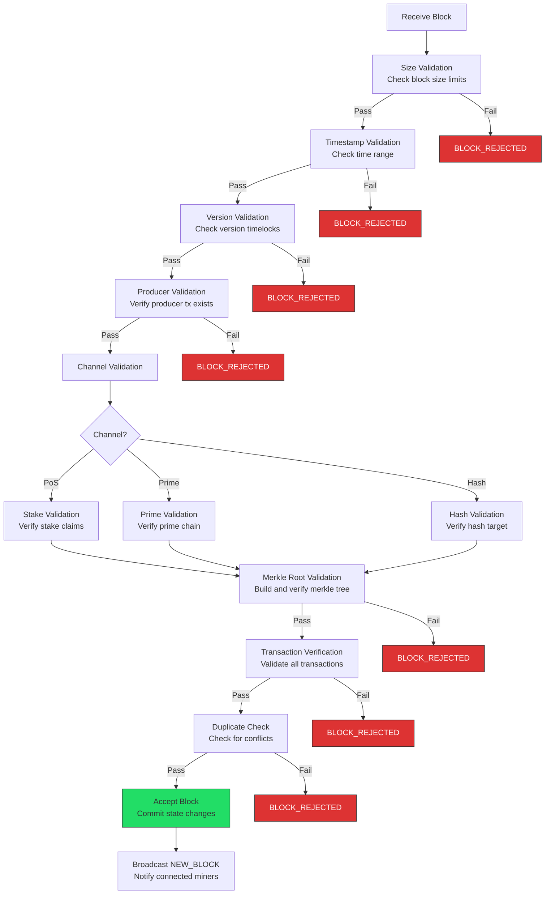
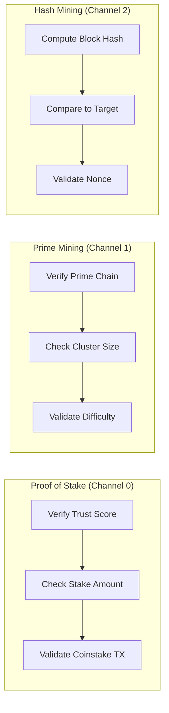
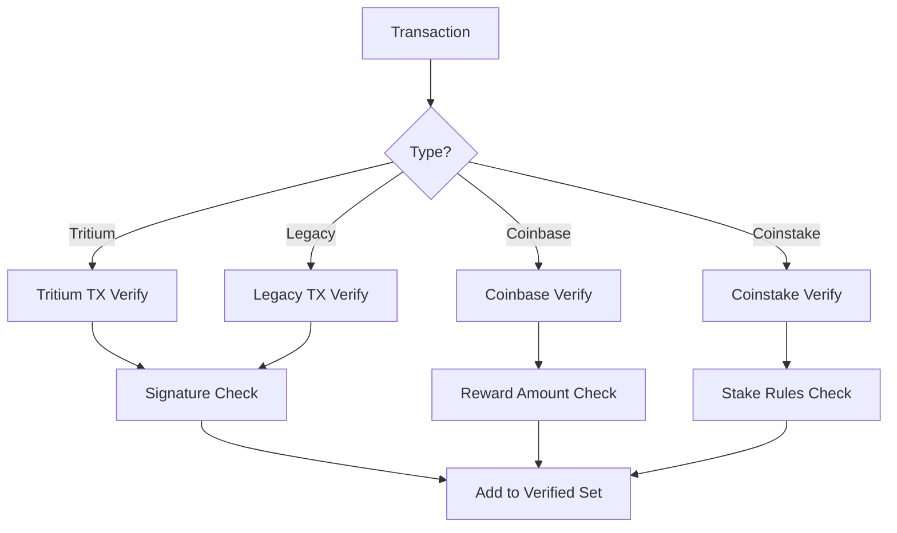

# Block Validation Pipeline

Diagrams showing how incoming blocks are validated before acceptance into the blockchain.

---

## Complete Block Validation Flow

---

## Consensus Channels

---

## Transaction Verification Detail

---

## Cross-References

- [Mining Flow](mining-flow-complete.md)
- [Ledger State Machine](ledger-state-machine.md)
- [Opcodes Reference](../../reference/opcodes-reference.md)
- Source: `src/TAO/Ledger/tritium.cpp`
