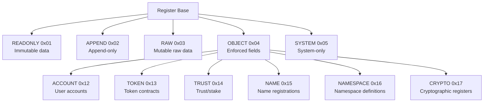
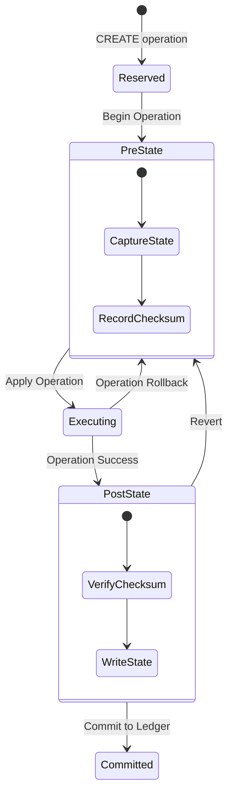
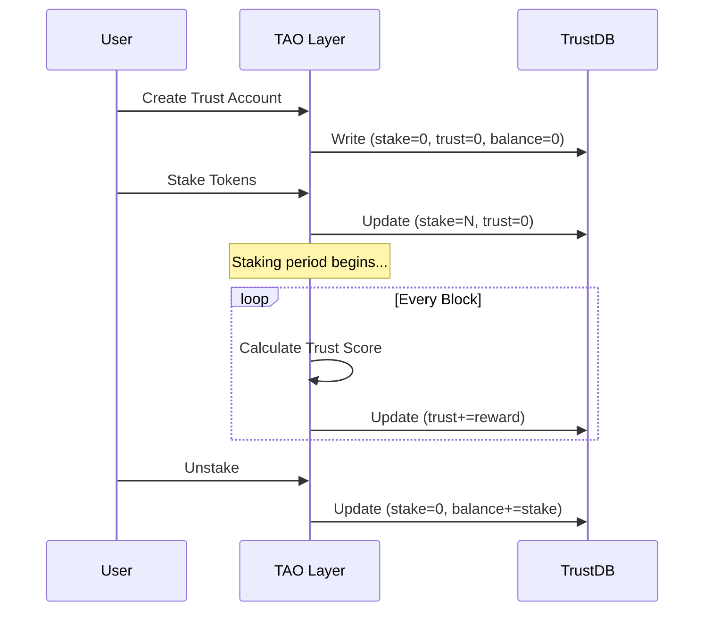
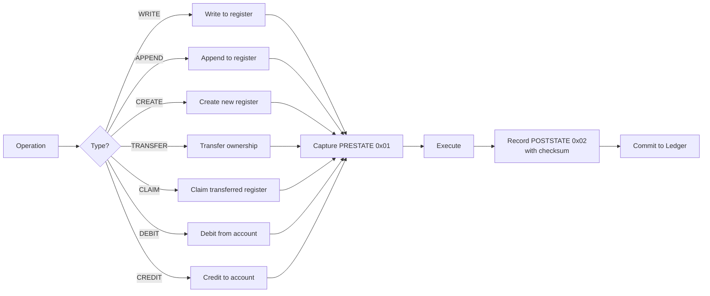

# TAO Register State Transitions

Diagrams showing the lifecycle and state transitions of Nexus TAO registers.

---

## Register Type Hierarchy

---

## Register Operation State Machine

---

## Trust Register Lifecycle

---

## Register Operation Flow

---

## Cross-References

- [Consensus Validation](consensus-validation-flow.md)
- [State Machine Templates](../state-machine.md)
- Source: `src/TAO/Register/include/enum.h`
