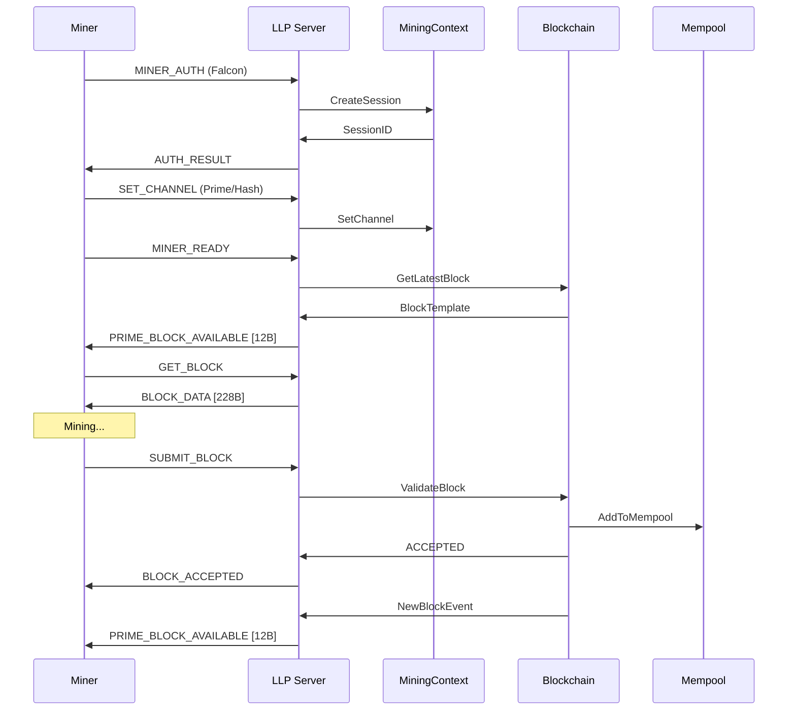
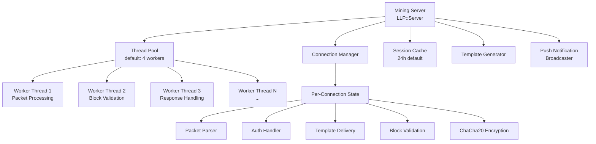
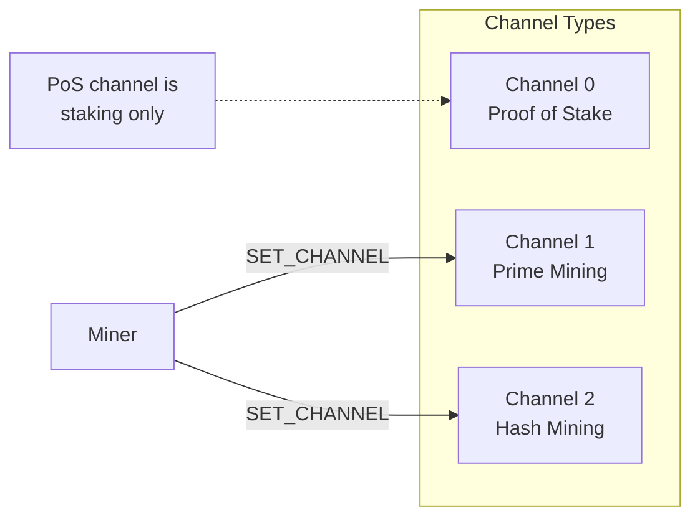

# End-to-End Mining Lifecycle

Complete sequence diagram showing the full mining lifecycle from authentication through block submission and new block notification.

---

## Stateless Tritium Mining Protocol Flow



---

## Mining Thread Model



---

## Mining Channel Selection



---

## Push Notification Payload (12 bytes)

Both Legacy and Stateless lanes use the same format:

```
Offset   Field              Type        Description
──────   ─────              ────        ───────────
[0-3]    nUnifiedHeight     uint32 BE   Blockchain height
[4-7]    nChannelHeight     uint32 BE   Channel-specific height
[8-11]   nBits              uint32 BE   Difficulty target
```

---

## Cross-References

- [Push Notification Flow](../push-notification-flow.md)
- [Mining Protocol](../../protocol/mining-protocol.md)
- [Opcodes Reference](../../reference/opcodes-reference.md)
- [Mining Server](../../current/mining/mining-server.md)
