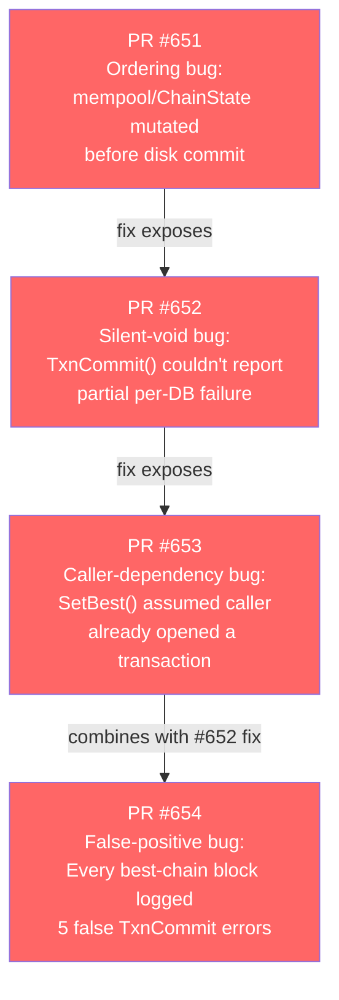
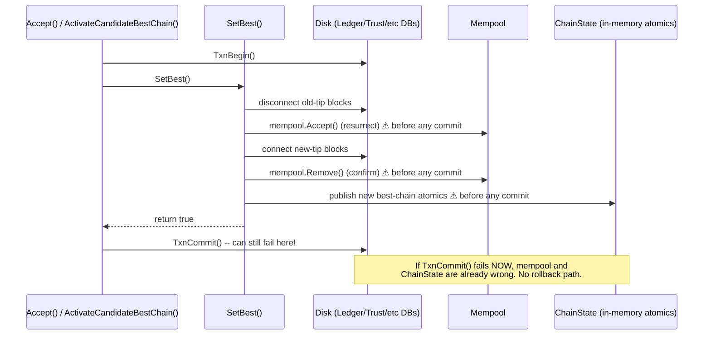
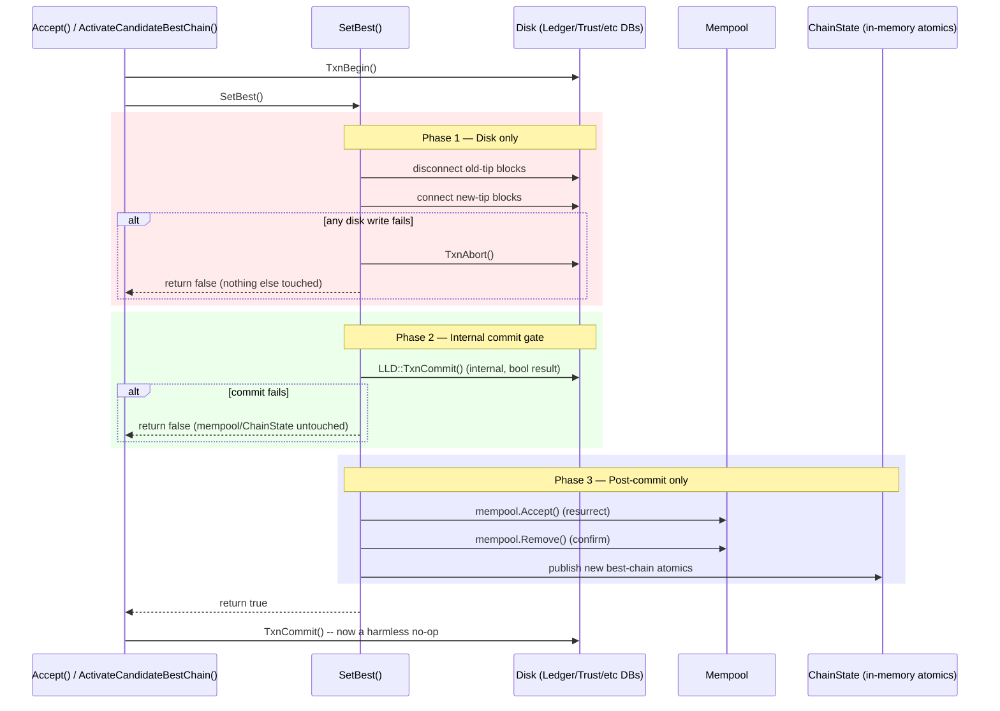
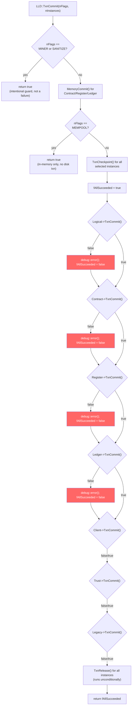
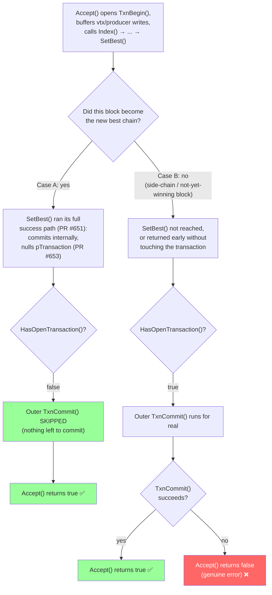
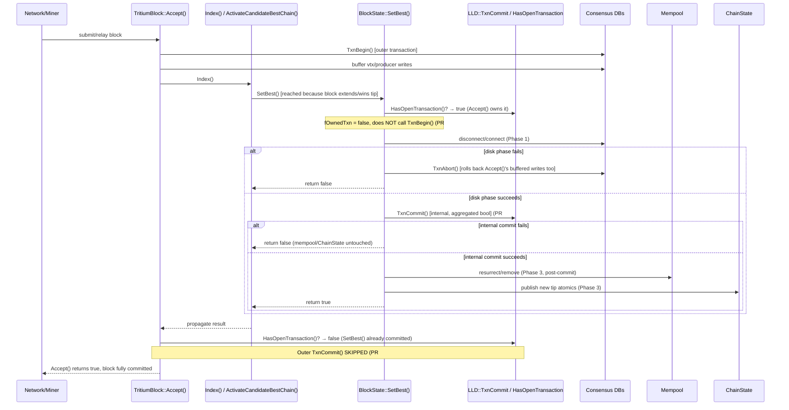

# RC13 Diagrams: `SetBest()` Transaction Boundary

Companion diagrams for
[`docs/release/rc13-transactional-chain-transition-fixes.md`](../../release/rc13-transactional-chain-transition-fixes.md),
covering the four interlocking fixes shipped in
[nexus-node-v5.1.0-localhost-prime-cpu-rc13](https://github.com/NamecoinGithub/LLL-TAO/releases/tag/nexus-node-v5.1.0-localhost-prime-cpu-rc13-linux-x86_64)
(PRs [#651](https://github.com/NamecoinGithub/LLL-TAO/pull/651),
[#652](https://github.com/NamecoinGithub/LLL-TAO/pull/652),
[#653](https://github.com/NamecoinGithub/LLL-TAO/pull/653),
[#654](https://github.com/NamecoinGithub/LLL-TAO/pull/654)) and referenced from
[Nexusoft/LLL-TAO#254](https://github.com/Nexusoft/LLL-TAO/issues/254).

---

## 1. Bug chain overview



---

## 2. PR #651 — Before/After: mempool mutation timing

### Before (bug): mempool/ChainState mutated before any commit



### After (fixed): three strict phases, commit gates everything else



---

## 3. PR #652 — `TxnCommit()` return-value aggregation



**Key point:** every instance is attempted regardless of an earlier failure (no
short-circuit) — a partial-failure scenario (e.g. Trust DB fails, Ledger DB succeeds)
now returns `false` overall instead of being silently swallowed, and no instance is
skipped just because an earlier one failed.

---

## 4. PR #653 — Self-contained transaction ownership

```mermaid
stateDiagram-v2
    [*] --> CheckOwnership: SetBest() called

    CheckOwnership --> CallerOwns: HasOpenTransaction() == true\n(caller already did TxnBegin())
    CheckOwnership --> SelfOwns: HasOpenTransaction() == false\n(fOwnedTxn = true)

    SelfOwns --> TxnBeginSelf: SetBest() calls TxnBegin() itself

    CallerOwns --> DiskPhase
    TxnBeginSelf --> DiskPhase

    DiskPhase --> Success: all disk writes succeed
    DiskPhase --> Failure: any disk write fails

    Failure --> AbortAlways: TxnAbort() called\nunconditionally
    AbortAlways --> CallerOwnedAbort: if CallerOwns,\nrolls back caller's\nbuffered writes too
    AbortAlways --> SelfOwnedAbort: if SelfOwns,\nrolls back only\nSetBest()'s own writes
    CallerOwnedAbort --> ReturnFalse: return false\n(caller's own TxnAbort()\nbecomes safe no-op)
    SelfOwnedAbort --> ReturnFalse

    Success --> InternalCommit: LLD::TxnCommit()\n(nulls pTransaction)
    InternalCommit --> PostCommit: mempool + ChainState mutations
    PostCommit --> ReturnTrue: return true

    ReturnFalse --> [*]
    ReturnTrue --> [*]
```

**Why `SetBest()` can't just always call `TxnBegin()`:** `SectorDatabase::TxnBegin()`
deletes any existing `pTransaction` before creating a new one. If a caller like
`TritiumBlock::Accept()` already buffered vtx/producer writes in an open transaction,
an unconditional `TxnBegin()` inside `SetBest()` would silently discard them. The
`fOwnedTxn` check exists specifically to avoid that.

---

## 5. PR #654 — Case A vs Case B: why the outer `TxnCommit()` needs a guard



### Before PR #654 (bug): Case A treated as a failure

```
if(!LLD::TxnCommit())
    return debug::error(FUNCTION, "disk transaction commit failed for block acceptance");
```
Every Case A block (the common, successful path!) hit this because
`TxnCommit()` correctly returns `false` for "nothing to commit" — but the code
couldn't tell that apart from a real failure. Result: 5 error logs + `false` return on
every accepted best-chain block.

### After PR #654 (fixed): guarded with `HasOpenTransaction()`

```
if(LLD::HasOpenTransaction() && !LLD::TxnCommit())
    return debug::error(FUNCTION, "disk transaction commit failed for block acceptance");
```
Now Case A (`HasOpenTransaction() == false`) short-circuits past the check entirely,
and only Case B's real commit failures are treated as errors.

---

## 6. End-to-end timeline across all four PRs (single block acceptance)



---

## Related documents

- [`docs/release/rc13-transactional-chain-transition-fixes.md`](../../release/rc13-transactional-chain-transition-fixes.md) — full teaching write-up
- [Nexusoft/LLL-TAO#254](https://github.com/Nexusoft/LLL-TAO/issues/254)
