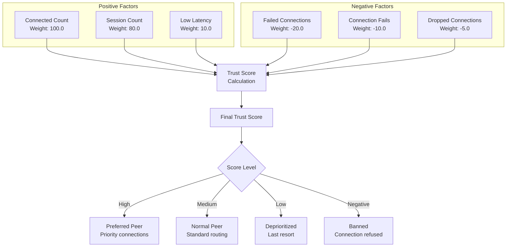
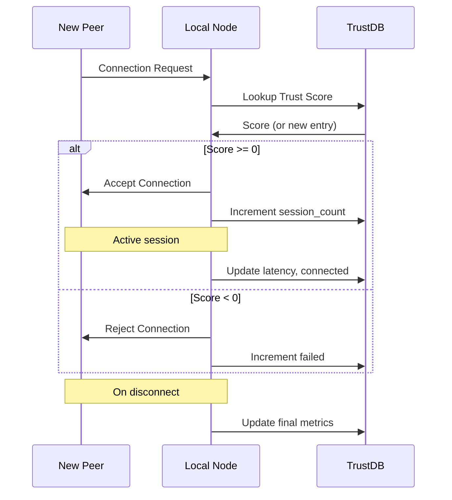
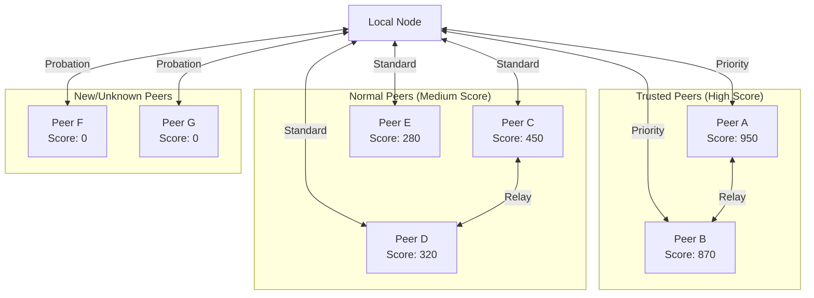

# Peer Reputation & Trust Network Topology

Diagrams showing how the Nexus peer trust system evaluates and ranks network peers.

---

## Trust Score Calculation



---

## Trust Score Formula

```
Score = (100.0 × min(connected, max_connected))
      + ( 80.0 × session_count)
      + ( 10.0 × (max_latency - actual_latency))
      - ( 20.0 × min(failed, max_failed))
      - ( 10.0 × min(fails, max_fails))
      - (  5.0 × min(dropped, max_dropped))
```

---

## Peer Discovery & Connection Lifecycle



---

## Network Topology View



---

## Cross-References

- [Consensus Validation](consensus-validation-flow.md)
- [Architecture Boxes](../architecture-boxes.md)
- Source: `src/LLP/trust_address.cpp`
