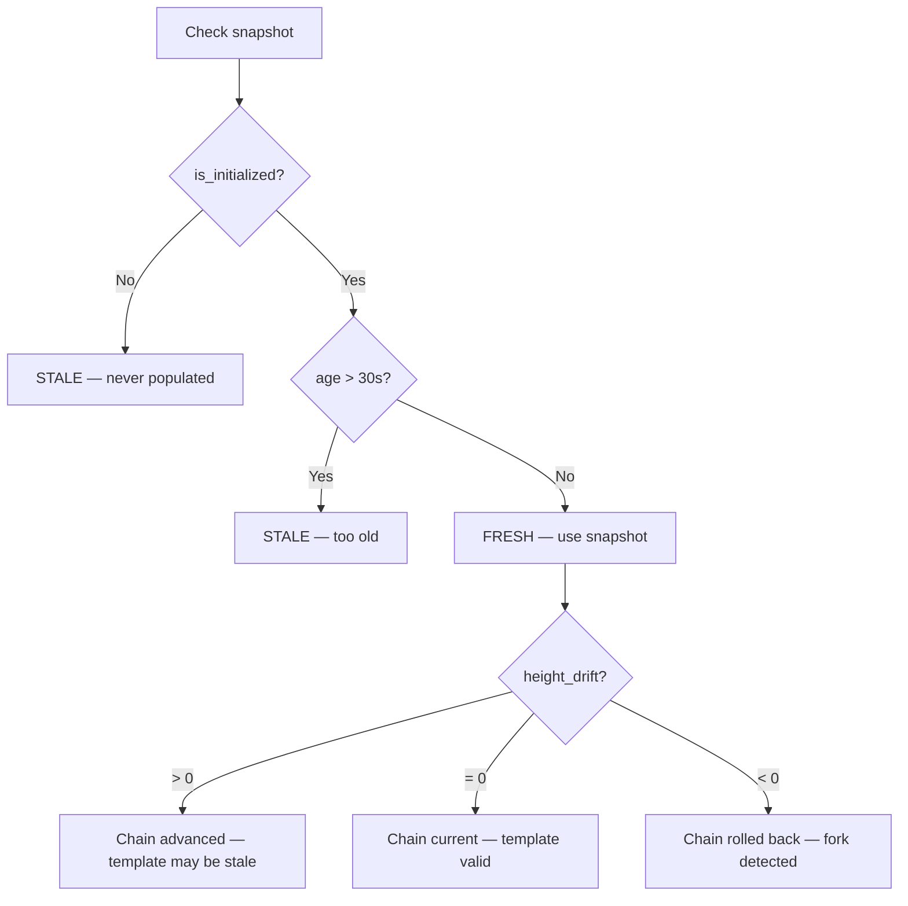

# CanonicalChainState — Data Flow & Integration Diagram

Architectural diagrams showing how `CanonicalChainState` integrates into
the Nexus mining template-serving pipeline.

---

## 1. Snapshot Lifecycle

```mermaid
stateDiagram-v2
    [*] --> Default : struct constructed
    Default --> Initialized : from_chain_state()
    Initialized --> Fresh : age ≤ 30s
    Fresh --> Stale : age > 30s
    Stale --> Initialized : from_chain_state() (refresh)
    Initialized --> DriftPositive : chain advanced
    Initialized --> DriftNegative : chain rolled back (reorg)
    DriftPositive --> Initialized : acknowledged
    DriftNegative --> Initialized : fork handled
```

```
           ┌─────────────┐
           │   DEFAULT    │  canonical_unified_height = 0
           │  (all zero)  │  is_initialized() → false
           └──────┬───────┘  is_canonically_stale() → true
                  │
                  │ from_chain_state(stateBest, stateChannel, nBits)
                  ▼
           ┌─────────────┐
           │ INITIALIZED  │  canonical_unified_height > 0
           │   (FRESH)    │  is_initialized() → true
           └──┬───────┬───┘  is_canonically_stale() → false
              │       │
    age > 30s │       │ chain moves
              ▼       ▼
       ┌──────────┐  ┌──────────────────────┐
       │  STALE   │  │ DRIFT DETECTED       │
       │ (aged)   │  │ drift > 0: advance   │
       └──────────┘  │ drift < 0: reorg     │
                     │ drift = 0: current   │
                     └──────────────────────┘
```

---

## 2. Template-Serving Pipeline Integration

```
  NexusMiner                        Nexus Node
  ═════════                         ═════════════════════════════════════

  MINER_READY ─────────────────────→ ┌───────────────────────────┐
                                     │ SendStatelessTemplate()    │
                                     │                            │
                                     │ 1. tStateBest.load()       │
                                     │ 2. GetLastState(channel)   │
                                     │ 3. GetNextTargetRequired() │
                                     │                            │
                                     │ 4. ╔═══════════════════╗   │
                                     │    ║ CanonicalChainState║   │
                                     │    ║ from_chain_state() ║   │
                                     │    ╚═══════════════════╝   │
                                     │                            │
                                     │ 5. new_block()             │
                                     │ 6. Serialize 228 bytes     │
                                     └────────────┬──────────────┘
                                                  │
  ←──── 0xD081 BLOCK_DATA ────────────────────────┘
        [12-byte meta + 216-byte template]


  GET_BLOCK ───────────────────────→ ┌───────────────────────────┐
                                     │ GET_BLOCK Handler          │
                                     │                            │
                                     │ 1. new_block()             │
                                     │ 2. Serialize()             │
                                     │ 3. GetLastState(channel)   │
                                     │ 4. nBits from pBlock       │
                                     │                            │
                                     │ 5. ╔═══════════════════╗   │
                                     │    ║ CanonicalChainState║   │
                                     │    ║ from_chain_state() ║   │
                                     │    ╚═══════════════════╝   │
                                     │                            │
                                     │ 6. Build 228-byte payload  │
                                     └────────────┬──────────────┘
                                                  │
  ←──── BLOCK_DATA ───────────────────────────────┘
        [12-byte meta + 216-byte template]
```

---

## 3. Relationship to Existing Chain-State Types

```
┌─────────────────────────────────────────────────────────────────┐
│                    Blockchain (TAO::Ledger)                      │
│                                                                  │
│  ChainState::tStateBest ──────── atomic BlockState               │
│  ChainState::hashBestChain ──── uint1024_t (tip hash)           │
│  ChainState::nBestHeight ────── uint32_t (tip height)           │
└──────────────┬──────────────────────────────────────────────────┘
               │
               │ .load() — atomic snapshot
               ▼
┌──────────────────────────────────────────────────────────────────┐
│                     LLP Layer (Mining)                            │
│                                                                   │
│  ┌─────────────────────────┐  ┌──────────────────────────┐       │
│  │  CanonicalChainState    │  │  TemplateMetadata         │       │
│  │  ─────────────────────  │  │  ──────────────────────   │       │
│  │  Whole-chain snapshot   │  │  Per-template snapshot    │       │
│  │  at push/GET time       │  │  at creation time         │       │
│  │                         │  │                           │       │
│  │  unified_height         │  │  nHeight (unified)        │       │
│  │  channel_height         │  │  nChannelHeight           │       │
│  │  difficulty_nbits       │  │  hashBestChainAtCreation  │       │
│  │  hash_prev_block        │  │  hashMerkleRoot           │       │
│  │  received_at            │  │  nCreationTime            │       │
│  └─────────────────────────┘  └──────────────────────────┘       │
│                                                                   │
│  ┌─────────────────────────┐  ┌──────────────────────────┐       │
│  │  HeightInfo             │  │  ColinMiningAgent         │       │
│  │  ─────────────────────  │  │  ──────────────────────   │       │
│  │  Full diagnostic view   │  │  Periodic health reports  │       │
│  │  from ChannelStateMgr   │  │  per-miner telemetry      │       │
│  │                         │  │                           │       │
│  │  nUnifiedHeight         │  │  MinerStats (per miner)   │       │
│  │  nChannelHeight         │  │  GlobalStats (all miners) │       │
│  │  nNextUnifiedHeight     │  │  PingFrame / PongRecord   │       │
│  │  fForkDetected          │  │  Dedup cache              │       │
│  └─────────────────────────┘  └──────────────────────────┘       │
│                                                                   │
└──────────────────────────────────────────────────────────────────┘
```

---

## 4. Wire Format — 12-Byte Metadata Prefix

The canonical snapshot's values are serialized into the 12-byte metadata
prefix that precedes every 216-byte block template:

```
 Byte offset
 ┌────┬────┬────┬────┬────┬────┬────┬────┬────┬────┬────┬────┐
 │  0 │  1 │  2 │  3 │  4 │  5 │  6 │  7 │  8 │  9 │ 10 │ 11 │
 ├────┴────┴────┴────┼────┴────┴────┴────┼────┴────┴────┴────┤
 │ unified_height    │ channel_height    │ difficulty_nbits  │
 │ (big-endian u32)  │ (big-endian u32)  │ (big-endian u32)  │
 │                   │                   │                   │
 │ ← from canonical_ │ ← from canonical_ │ ← from canonical_ │
 │    unified_height │    channel_height │    difficulty_    │
 │                   │                   │    nbits          │
 └───────────────────┴───────────────────┴───────────────────┘

 Followed by 216-byte serialized TritiumBlock = 228 bytes total
```

---

## 5. Staleness Decision Flow



```
  CanonicalChainState snap = ...;

  is_initialized()?
       │
       ├── NO  → STALE (return true)
       │
       └── YES → age > CANONICAL_STALE_SECONDS (30s)?
                     │
                     ├── YES → STALE (return true)
                     │
                     └── NO  → FRESH (return false)
                                 │
                                 └── height_drift_from_canonical()
                                       │
                                       ├── > 0  chain advanced
                                       ├── = 0  chain current
                                       └── < 0  chain rolled back
```
