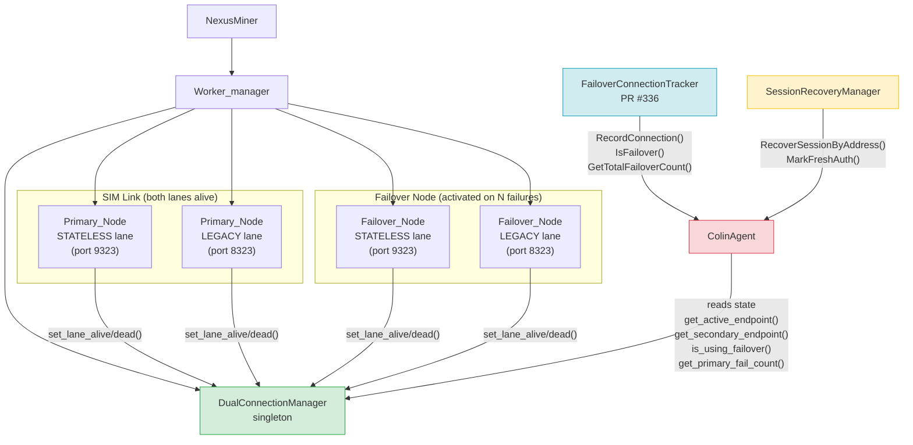

# Dual-Connection Architecture

Component architecture diagram for the NexusMiner dual-connection / SIM Link / failover subsystem.

## Component Responsibilities

| Component | Responsibility |
|-----------|---------------|
| `Worker_manager` | Manages worker threads, block template distribution, and connection lifecycle. Calls `set_lane_alive/dead()` and `set_failover_active()`. |
| `DualConnectionManager` | Singleton that tracks lane health (STATELESS/LEGACY), failover state, active endpoint, and fail count. Source of truth for all failover decisions. |
| `FailoverConnectionTracker` (PR #336) | Node-side tracker recording which incoming connections originated from a failover switch. Used for Colin reporting of total failover events. |
| `SessionRecoveryManager` | Tracks `SessionRecoveryData` per miner address; `fFreshAuth` flag set after a confirmed failover Falcon handshake. |
| `ColinAgent` | Periodic reporting agent that reads from all three managers to emit the `COLIN NODE MINING REPORT`. |
| Primary / Failover Nodes | Remote Nexus nodes; miner connects to both STATELESS (9323) and LEGACY (8323) ports simultaneously when SIM Link is active. |

## Data Flow

1. `Worker_manager` maintains persistent TCP connections to both ports of the active node (SIM Link).
2. On connection failure, `set_lane_dead()` updates `DualConnectionManager`; `retry_connect()` begins backoff.
3. When `get_primary_fail_count() ≥ N`, `set_failover_active(true, failover_ip)` switches the active endpoint.
4. A fresh Falcon handshake is performed on the failover node; `SessionRecoveryManager.MarkFreshAuth()` is called.
5. `ColinAgent` reads the unified state on each report cycle and formats the `COLIN NODE MINING REPORT`.
