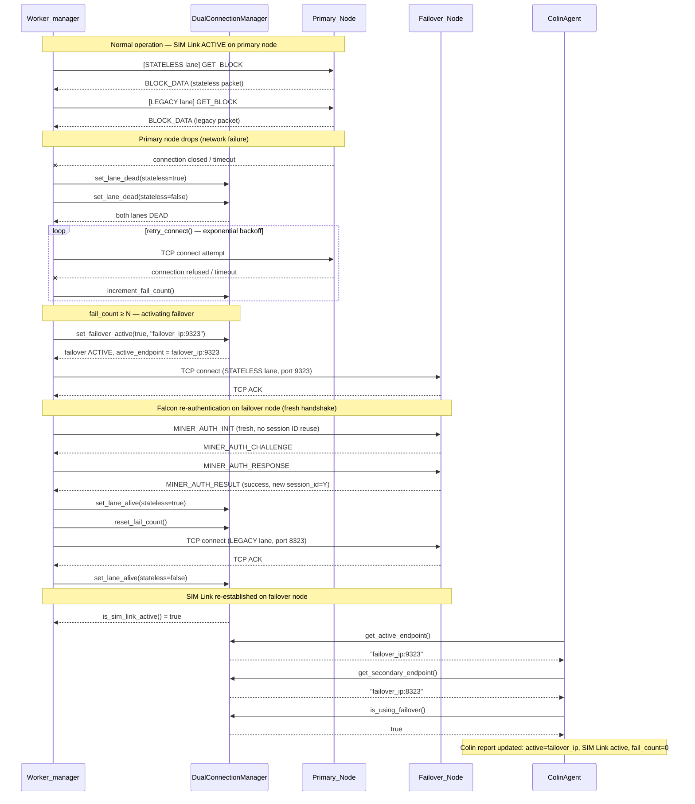

# Failover Event Sequence

Mermaid sequence diagram showing the full failover event sequence from primary node failure through reconnection on the failover node.

## Key Points

- **No session ID reuse**: The failover node issues a brand-new session ID (`Y ≠ X`). The miner must perform a full `MINER_AUTH_INIT` handshake — see [falcon-reauth-failover.md](falcon-reauth-failover.md) for details.
- **Fail counter reset**: `reset_fail_count()` is called as soon as the failover connection is established and authenticated.
- **Colin reporting**: `ColinAgent` reads state from `DualConnectionManager` on each report cycle, so the transition is automatically reflected in the next report.
- **SIM Link re-establishment**: The LEGACY lane reconnects independently after the STATELESS lane is authenticated; `is_sim_link_active()` becomes `true` once both lanes are alive.
