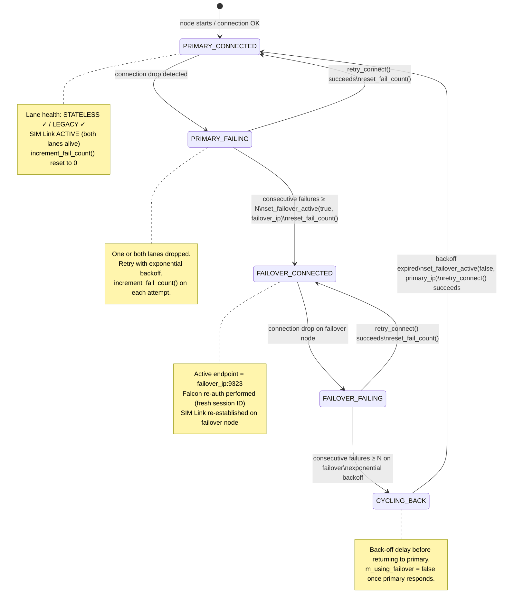

# Failover State Machine

Mermaid state diagram showing the mining-node failover state machine.

## State Descriptions

| State | Description |
|-------|-------------|
| `PRIMARY_CONNECTED` | Miner is connected to the primary node. SIM Link active when both STATELESS (9323) and LEGACY (8323) lanes are alive. |
| `PRIMARY_FAILING` | One or both lanes to the primary node have dropped. Retry logic is running with exponential back-off. |
| `FAILOVER_CONNECTED` | Miner has switched to the configured failover node. A fresh Falcon handshake was performed. |
| `FAILOVER_FAILING` | The failover node is also unreachable. Retry logic active. |
| `CYCLING_BACK` | Both primary and failover have exceeded their retry limits. Waiting for back-off to expire before cycling back to primary. |

## Transition Conditions

| Transition | Condition |
|-----------|-----------|
| `PRIMARY_CONNECTED → PRIMARY_FAILING` | `set_lane_dead()` called; at least one lane is down. |
| `PRIMARY_FAILING → PRIMARY_CONNECTED` | `retry_connect()` succeeds; `reset_fail_count()` called. |
| `PRIMARY_FAILING → FAILOVER_CONNECTED` | `get_primary_fail_count() ≥ N`; `set_failover_active(true, ...)` called. |
| `FAILOVER_CONNECTED → FAILOVER_FAILING` | Connection drop on failover node. |
| `FAILOVER_FAILING → FAILOVER_CONNECTED` | `retry_connect()` to failover succeeds. |
| `FAILOVER_FAILING → CYCLING_BACK` | Failover fail count ≥ N; exponential back-off starts. |
| `CYCLING_BACK → PRIMARY_CONNECTED` | Back-off expired; `set_failover_active(false, ...)` + connect succeeds. |
