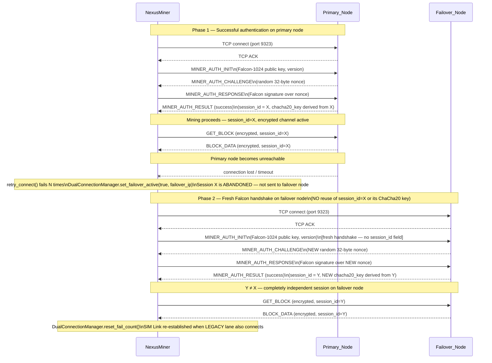

# Falcon Re-Authentication on Failover

> **⚠️ Partial Update (2026-04-11):** `SessionRecoveryManager` and `fFreshAuth` were
> **removed** in PR #532.  On failover, miners perform a full fresh Falcon handshake
> (as shown below) — this behavior is unchanged.  The `MarkFreshAuth()` tracking
> call and `SessionRecoveryData` no longer exist.

Mermaid sequence diagram showing the Falcon post-quantum re-authentication flow when a miner fails over from the primary node to the failover node.

> **Critical**: Session IDs are **NOT portable** between nodes. Each node issues its own session ID and derives an independent ChaCha20-Poly1305 encryption key. On failover, the miner must perform a completely fresh `MINER_AUTH_INIT` handshake — no session ID reuse is permitted.

## Why Session IDs Are Not Portable

| Property | Explanation |
|----------|-------------|
| **Node-local nonce** | The `MINER_AUTH_CHALLENGE` nonce is generated fresh by each node. A signature valid for node A's nonce is cryptographically unrelated to node B's nonce. |
| **Key derivation** | ChaCha20-Poly1305 keys are derived from the session ID, which encodes the node-local challenge. A key derived on node A cannot decrypt node B's packets. |
| **Replay prevention** | Accepting a session ID from another node would break replay-attack prevention: a MITM could forward captured session traffic from the primary to the failover. |
| **Fresh session_id = Y** | After failover, the miner operates with `session_id=Y` exclusively. The old `session_id=X` is discarded and never transmitted to the failover node. |

## `fFreshAuth` Flag [REMOVED]

~~After a successful failover handshake, `SessionRecoveryManager::MarkFreshAuth(strAddress)` sets the `fFreshAuth` flag in `SessionRecoveryData`.~~

**Removed in PR #532:** `SessionRecoveryManager` and `fFreshAuth` no longer exist.  On failover, miners simply perform a full Falcon re-authentication handshake.  The CanonicalSession in SessionStore tracks session state without a separate recovery mechanism.
