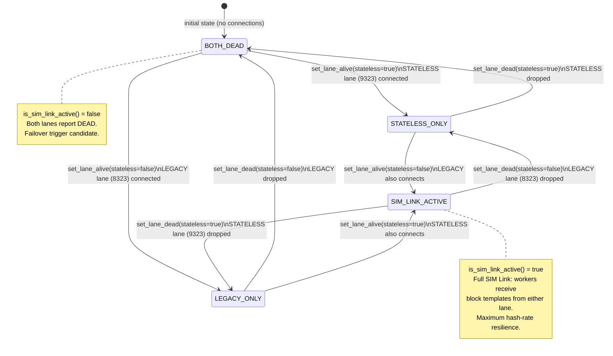

# SIM Link Lane Health States

Mermaid state diagram showing all dual-lane health states and transitions for the SIM Link architecture.

## Lane State Descriptions

| State | STATELESS (9323) | LEGACY (8323) | SIM Link |
|-------|-----------------|---------------|----------|
| `BOTH_DEAD` | ✗ dead | ✗ dead | inactive |
| `STATELESS_ONLY` | ✓ alive | ✗ dead | inactive |
| `LEGACY_ONLY` | ✗ dead | ✓ alive | inactive |
| `SIM_LINK_ACTIVE` | ✓ alive | ✓ alive | **ACTIVE** |

## SIM Link Semantics

When `SIM_LINK_ACTIVE`:
- Workers connected via both STATELESS (9323) and LEGACY (8323) lanes simultaneously.
- GET_BLOCK requests can be served on either lane; responses are unified.
- `get_secondary_endpoint()` returns the LEGACY endpoint derived from the active primary.
- If one lane drops, workers seamlessly continue on the surviving lane (no failover needed).

When transitioning **out** of `SIM_LINK_ACTIVE` to `BOTH_DEAD`:
- `failover_connection_tracker` increments the total failover count.
- `retry_connect()` begins exponential back-off.
- Failover state machine transitions to `PRIMARY_FAILING`.
