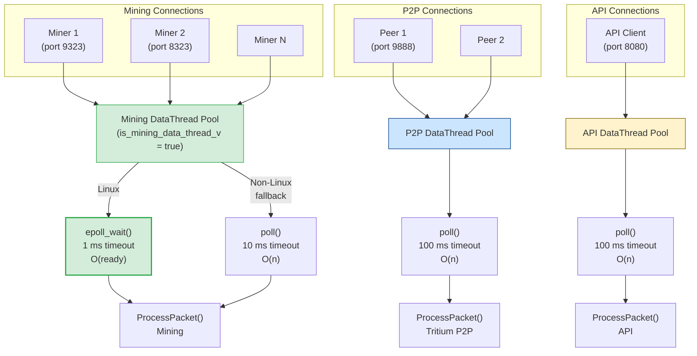
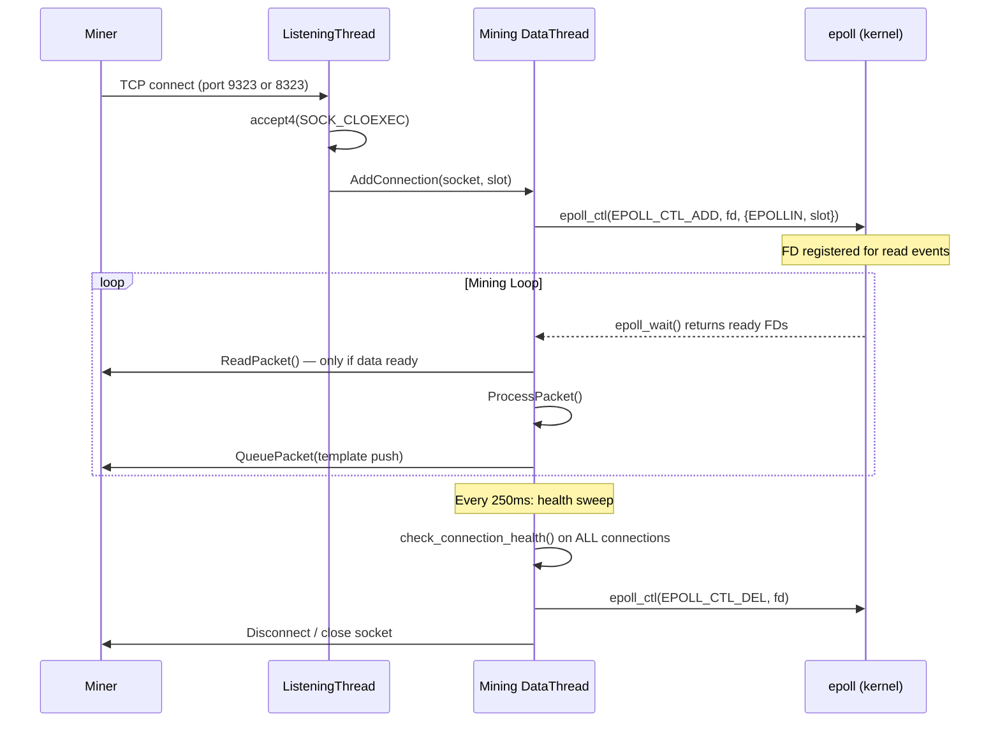
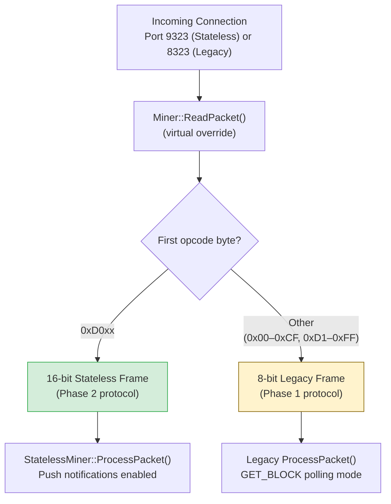
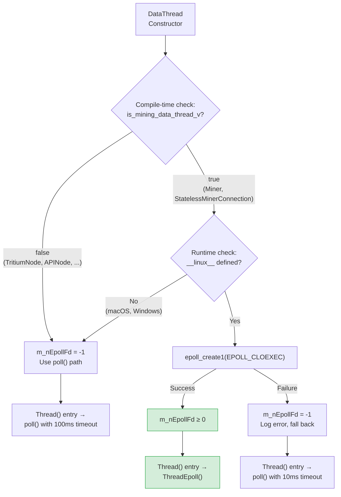

# Epoll vs Poll Architecture Diagrams

**Version:** LLL-TAO 5.1.0+ (PR #543)  
**Last Updated:** 2026-04-11

---

## 1. Full System I/O Architecture

Shows how mining, P2P, and API connections use different I/O mechanisms and
DataThread pools.

---

## 2. Connection Lifecycle with Epoll Registration

Shows the sequence from TCP connect through mining to disconnect, including
epoll registration and deregistration.

---

## 3. Dual-Lane Protocol Detection

Shows how `Miner::ReadPacket()` auto-detects the protocol lane based on the
first byte received from the miner.

---

## 4. Thread Dispatch Decision

Shows how the DataThread constructor and Thread() entry point select between
epoll and poll paths at compile time and runtime.

---

## 5. Epoll vs Poll Comparison

| Aspect | epoll (Mining, Linux) | poll() (Mining, Fallback) | poll() (P2P/API) |
|--------|----------------------|--------------------------|------------------|
| **Complexity** | O(ready) | O(n) | O(n) |
| **Timeout** | 1 ms (`-miningwait`) | 10 ms (`-miningwait`) | 100 ms (hardcoded) |
| **FD Registration** | Kernel-managed set | Rebuild every cycle | Rebuild every cycle |
| **Health Sweep** | Every 250 ms (decoupled) | Every iteration | Every iteration |
| **Platform** | Linux only | All platforms | All platforms |
| **Use Case** | Production mining | Dev/test mining | Production P2P |

---

## Related Documentation

- [Linux Epoll Mining Architecture](../../current/mining/linux-epoll-mining-architecture.md)
- [Dedicated DataThread Decision Record](../../current/mining/dedicated-datathread-decision.md)
- [Health Check Flow Diagram](health-check-flow.md)
