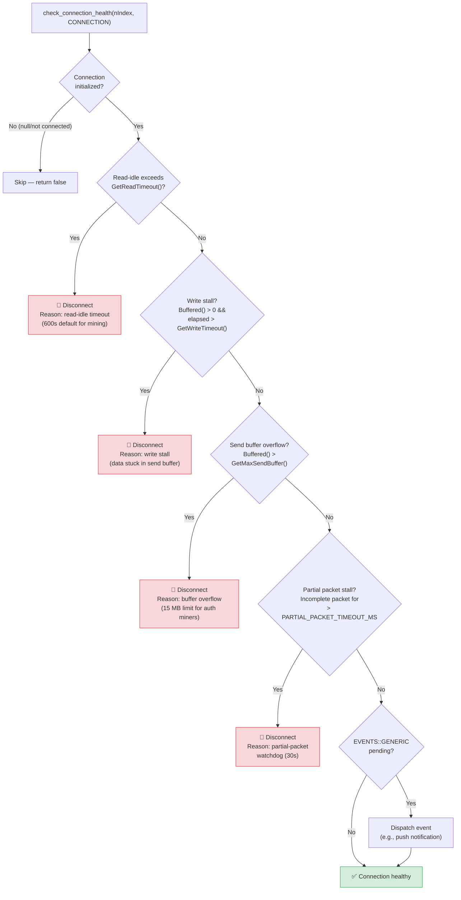

# Health Check Flow Diagram

**Version:** LLL-TAO 5.1.0+  
**Last Updated:** 2026-04-11  
**Source:** `src/LLP/data.cpp` — `check_connection_health()`

---

## Overview

`check_connection_health()` is a private helper shared between the `Thread()`
(poll) and `ThreadEpoll()` (epoll) I/O paths.  It runs:

- **poll() path:** Every iteration (100 ms or 10 ms for mining)
- **epoll path:** Every **250 ms** as part of the periodic health sweep

The function checks five conditions in order and disconnects on the first
failure.  If all checks pass, it dispatches any pending `EVENTS::GENERIC`
events before declaring the connection healthy.

---

## Decision Tree



---

## Check Details

### 1. Read-Idle Timeout

| Parameter | Mining (authenticated) | Mining (unauthenticated) | P2P/API |
|-----------|----------------------|--------------------------|---------|
| **Default** | 600 s (10 min) | 300 s (5 min) | 30 s |
| **Configurable** | `-miningtimeout` | `-miningtimeout` | `-timeout` |

Authenticated miners are exempt from the standard socket timeout
(`IsTimeoutExempt()`) and use the longer mining-specific read timeout.

### 2. Write Stall Detection

Triggered when `Buffered() > 0` (data in send buffer) and the elapsed time
since the last successful write exceeds `GetWriteTimeout()`.  This detects
miners that have stopped reading from their socket.

### 3. Send Buffer Overflow

| Connection Type | Max Buffer |
|----------------|-----------|
| Authenticated miner | 15 MB (`MINING_MAX_SEND_BUFFER`) |
| Unauthenticated | 1 MB (default) |
| P2P/API | 1 MB (default) |

### 4. Partial Packet Watchdog

If an incomplete packet (header received but payload not yet complete) has been
pending for longer than `PARTIAL_PACKET_TIMEOUT_MS` (30 seconds), the connection
is terminated.  This prevents slow-read attacks and zombie connections.

### 5. EVENTS::GENERIC Dispatch

If none of the failure conditions are met, any pending `EVENTS::GENERIC` events
(such as push notifications queued by the MinerPushDispatcher) are dispatched to
the connection handler.

---

## Integration with ThreadEpoll

In the epoll path, the health sweep is **decoupled** from I/O processing:

```
ThreadEpoll loop:
│
├── epoll_wait(1ms)    ← I/O hot path: only ready FDs
│   └── ReadPacket / ProcessPacket
│
└── if (250ms elapsed) ← Health sweep: scan ALL connections
    └── for each slot:
        └── check_connection_health(slot, CONNECTION)
```

This design ensures that health checks do not add latency to the I/O hot path
(unlike poll, where health checks run on every iteration alongside I/O).

---

## Related Documentation

- [Linux Epoll Mining Architecture](../../current/mining/linux-epoll-mining-architecture.md)
- [Epoll vs Poll Architecture Diagrams](epoll-vs-poll-architecture.md)
