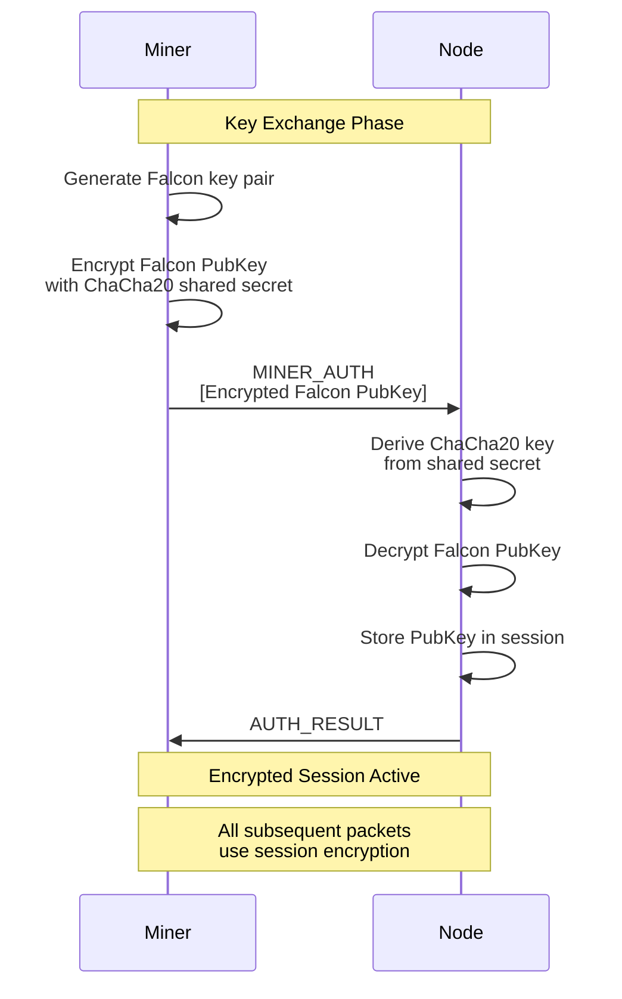
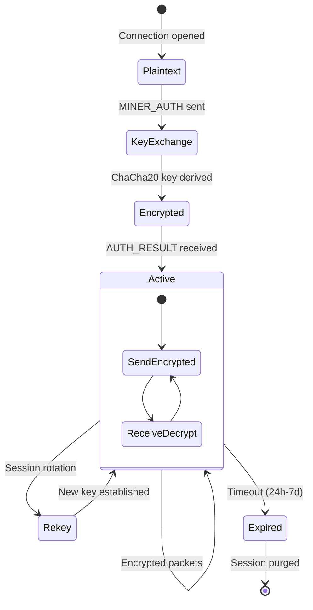
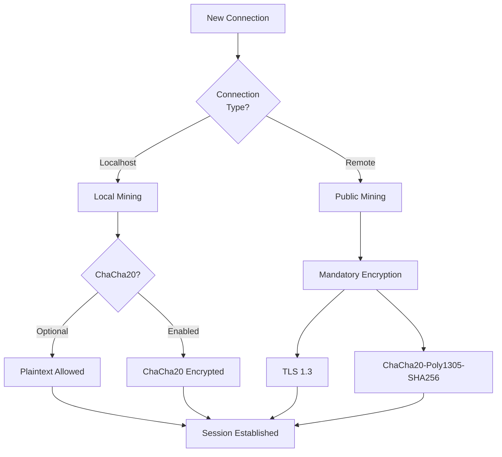

# ChaCha20 Session Lifecycle

Diagrams showing the ChaCha20 encryption lifecycle used in Falcon public key exchange and session security.

---

## ChaCha20 Encryption Flow



---

## Session Encryption Lifecycle



---

## Encryption Requirements by Mode



---

## ChaCha20 Configuration

```bash
# Require encryption for all miners
# Default: false for localhost, true for remote
-falconhandshake.requireencryption=1

# Cipher suite for public connections
# TLS 1.3 with ChaCha20-Poly1305-SHA256
```

---

## Cross-References

- [Falcon Auth Sequence](falcon-auth-sequence.md)
- [LLP Packet Anatomy](llp-packet-anatomy.md)
- [Falcon Verification](../../current/authentication/falcon-verification.md)
