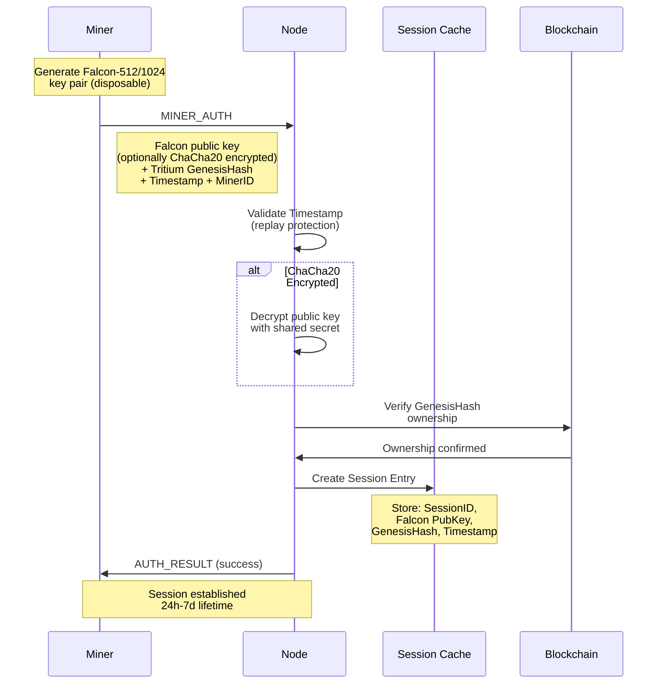
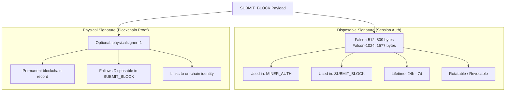
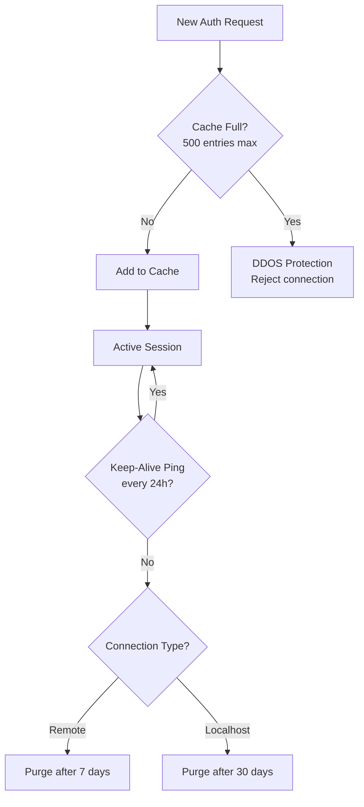
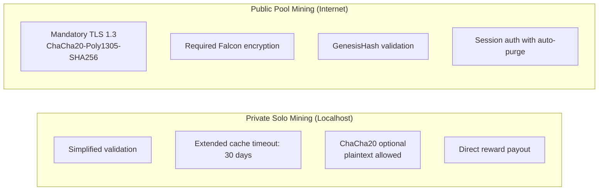

# Falcon Authentication Sequence

Full Falcon handshake diagram showing the post-quantum authentication flow between miners and nodes.

---

## Complete Falcon Handshake

---

## Dual Signature Architecture

---

## Session Cache Management

---

## Authentication Modes

---

## Cross-References

- [ChaCha20 Session Lifecycle](chacha20-session-lifecycle.md)
- [Mining Flow](../architecture/mining-flow-complete.md)
- [Falcon Verification](../../current/authentication/falcon-verification.md)
- Source: `src/LLP/include/falcon_handshake.h`
