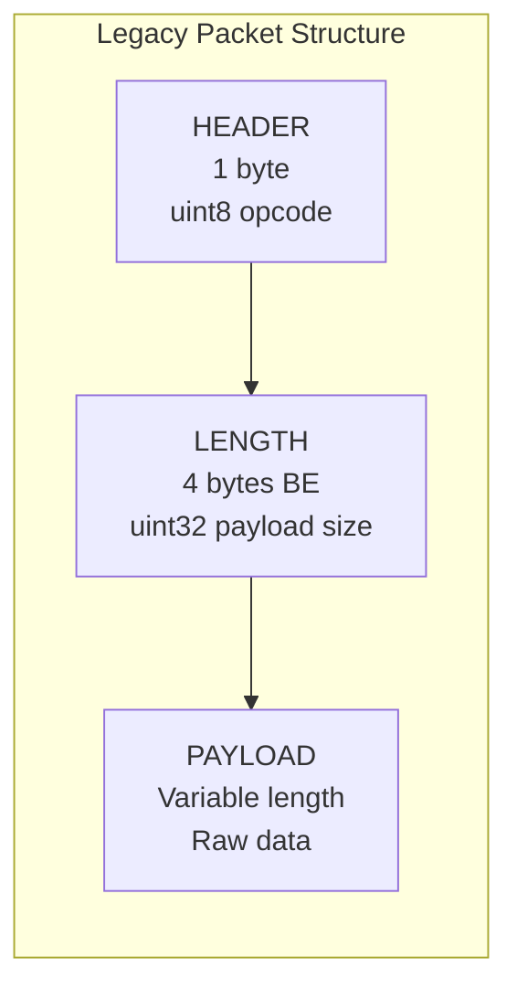
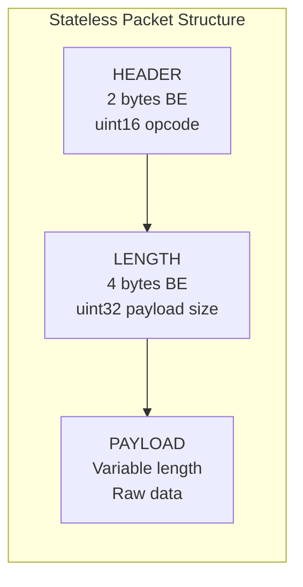
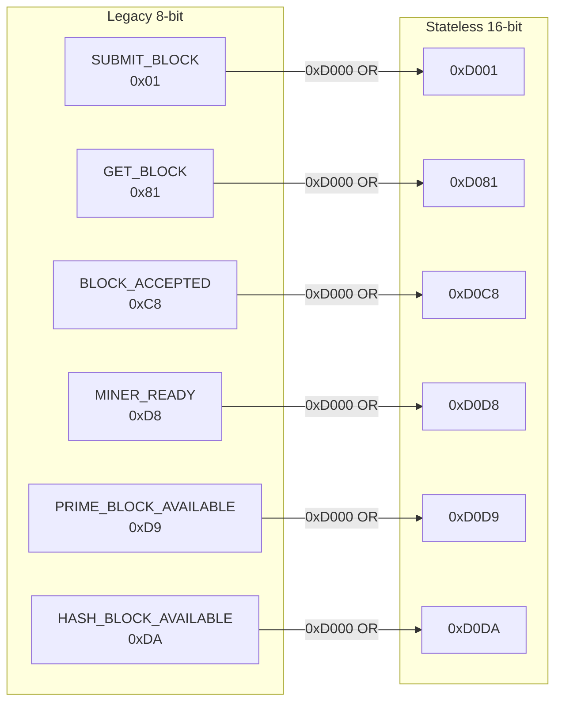

# LLP Packet Anatomy

Wire format visualization for the Lower Level Protocol (LLP) packet structure.

---

## Legacy Tritium Protocol (8-bit, Port 8323)



```
┌──────────┬──────────────┬─────────────────────┐
│ HEADER   │ LENGTH       │ PAYLOAD             │
│ 1 byte   │ 4 bytes BE   │ Variable            │
│ 0x00-0xFF│ uint32       │ Raw bytes           │
├──────────┼──────────────┼─────────────────────┤
│ Example: │              │                     │
│ 0xD8     │ 0x00000000   │ (empty)             │
│ MINER_   │ Length = 0   │ Ready signal only   │
│ READY    │              │                     │
└──────────┴──────────────┴─────────────────────┘
```

---

## Stateless Tritium Protocol (16-bit, Port 9323)



```
┌───────────┬──────────────┬─────────────────────┐
│ HEADER    │ LENGTH       │ PAYLOAD             │
│ 2 bytes BE│ 4 bytes BE   │ Variable            │
│ 0xD000-   │ uint32       │ Raw bytes           │
│ 0xD0FF    │              │                     │
├───────────┼──────────────┼─────────────────────┤
│ Example:  │              │                     │
│ 0xD0D8    │ 0x00000000   │ (empty)             │
│ STATELESS_│ Length = 0   │ Ready signal only   │
│ MINER_    │              │                     │
│ READY     │              │                     │
└───────────┴──────────────┴─────────────────────┘
```

---

## Opcode Mirror Mapping



**Formula:** `stateless_opcode = 0xD000 | legacy_opcode`

---

## Block Data Payload Sizes

| Packet Type | Legacy Size | Stateless Size | Notes |
|---|---|---|---|
| Push Notification | 12 bytes | 12 bytes | Height + Channel + Bits |
| Block Template | 216 bytes | 228 bytes | 12 meta + 216 block |
| Submit Block | Variable | Variable | Includes solution |

---

## Cross-References

- [Push Notification Flow](../push-notification-flow.md)
- [Mining Flow](../architecture/mining-flow-complete.md)
- [Opcodes Reference](../../reference/opcodes-reference.md)
- Source: `src/LLP/include/opcode_utility.h`
