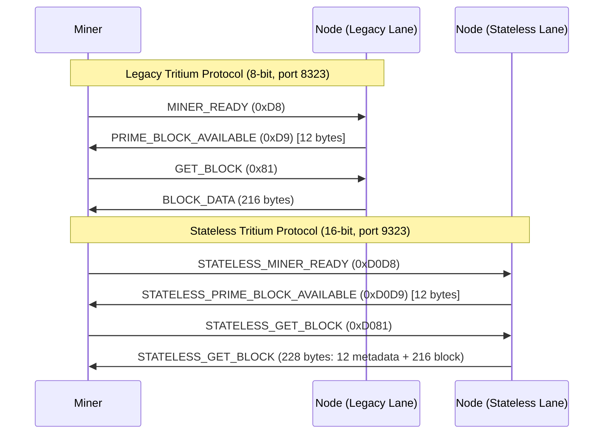

# Push Notification Flow

Sequence diagrams illustrating the push notification flow for both mining protocol lanes.

---

## Legacy vs Stateless Protocol Flow



---

## Push Notification Payload (Both Lanes)

Both Legacy Tritium Protocol and Stateless Tritium Protocol lanes use the same 12-byte payload format:

```
┌──────────────────────────────────────────────────────────────────────────┐
│                   Push Notification Payload (12 bytes)                    │
├───────────┬──────────────────┬──────────────────────────────────────────┤
│  Bytes    │  Field           │  Description                             │
├───────────┼──────────────────┼──────────────────────────────────────────┤
│  [0-3]    │  nUnifiedHeight  │  Unified chain height (all channels).    │
│           │                  │  Used for tip-movement detection          │
│           │                  │  (tip_moved). NOT the template nHeight.  │
├───────────┼──────────────────┼──────────────────────────────────────────┤
│  [4-7]    │  nChannelHeight  │  Current height of this channel.         │
│           │                  │  Used for channel-advancement detection   │
│           │                  │  (channel_advanced).                      │
├───────────┼──────────────────┼──────────────────────────────────────────┤
│  [8-11]   │  nBits           │  Next difficulty target for channel.     │
└───────────┴──────────────────┴──────────────────────────────────────────┘
```

> **Anchoring note:** `nUnifiedHeight` allows miners to detect a tip change without fetching a
> new template. The authoritative best-tip anchor is `hashBestChain`, conveyed as
> `pBlock->hashPrevBlock` inside the block template. Miners must refresh templates on any
> `tip_moved` event (unified height change), even when the channel height has not advanced.
>
> See [Unified Tip and Channel Heights](../current/mining/unified-tip-and-channel-heights.md).

---

## Opcode Mirror Mapping

```
Legacy (8-bit)                  Stateless (16-bit)
──────────────                  ──────────────────
MINER_READY         0xD8   →   0xD0D8   STATELESS_MINER_READY
PRIME_BLOCK_AVAILABLE 0xD9 →   0xD0D9   STATELESS_PRIME_BLOCK_AVAILABLE
HASH_BLOCK_AVAILABLE  0xDA →   0xD0DA   STATELESS_HASH_BLOCK_AVAILABLE
GET_BLOCK           0x81   →   0xD081   STATELESS_GET_BLOCK

Formula: stateless_opcode = 0xD000 | legacy_opcode
```

---

## Cross-References

- [Mining Protocol Lanes](../protocol/mining-protocol.md)
- [Opcodes Reference](../reference/opcodes-reference.md)
- [Mining Lanes Cheat Sheet](../current/mining/mining-lanes-cheat-sheet.md)
- [Unified Tip and Channel Heights](../current/mining/unified-tip-and-channel-heights.md)
- Source: `src/LLP/include/push_notification.h`
