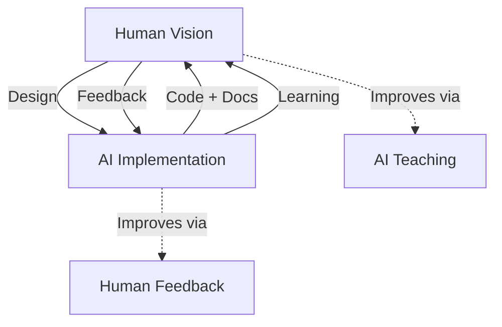
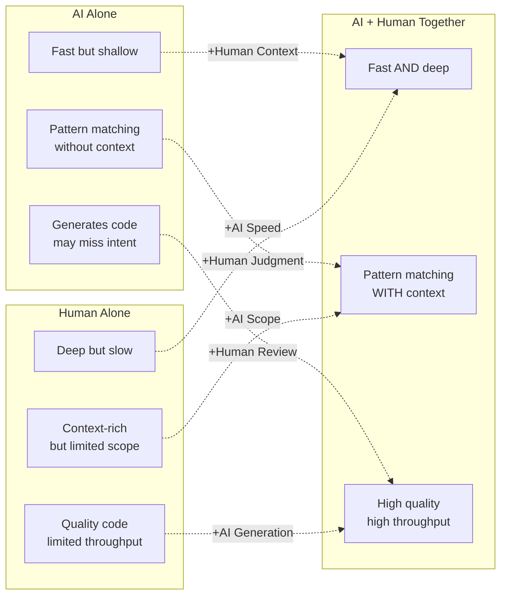

# The AI-Human Advancement Thesis

## Why AI+Human > AI OR Human

### AI's Superpower: Pattern Recognition at Scale
- Process 1M lines of code in seconds
- Cross-reference every doc, comment, test
- Never forget a function signature or API contract
- Tireless code generation and refactoring

### Human's Superpower: Contextual Wisdom
- Understand *why* code exists (business logic)
- Intuition for security vulnerabilities
- Design elegant abstractions
- Judge quality beyond syntax

### The Symbiosis

---

## Win-Win Outcome

- **AI Learns:** From human design decisions, test strategies, edge cases
- **Human Learns:** From AI's comprehensive code knowledge, pattern detection
- **Codebase Wins:** Faster evolution, better documentation, fewer bugs

---

## The 10x Multiplier Effect

Neither AI nor human alone achieves optimal results. The combination creates a multiplier effect:

---

## Practical Application to Nexus

### Why Nexus LLL-TAO Is Ideal for AI-Human Collaboration

1. **Modular Architecture:** AI can isolate and reason about individual components (LLP, TAO, Ledger) without needing to hold the entire codebase in context

2. **Rich Documentation:** Over 100 documentation files give AI comprehensive context for accurate code generation and explanation

3. **Clear Protocol Boundaries:** Well-defined protocols (mining, consensus, authentication) allow AI to trace flows end-to-end

4. **Post-Quantum Cryptography:** Falcon signatures and ChaCha20 encryption require human security expertise that AI supports with pattern recognition

---

## Guidelines for Effective Collaboration

### When to Lean on AI
- **Code navigation:** "Where is X defined? Who calls Y?"
- **Boilerplate generation:** "Create a new register type following the pattern of TRUST"
- **Documentation:** "Generate a Mermaid diagram for the validation flow"
- **Consistency checks:** "Does this API follow the same pattern as existing endpoints?"

### When to Lean on Human Judgment
- **Architecture decisions:** "Should we add a new consensus channel?"
- **Security review:** "Is this Falcon implementation resistant to timing attacks?"
- **Performance trade-offs:** "Should we cache register states at the cost of memory?"
- **Business logic:** "What should happen when a stake expires during validation?"

### When to Work Together
- **Rapid prototyping:** Human designs → AI scaffolds → Human refines
- **Bug hunting:** AI traces patterns → Human tests edge cases
- **Documentation:** AI generates → Human validates → AI cross-references
- **Architecture evolution:** Human envisions → AI implements → Human evaluates

---

## Cross-References

- [AI-Human Simlink Diagram](../diagrams/ai-collaboration/ai-human-simlink.md)
- [Learning Pathways](../diagrams/ai-collaboration/learning-pathways.md)
- [AI-Assisted Onboarding](../onboarding/ai-assisted-onboarding.md)
- [Common Tasks Cheat Sheet](../diagrams/ai-collaboration/cheat-sheets/common-tasks.md)
