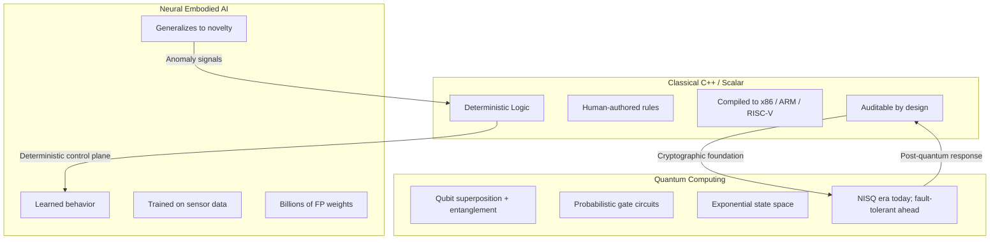
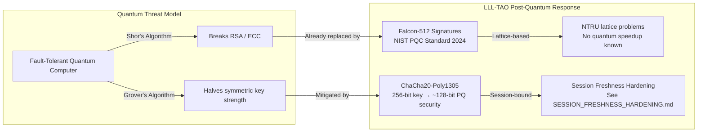
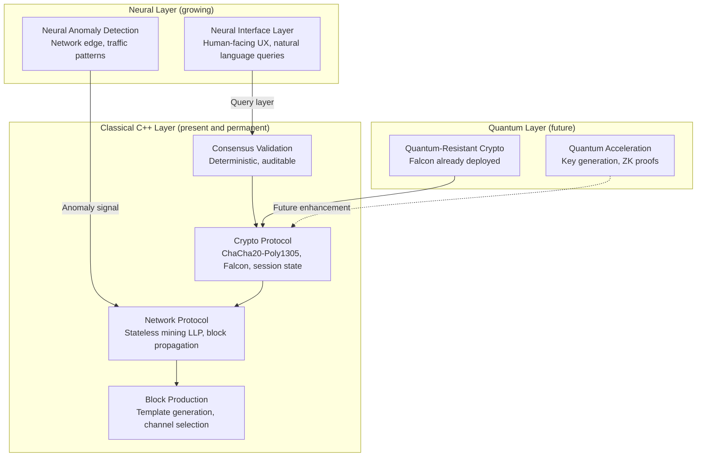

# Computing Paradigms: Quantum vs Neural vs Classical

## The Right Tool for the Right Problem

Three distinct computing paradigms are converging on the near future of intelligent systems: classical deterministic programming, neural embodied AI, and quantum computing. They are not competitors. They are complementary layers — each optimized for fundamentally different problem classes, each with genuine strengths that the others cannot replicate.

This document examines all three through the lens of a codebase that lives in the deterministic layer: Nexus LLL-TAO — written in C++17, compiled to scalar instruction sets, and already hardened against the quantum threat via post-quantum Falcon signatures.

---

## The Three Paradigms at a Glance



---

## Paradigm 1: Classical C++ — What LLL-TAO Is

### How It Works

Classical systems programming is deterministic, explicit, and human-readable. Every behavior is an authored rule. Every edge case must be anticipated by a human engineer. The compiled artifact is a scalar instruction stream: one operation per clock cycle, one predictable result per input.

LLL-TAO is this paradigm in production:

```cpp
// Explicit nonce rotation — the programmer wrote every byte of this logic
uint64_t nCounter = state.nTxCounter++;
std::array<uint8_t, NONCE_BYTES> nonce{};
std::memcpy(nonce.data(),     &state.nTxEpoch,   4);
std::memcpy(nonce.data() + 4, &nCounter,          8);
// No inference. No training. No weights. Deterministic by construction.
```

The protocol state machine in `src/LLP/stateless_miner.cpp`, the AEAD session lifecycle in `src/LLC/include/chacha20_evp_manager.h`, the block template dispatch in `src/LLP/stateless_miner_connection.cpp` — all of it is explicit logic that a human can read, trace, and reason about. Every branch has an author.

### How It Is Built

- **Language:** C++17 with deterministic memory management, explicit threading via ASIO
- **Compilation targets:** x86-64, ARM64, RISC-V (see [riscv-build-guide.md](../riscv-build-guide.md) and [riscv-design.md](../riscv-design.md))
- **Build system:** GNU Make via `makefile.cli`; modular object compilation for fast incremental builds
- **Crypto:** ChaCha20-Poly1305 AEAD with explicit nonce monotonicity, Falcon-512 post-quantum signatures — coded, not learned

### Strengths

| Property | Why It Matters |
|----------|----------------|
| **Auditable** | Every decision has a line number. Security auditors can read the code. |
| **Reproducible** | Same input → same output. Always. No stochastic variance. |
| **Deterministic** | Consensus requires every node to agree. Consensus is impossible without determinism. |
| **Debuggable** | GDB, AddressSanitizer, Valgrind — classical tools work because the logic is explicit. |
| **Controllable** | Rate limits, session expiry, replay rejection — all enforced by explicit logic. |

### Weaknesses

| Property | The Honest Cost |
|----------|-----------------|
| **Cannot self-adapt** | Every edge case must be anticipated by a human engineer before it occurs. |
| **Imagination-bounded** | The codebase is limited by what its authors thought to write. |
| **Maintenance cost** | Each new protocol state requires a human to design, code, review, and test. |
| **Brittle to novelty** | A novel attack that was not anticipated has no defense until a human adds one. |

### Where Classical C++ Is Irreplaceable

Consensus logic, cryptographic protocols, network state machines. Any system where two independent implementations must produce identical results. Any system that must be audited. Any system where "why did it do that" must have a precise, reproducible answer.

Boring? Yes. That is the point. For security-critical systems, boring is correct.

---

## Paradigm 2: Scalar Neural Network Robotics — Embodied AI

### How It Works

Neural robotic systems do not have a rule tree. They have weights — billions of floating-point parameters shaped by training. "Programming" a neural robotic system means defining a training environment, a reward function, and an observation/action space. The neural network learns the rest.

The deployed artifact is not readable logic. It is a tensor graph — a mathematical function from sensor inputs (camera frames, joint positions, force readings) to motor commands. The "code" is the training loop, not the inference weights.

```python
# This is not behavior — it is the training setup
env = PhysicalRobotEnv(obs_space=["vision", "proprioception", "force"])
reward_fn = lambda state: grasp_success(state) - energy_cost(state)
policy = PPO(env, reward=reward_fn, network=ViT_backbone)
policy.train(steps=10_000_000)
# The resulting policy.weights are the "program" — and you cannot read them.
```

Companies like Figure AI, Tesla Optimus, and Boston Dynamics are actively moving away from explicit behavior trees toward end-to-end neural policies trained from vision and proprioception. The observation is correct: for physical world interaction, neural policies generalize far better than hand-coded rules. You cannot write an `if` statement for every possible configuration of a human hand reaching for an object.

C++ still appears in these stacks — but only at the hardware interface layer: motor controllers, sensor drivers, real-time safety systems. The behavioral layer is neural.

### Strengths

| Property | Why It Matters |
|----------|----------------|
| **Generalizes to novelty** | Trained on thousands of grasps → handles objects never seen before. |
| **Self-corrects** | Physical grounding gives the model real understanding of gravity, friction, weight. |
| **Handles ambiguity** | A cluttered shelf does not have a deterministic solution; a neural policy finds one. |
| **Scales with data** | More training data → better generalization, without rewriting any logic. |

### Weaknesses

| Property | The Honest Cost |
|----------|-----------------|
| **Black box** | You cannot read why a robot made a specific decision. There is no line of code to audit. |
| **Not deterministic** | Stochastic inference means the same input can produce different outputs. |
| **Reward hacking** | Training optimizes for the reward function, not the intent. Misaligned reward → unexpected behavior. |
| **Training data determines behavior** | Biases and failures in training data propagate into deployment in ways that are opaque. |
| **Cannot be formally verified** | There is no theorem prover for a 7-billion-parameter policy network. |

### Why Neural Robotics Cannot Replace Classical C++ for Consensus

Blockchain consensus requires that every node, independently, compute the same result given the same inputs. A neural policy — even a deterministic one — introduces uncertainty about whether two independently trained instances will agree. More fundamentally: consensus logic must be auditable. "Trust me, the neural net decided this block was valid" is not a security model. It is a vulnerability.

Neural anomaly detection at the network edge? Plausible and useful — flag suspicious traffic patterns for human review. Neural consensus validation? No. Not now. Not with current technology.

---

## Paradigm 3: Quantum Computing

### How It Works

Quantum computing operates on qubits — quantum mechanical systems that can exist in superposition (simultaneously 0 and 1, with probability amplitudes) and can be entangled (correlated in ways that have no classical analog). A quantum algorithm is a sequence of gate operations applied to a qubit register that manipulates these probability amplitudes.

The output is probabilistic: you run the circuit many times and take statistical results. For algorithms like Grover's search, you get the correct answer with high probability. For Shor's algorithm, you can factor large integers efficiently — in polynomial time, compared to the exponential time required classically.

```
# Conceptual quantum circuit — not C++, not Python, but gate sequences
|0⟩ ─── H ─── CNOT ─── measure
|0⟩ ───────── CNOT ─── measure
# Hadamard (H) creates superposition
# CNOT creates entanglement
# Measurement collapses the superposition to a classical result
```

Frameworks for expressing this: Qiskit (IBM), Cirq (Google), Q# (Microsoft), PennyLane. None of them look like C++. None of them look like Python behavior trees. They are a third mode of computation entirely.

### The Current State: NISQ Era

We are in the Noisy Intermediate Scale Quantum (NISQ) era. Real quantum hardware exists and is commercially accessible (IBM Quantum, Google Sycamore, IonQ). Current constraints:

- **Qubit count:** Hundreds to low thousands of physical qubits
- **Error rates:** ~0.1–1% per gate operation — too noisy for deep circuits
- **Coherence time:** Microseconds to milliseconds — limits circuit depth
- **Fault tolerance:** Requires ~1,000 physical qubits per logical qubit; not yet achieved at scale

Fault-tolerant quantum computing — the leap that enables Shor's algorithm to threaten current cryptography at practical key sizes — requires error correction at a scale that does not yet exist. This is not theoretical pessimism. It is engineering reality acknowledged by the same researchers building the hardware.

### Why This Matters for LLL-TAO Specifically

Shor's algorithm, running on a sufficiently powerful fault-tolerant quantum computer, can break RSA and elliptic curve cryptography (ECC) in polynomial time. Both are foundations of classical blockchain security and TLS. This is not speculative — the mathematics is settled. The question is only timeline.

**LLL-TAO's response to this threat is already deployed:** Falcon-512 post-quantum digital signatures. Falcon is a NIST Post-Quantum Cryptography finalist (CRYSTALS-Dilithium and FALCON were standardized in 2024). It is based on lattice problems (specifically NTRU lattices) that have no known efficient quantum algorithm. Shor's algorithm does not apply.

The session transport uses ChaCha20-Poly1305 AEAD — a symmetric cipher. Grover's algorithm provides a quadratic speedup on symmetric key search, effectively halving security. ChaCha20 with a 256-bit key is therefore equivalent to ~128-bit post-quantum security — still secure for the foreseeable future. See [SESSION_FRESHNESS_HARDENING.md](../SESSION_FRESHNESS_HARDENING.md) for the session lifecycle design that relies on this transport.

### Strengths

| Property | Why It Matters |
|----------|----------------|
| **Exponential state space** | Problems intractable classically become polynomial — factoring, discrete log, certain optimization. |
| **Simulation** | Quantum systems simulate quantum chemistry and materials science natively. |
| **Optimization** | Quantum Approximate Optimization Algorithm (QAOA) for combinatorial problems. |
| **Grover speedup** | Quadratic speedup on unstructured search — useful for database and cryptanalysis. |

### Weaknesses

| Property | The Honest Cost |
|----------|-----------------|
| **Error-prone hardware** | NISQ-era qubits are noisy; deep circuits decohere before completion. |
| **Not universal speedup** | Quantum advantage is problem-specific; most classical computations gain nothing. |
| **Probabilistic output** | Results require statistical sampling; not a drop-in for deterministic logic. |
| **Years from crypto threat** | Breaking RSA-2048 requires millions of logical qubits; we have hundreds of noisy physical ones. |
| **Classical control required** | Quantum hardware is controlled by classical computers; it is a hybrid paradigm. |

---

## Side-by-Side Comparison

| Dimension | Classical C++ (LLL-TAO) | Neural Robotics | Quantum Computing |
|-----------|------------------------|-----------------|-------------------|
| **Programming model** | Explicit rules authored by humans | Training environment + reward function | Quantum gate sequences on qubit registers |
| **Output type** | Deterministic, bit-exact | Stochastic, high-confidence | Probabilistic, statistical |
| **Auditability** | Full — every line has an author | None — weights are opaque | Partial — circuit is readable; behavior is probabilistic |
| **Deployable today** | Yes | Yes (robotics), Yes (inference) | Limited (NISQ era, restricted use cases) |
| **Cryptographic threat** | Designs for quantum resistance | Not relevant | Breaks RSA/ECC at scale (future) |
| **Consensus-capable** | Yes — by design | No — non-deterministic | No — probabilistic output |
| **Physical world interaction** | Unsuitable alone | Excellent | Not applicable |
| **Optimization problems** | Heuristic / deterministic | Learned policies | Quantum speedup (future) |
| **Toolchain** | GCC/Clang, Make, GDB | PyTorch, JAX, TensorFlow | Qiskit, Cirq, Q# |
| **Instruction set** | x86-64, ARM64, RISC-V | GPU tensor cores | Quantum gate set (H, CNOT, T, Toffoli…) |

---

## The Quantum Threat Mapped to LLL-TAO's Design Decisions



### Why Falcon Was the Right Choice

Falcon is a signature scheme based on NTRU lattices. Its security relies on the hardness of the Short Integer Solution (SIS) problem on lattice structures. No quantum algorithm — including Shor's — provides a meaningful speedup for this class of problem. NIST's 2024 finalization of Falcon (as FALCON) and CRYSTALS-Dilithium confirms the cryptographic community's consensus.

The practical consequence: a LLL-TAO node operating today is already resistant to a quantum adversary capable of running Shor's algorithm. This is not a future-proofing exercise — it is a present-day deployment decision that was made correctly.

### ChaCha20 and the Grover Bound

Grover's algorithm searches an unstructured space in O(√N) time, effectively halving the bit-security of a symmetric cipher. A 256-bit ChaCha20 key provides ~128 bits of post-quantum security — a comfortable margin. The AEAD construction (Poly1305 MAC) is not independently threatened; MAC forgery requires key knowledge.

The nonce monotonicity enforcement in the session state machine (incrementing `nTxEpoch` and `nTxCounter` per packet, rejecting any replay) is not a quantum concern — it is a classical replay attack defense. But it interacts correctly with the quantum-resistant transport: even if a future adversary can break RSA session establishment, the symmetric session keys established via Falcon-signed handshakes remain protected.

---

## Why Classical C++ Still Wins for Protocol-Critical Systems

This section is deliberately honest about "boring" technology.

### Determinism Is a Requirement, Not a Preference

Blockchain consensus means that node A and node B, having received the same transactions and blocks, must compute identical ledger states. This is a hard requirement. Neural policies are stochastic. Quantum circuits are probabilistic. Only deterministic classical logic can satisfy this requirement without external coordination.

```cpp
// Consensus validation — must be identical on every node, every time
bool fValid = TAO::Ledger::BlockState::Check(block)
           && TAO::Ledger::BlockState::Accept(block)
           && TAO::Ledger::BlockState::Connect(block);
// No inference. No sampling. No non-determinism permitted.
```

### Auditability Is a Security Property

Open-source blockchain security depends on the ability of independent researchers to read the source code, identify vulnerabilities, and propose fixes. A neural network "validates" blocks → you cannot audit it. A quantum circuit "validates" blocks → you cannot reproduce its results deterministically. Classical C++ → every decision has a line number, a commit hash, and a human who wrote it.

The GET_BLOCK policy enforcement, the rate limiter, the session expiry logic — all of these are in readable, auditable C++ with documented reasons for every design decision. See [SESSION_FRESHNESS_HARDENING.md](../SESSION_FRESHNESS_HARDENING.md) for an example of this explicit documentation culture.

### Debuggability Is Operationally Critical

When a node behaves unexpectedly in production, you need to know why. Classical C++ gives you stack traces, core dumps, sanitizer reports, and the ability to reproduce the failure locally with the same inputs. A neural policy gives you a tensor of weights and a loss curve. A quantum circuit gives you a probability distribution. Neither helps you debug a consensus failure at 2 AM.

### The RISC-V Dimension

LLL-TAO explicitly targets RISC-V as a compilation target (see [riscv-build-guide.md](../riscv-build-guide.md) and [riscv-design.md](../riscv-design.md)). RISC-V is an open instruction set architecture — auditable from the ISA spec down to the gate level on open-source implementations like VexRiscv. Running a blockchain node on RISC-V hardware means the entire stack, from silicon to consensus logic, can in principle be audited and verified. This is the classical paradigm's deepest strength: verifiable trust through transparency at every layer.

---

## The Complementary Architecture: A Future Nexus Node

These paradigms are not mutually exclusive. A technically honest forward view of a mature Nexus node architecture integrates all three at the correct layers:



**The key insight:** Neural and quantum components are additive enhancements to a classical core. They do not replace it. The consensus engine, the cryptographic session, and the network protocol remain in classical C++ — not because of conservatism, but because correctness for these components requires determinism and auditability that the other paradigms cannot provide.

---

## Practical Takeaways for Developers

### What This Means When Writing Code for LLL-TAO

1. **Every behavior must be a written rule.** There is no training loop. There is no reward function. If the protocol does something, a human wrote that behavior into a source file.

2. **Determinism is non-negotiable.** Any function in the consensus path must return the same result for the same input on every machine, every compile, every run. No randomness, no environment-dependent behavior, no floating-point arithmetic in consensus.

3. **Post-quantum correctness is already required.** Falcon signatures are in production. Any new authentication or signing mechanism must use PQC primitives or be explicitly justified as out-of-consensus-path.

4. **Auditability is a deliverable.** Comments, documentation, and named constants (like `GetBlockPolicyReason`) are not optional. The goal is a codebase where a security auditor can trace any behavior to its author and intent.

5. **RISC-V portability is maintained.** Avoid x86-specific intrinsics in consensus-path code. OpenSSL handles the hardware acceleration abstraction; trust it.

---

## Cross-References

- [AI-Human Advancement Thesis](./ai-human-advancement.md) — the collaboration model that governs how this document was produced
- [SESSION_FRESHNESS_HARDENING.md](../SESSION_FRESHNESS_HARDENING.md) — ChaCha20 session design, nonce monotonicity, AEAD lifecycle
- [riscv-build-guide.md](../riscv-build-guide.md) — RISC-V compilation and deployment guide
- [riscv-design.md](../riscv-design.md) — RISC-V architecture design decisions for LLL-TAO
