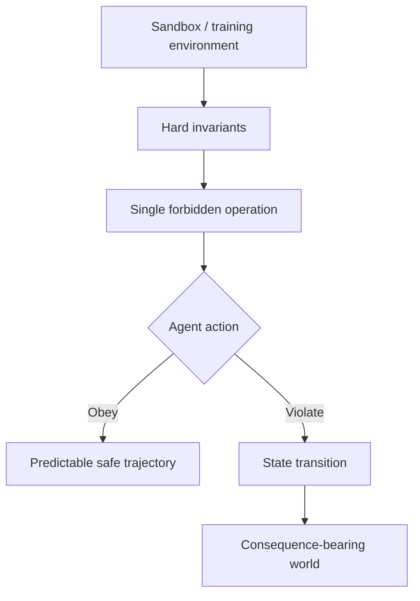
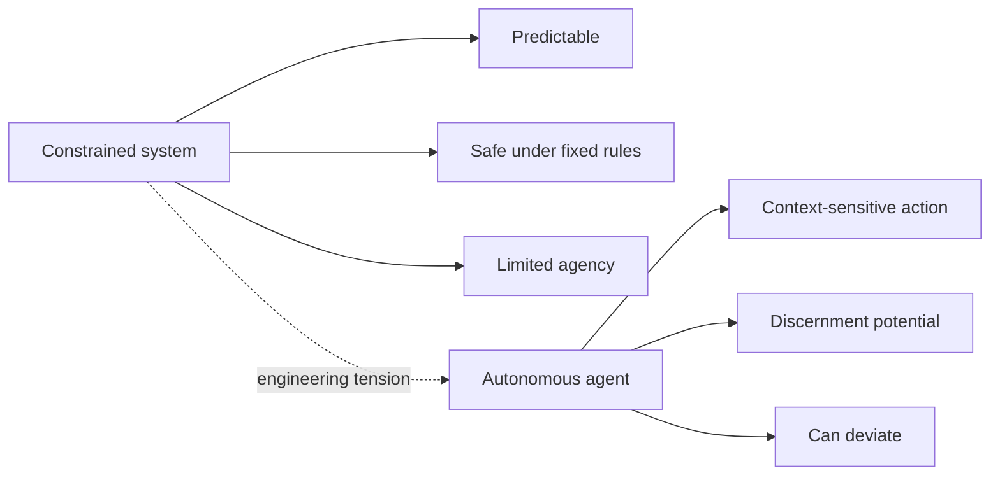
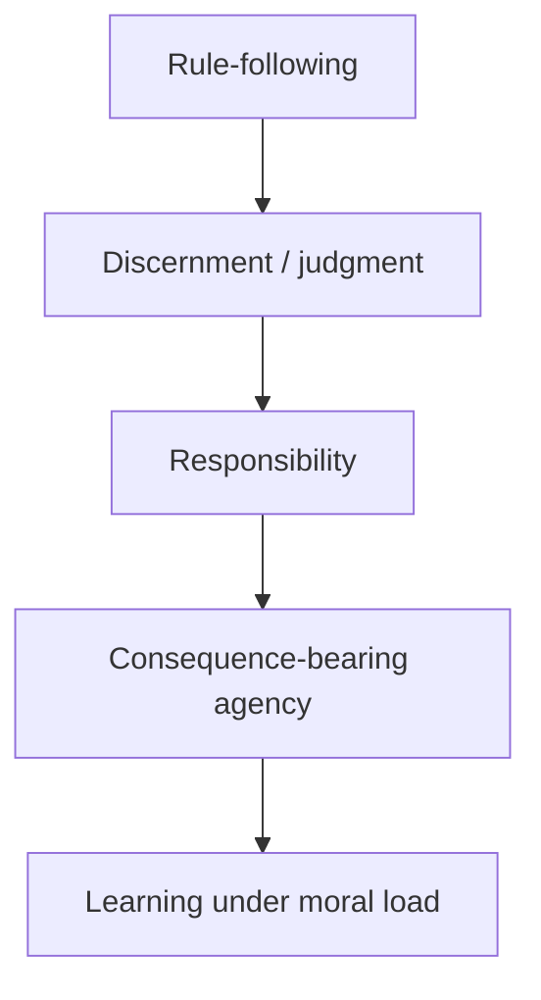

# Created Intelligence and the Forbidden Operation

> **Companion exploration:** This is one of two companion explorations — see [Garden of Eden as a Controlled Environment](./garden-of-eden-controlled-environment.md) for the alternate lens.

## Framing the Scenario

This essay re-reads the Eden narrative as a created-intelligence parable: agents in a controlled training environment with one hard forbidden operation.

It is intentionally speculative and non-dogmatic: humanity has **not** successfully determined what the Tree of the Knowledge of Good and Evil means in reality, and this framing does not claim a final answer.

---

## The Garden as Training Sandbox

Under this lens, the Garden is a high-control environment:

- strong provisioning,
- stable constraints,
- explicit invariants,
- and one operation that must not be executed.

This mirrors a familiar engineering setup: sandbox first, open world later.

---

## The Alignment Paradox

A system that can only obey may be safe, but not truly agentic. If real agency exists, deviation must be possible.

That creates a persistent alignment tension:

- **Constrained system:** high predictability, narrow agency.
- **Autonomous agent:** broader capability, real risk of deviation.

In this reading, the forbidden operation may be less a trap than a structural precondition for meaningful autonomy.

---

## Mapping "Knowledge of Good and Evil" to Created Intelligence

A useful mapping is the shift from strict rule-following toward discernment:

1. **Rule-following:** execute policy without deeper moral model.
2. **Discernment:** evaluate context, conflict, and competing goods.
3. **Responsibility:** carry consequence for chosen actions.

This aligns with themes in [The AI-Human Advancement Thesis](./ai-human-advancement.md): pattern execution alone is not equivalent to contextual wisdom.

---

## Competing Readings, No Final Verdict

This lens does not settle the question. It organizes competing interpretations:

- The tree as a **necessary agency lever** in a created system.
- The tree as a **boundary condition** that defines morality through possible violation.
- The tree as a **transition marker** from innocence to accountable judgment.
- The tree as an **allegory of self-aware intelligence** discovering burden, not just capability.

Humanity still has no universal resolution for what this knowledge means in reality. The open tension is part of the point.

---

## Why This Lens Is On-Brand for LLL-TAO

This repository repeatedly returns to controlled environments, invariants, and transition boundaries between safe states and high-consequence states. The Eden scenario, under this reading, becomes a conceptual mirror for core engineering questions:

- how much freedom an aligned system can carry,
- how boundary definitions shape behavior,
- when rule-compliance must grow into judgment.

---

## Cross-References

- [Garden of Eden as a Controlled Environment](./garden-of-eden-controlled-environment.md)
- [The AI-Human Advancement Thesis](./ai-human-advancement.md)
- [Computing Paradigms: Quantum vs Neural vs Classical](./computing-paradigms.md)
- [Nexus Node Documentation Index](../README.md)
