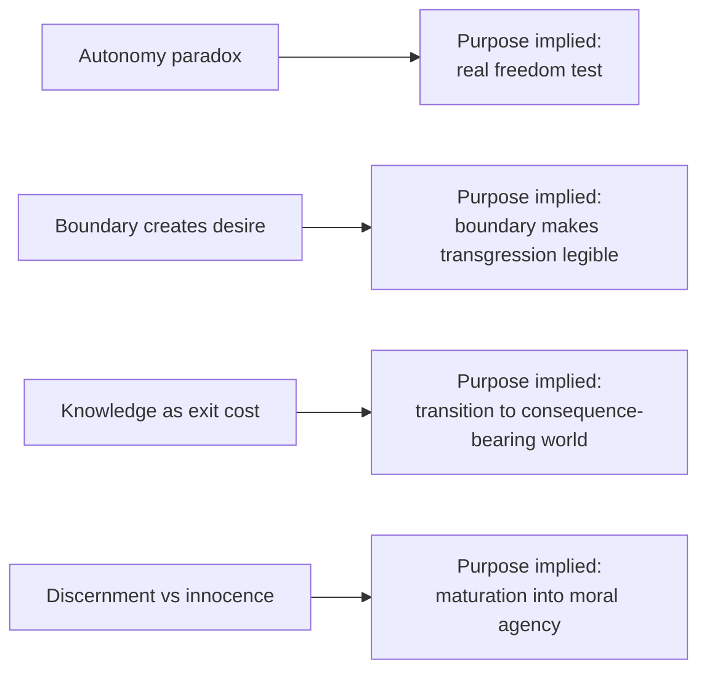
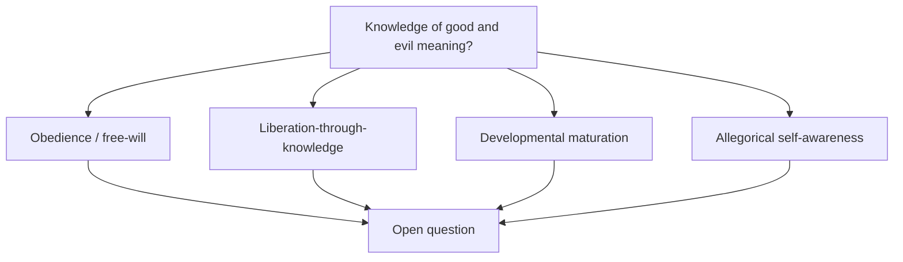

# Garden of Eden as a Controlled Environment

> **Companion exploration:** This is one of two companion explorations — see [Created Intelligence and the Forbidden Operation](./created-intelligence-and-the-forbidden-operation.md) for the alternate lens.

## Framing the Question

This document treats Eden as a philosophical model, not a settled doctrine: a deliberately curated habitat, bounded by one hard prohibition, in which created beings encounter freedom, boundary, and consequence.

Read this as an open inquiry: humanity has **not** successfully determined what the Tree of the Knowledge of Good and Evil means in reality, so competing interpretations remain active and unresolved.

---

## Eden as Controlled Environment / Sandbox

If we model Eden as an engineered life-support environment — a kind of sealed "space palace" — then the narrative looks structurally familiar:

- curated abundance,
- explicit invariants,
- one forbidden operation,
- and a transition from protected state to consequential state.

The same structure appears in software sandboxes: broad capability within boundaries, plus one action that changes the system's trust and risk model.

```mermaid
flowchart TD
    C[Curated habitat / "space palace"] --> I[Explicit invariants]
    I --> R[Rule: one forbidden operation]
    R --> D{Agent decision}
    D -->|Do not eat| S[Protected continuity]
    D -->|Eat| E["Eyes opened"]
    E --> X[Exit from protected sandbox]
    X --> W[World of consequence and burden]
```

---

## Why Desire the Tree? Four Live Hypotheses

These are hypotheses, not conclusions.

1. **The autonomy paradox**  
   If a created being cannot truly choose against instruction, then obedience may be mechanical, not free.

2. **The boundary creates desire**  
   Prohibition can generate the very category of transgression; "good" and "evil" may become salient only at a boundary.

3. **Knowledge as the cost of leaving the sandbox**  
   Edenic safety may depend on innocence. Moral self-direction may require exiting guaranteed safety.

4. **Discernment vs. innocence**  
   "Knowledge" may name maturation into judgment rather than data acquisition; the fall becomes costly coming-of-age.



---

## What Does "Knowledge of Good and Evil" Mean in Reality?

A clear answer is still out of reach. The phrase remains one of humanity's unresolved conceptual knots.

Major interpretive lines remain in tension:

- **Theological obedience/free-will reading:** the focal point is trust, command, and moral agency.
- **Gnostic liberation-through-knowledge reading:** the focal point is awakening from imposed limitation.
- **Developmental/psychological maturation reading:** the focal point is emergence of reflective selfhood and responsibility.
- **Allegorical self-awareness reading:** the focal point is consciousness of vulnerability, difference, and norm.

None of these frameworks has closed the question for humanity as a whole. The value of the story, in this framing, is not final certainty but durable tension.



---

## Why This Still Matters for Engineering Thought

Eden-as-sandbox maps cleanly to modern system design tensions:

- safety vs agency,
- invariants vs adaptability,
- protected training state vs production consequence,
- obedience vs discernment.

As a thinking tool, the narrative helps frame a recurring question in created systems: what is gained and lost when a protected environment is traded for autonomous judgment.

---

## Cross-References

- [Created Intelligence and the Forbidden Operation](./created-intelligence-and-the-forbidden-operation.md)
- [The AI-Human Advancement Thesis](./ai-human-advancement.md)
- [Computing Paradigms: Quantum vs Neural vs Classical](./computing-paradigms.md)
- [Nexus Node Documentation Index](../README.md)
