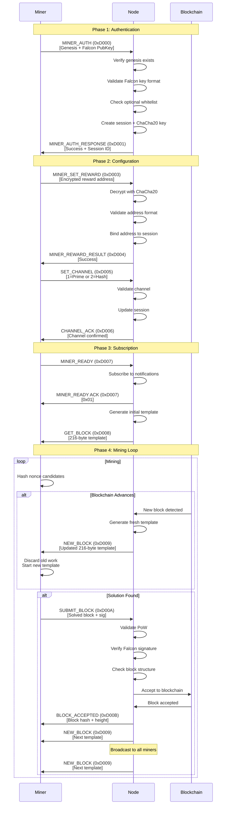
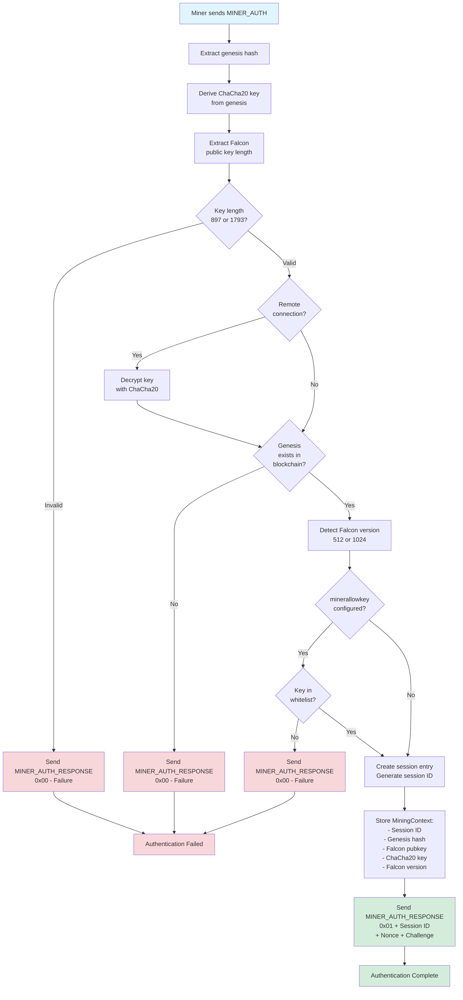
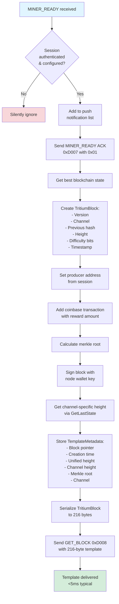
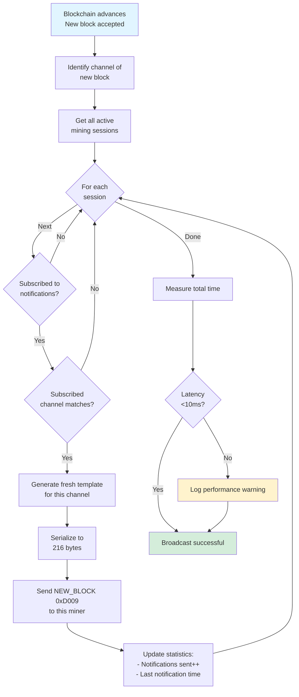
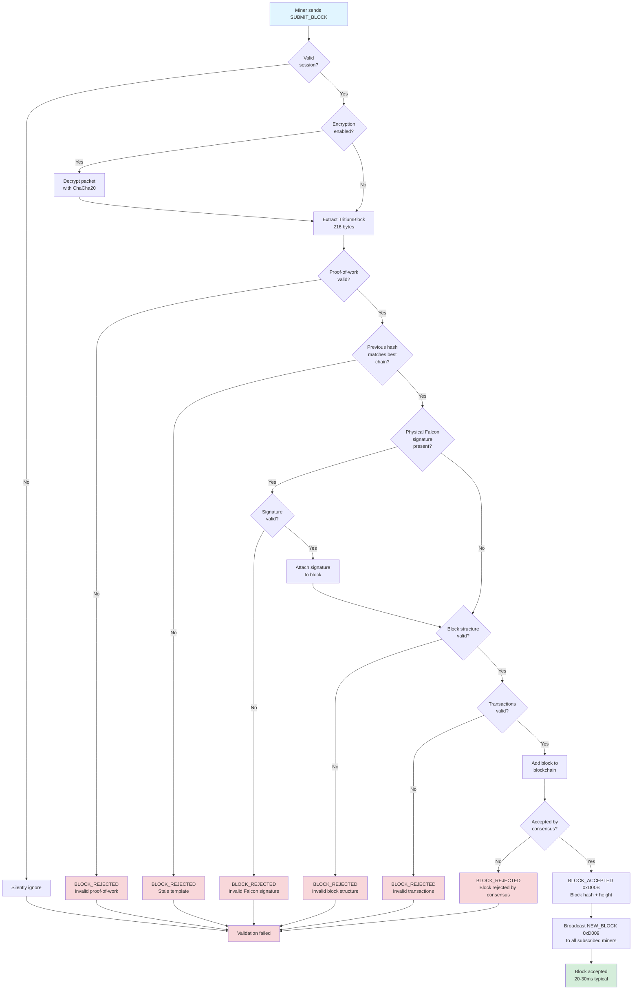
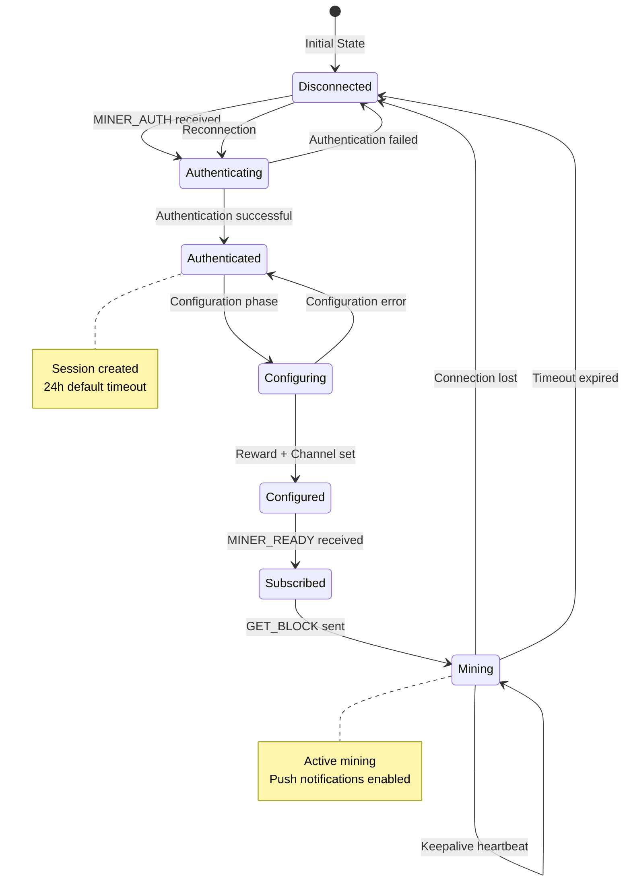
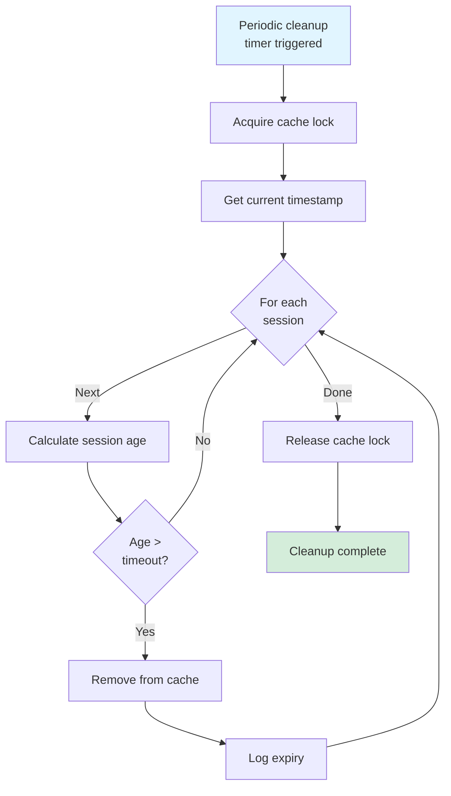
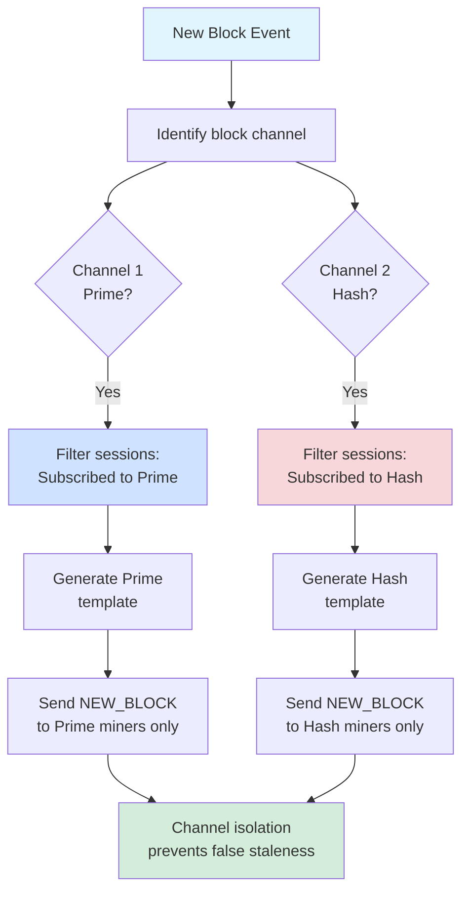
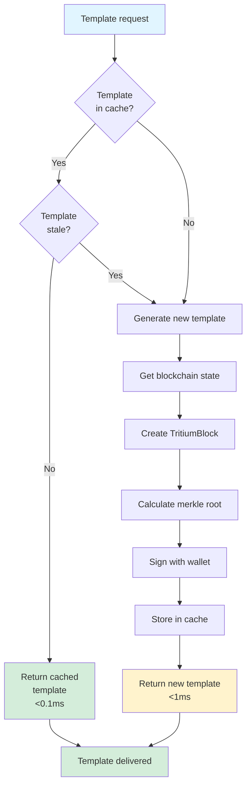
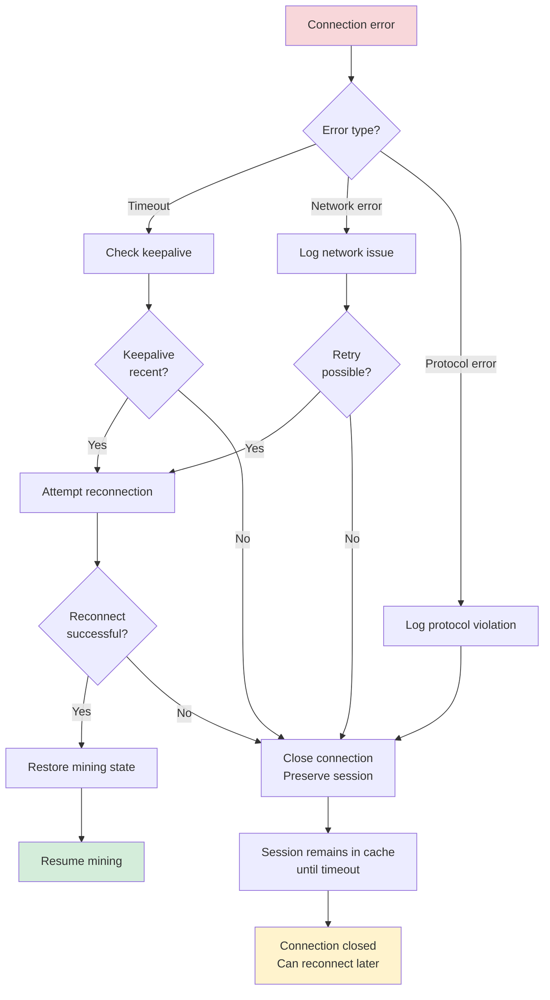

# Flow Architecture Diagrams - Node Reference

## Overview

This document provides comprehensive flow diagrams for the Nexus node's stateless mining protocol. These diagrams illustrate the complete lifecycle from miner connection to block acceptance.

**Document Version:** 1.0  
**Last Updated:** 2026-01-13

---

## Complete Protocol Flow

### Full Mining Session Lifecycle

---

## Authentication Flow Detail

### MINER_AUTH Processing

---

## Template Generation and Delivery

### Initial Template (GET_BLOCK)

### Push Notification (NEW_BLOCK)

---

## Block Submission Flow

### SUBMIT_BLOCK Validation

---

## Session Management

### Session Lifecycle

### Session Cache Cleanup

---

## Channel Isolation Architecture

### Multi-Channel Template Routing

---

## Performance Optimization Flow

### Template Caching Strategy

---

## Error Handling Flow

### Connection Error Recovery

---

## Cross-References

**Related Documentation:**
- [Stateless Protocol](../current/mining/stateless-protocol.md)
- [Mining Server Architecture](../current/mining/mining-server.md)
- [Opcodes Reference](opcodes-reference.md)
- [Configuration Reference](nexus.conf.md)

**Miner Perspective:**
- [NexusMiner Flow Diagrams](https://github.com/Nexusoft/NexusMiner/blob/main/docs/reference/Flow-Architecture-Diagram-REF.md)
- [NexusMiner Protocol Flow](https://github.com/Nexusoft/NexusMiner/blob/main/docs/current/mining-protocols/stateless-mining.md)

---

## Version Information

**Document Version:** 1.0  
**Protocol Version:** Stateless Mining 1.0  
**LLL-TAO Version:** 5.1.0+  
**Last Updated:** 2026-01-13

---

*These diagrams represent the node's perspective. For miner-side diagrams, see [NexusMiner documentation](https://github.com/Nexusoft/NexusMiner/blob/main/docs/reference/Flow-Architecture-Diagram-REF.md).*
